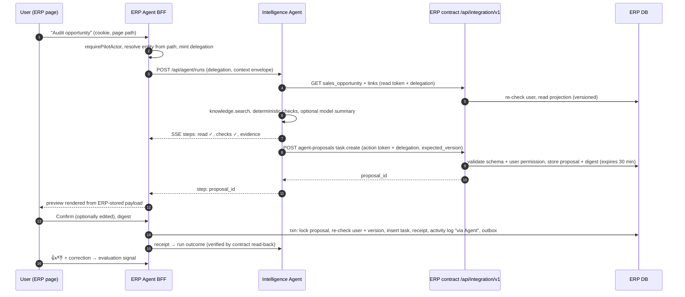

# Celerates Agent — Independent Audit and Next-Increment Recommendation

Date: 2026-09-26
Baseline: `audit/erp-production-readiness` @ `312e67a` (application code identical to deployed ERP/API `21372be` and web/worker `1ee00ef`; later commits are docs, tests and the generated OpenAPI file only).
Status: **audit + recommendation for review. Nothing in this document has been implemented yet.** Proposed decisions that change locked intent are marked *ADR-008 (proposed)*.

Read with: [10](10-closed-loop-intelligence-and-erp-maturity.md), [11](11-celerates-agent-direction-and-exploration-handoff.md), [12](12-celerates-agent-visual-reference.md), [ADR-007](adr/ADR-007-governed-closed-loop-foundation.md), [closed-loop foundation record](implementation/closed-loop-foundation.md), [ERP audit 10](erp-audit/10-capability-decomposition-audit.md).

---

## 0. Verdict in brief

1. **The handoff's direction is right; its picture of what is reusable is too optimistic.** The governed-knowledge store, ERP review/command/receipt pattern and fail-closed posture are genuinely reusable. The Context Builder, run model, ERP adapter, Model Gateway and principal model are **Pre-Sales-shaped**, not generic. The Agent needs a thin generalisation of each — not a rewrite, and not a new service.
2. **There is no agent substrate today.** No tool-calling, no generic model completion, no conversation/run store for interactive work, no streaming path, no user identity crossing ERP → Intelligence. Production runs `MODEL_MODE=demo` (deterministic text + hash "embeddings").
3. **The strongest next step is a playbook-first, model-assisted Agent on the Sales Opportunity page**: *Audit this opportunity → propose a linked follow-up task → user confirms in ERP → ERP applies it idempotently → receipt/outcome/feedback recorded.* It must deliver value with no model configured, then add a live model for free-form questions and tool selection behind an evaluation gate.
4. **Identity: ERP becomes the token issuer.** A short-lived, asymmetrically signed ERP delegation assertion, minted server-side by an ERP same-origin endpoint, replaces the shared workspace token for Agent use. The browser never holds an Intelligence credential.
5. **Key design correction to the handoff:** Intelligence should **propose**, but the **ERP should store the proposal, render the preview, take the user's confirmation and execute the command** in one ERP transaction. The current "Intelligence executes after ERP approval" dance is correct for unattended Pre-Sales, but wrong for an interactive agent: it adds a round trip, a "check approval" step, and makes the preview a model/Intelligence rendering rather than the ERP-validated payload.
6. **Authority rule for every tool:** *Agent capability = the user's current ERP authority ∩ the tool allowlist ∩ the current page context.* The Agent can never do what the user could not do by hand, and ERP re-checks at execution time.
7. **Deliberately defer:** PMO/Finance/HR tools (their semantics are still unresolved in ERP), "what changed" (no entity-level audit trail — F16), autonomous/proactive actions, cross-session memory, Workspace SSO, a LangGraph-based agent loop, token streaming, and any new infrastructure.

---

## 1. What was audited and how

| Area | Evidence examined |
| --- | --- |
| Product intent | `AGENTS.md`, docs 01–12, ADR-001–007, `docs/erp-audit/*` (esp. 04, 07, 10), implementation records |
| Intelligence service | every module in `services/intelligence-api/cdi/`, migrations `infra/postgres/migrations/001–002`, `Dockerfile`, `pyproject.toml`/`uv.lock`, Railway start scripts |
| ERP | `middleware.ts`, `lib/auth.ts`, `lib/actor.ts`, `lib/access-policy.ts`, `lib/require-division-access.ts`, `lib/operations/*`, `lib/integration/*`, `/api/integration/v1`, `/api/intelligence/reviews`, `/api/operations/context`, `components/operational-assistance.tsx`, tasks and feature-request actions/schema, drizzle `0001`, `0004` |
| Intelligence web | `api.ts`, `App.tsx` access dialog, `nginx.conf.template`, entrypoint |
| Deployed runtime | Public probes on 2026-09-26: Intelligence `/ready` → `{"status":"ready","pgvector":"0.8.6"}`; ERP `/api/health/ready` → ready; Intelligence `/api/system` anonymous → **401** (fails closed). Git diff of deployed commits vs HEAD shows no application-code drift. |

Limits: I had no Railway console, no authenticated production access and did not execute the test suites. Environment values (e.g. `MODEL_MODE=demo`, zero grants) are taken from the recorded runtime probe in the foundation record, not re-observed.

---

## 2. What is actually functional today

| Capability | State | Evidence | Agent relevance |
| --- | --- | --- | --- |
| ERP access | **Owner-only for the whole app** (middleware rejects non-Owner tokens on every non-contract route) | `middleware.ts`, `access-policy.ts:assertPilotActor` | Every current Agent user is an active Owner. Design must still carry division claims, because the division model already exists (`requireDivisionAccess`, `operations/policy.ts:canReadModule`). |
| Bantuan Operasional | Deterministic module-level attention (9 code-owned SQL rules, count + ≤5 samples, repeatable-read) and contextual Feature Request | `operations/reader.ts`, `operational-assistance.tsx` | Solid, trustworthy base. **Does not know the current record** — path UUIDs are kept by `operationalContext` but never used. |
| ERP machine contract | Read `sales_opportunity` (granted records only), outbox events, review request, one command `artifact.persist_approved_reference`; hashed read/action tokens, audience/environment, idempotency, atomic receipt/audit/outbox | `lib/integration/{contract,service}.ts`, drizzle `0004` | Excellent pattern to generalise. **No user delegation**: principal is always `intelligence-pilot`; access is Owner record grants. Tables are FK-bound to `sales_opportunity_trackers`. |
| ERP record versioning | `intelligence_version` trigger on the tracker; change/delete events into outbox | drizzle `0004` | Gives expected-version checks for the Sales slice for free. No equivalent on tasks or other tables. |
| Governed knowledge | company/division/opportunity scope, classification, immutable versions/checksums, approve/deprecate, FTS + pgvector, scope filter before ranking | `knowledge.py`, migration `002` | Reusable as-is behind a tool. |
| Context builder | Separates operational / source evidence / knowledge / observations; persisted with digest | `context.py:build_context` | Pattern reusable; **implementation is hard-wired** to `opportunity_id`, `"sales"` division and `WORKFLOW_VERSION="presales-closed-loop-v2"`, and only persists when tied to a Pre-Sales `run_id`. |
| Pre-Sales workflow | LangGraph ingest → analyze → human interrupt → close loop; durable Postgres queue with leases | `workflow.py`, `worker.py` | Keep as a specialist workflow the Agent can *launch/inspect*, not something to squeeze into the panel. |
| Model Gateway | `embed()` and a Pre-Sales-specific `narrative()`; LiteLLM SDK in-process; primary/fallback; JSON output; no tool calls | `gateway.py` | No generic `complete()`, no tool calling, one alias hard-coded, and **one `MODEL_MODE` switch controls both generation and embeddings**. |
| Outcomes/feedback | Outcome with deterministic checks, attributed feedback, explicit lesson promotion to a draft knowledge version | `foundation_api.py` | Good semantics; tables are keyed to Pre-Sales `runs`. |
| Intelligence identity | Static principals from env (token SHA-256 → roles/divisions/restricted); browser stores the token in `sessionStorage` | `identity.py`, `apps/web/src/api.ts` | Acceptable pilot boundary; unsuitable for an embedded agent. |
| Streaming | None anywhere. Web nginx proxies `/api` with default buffering and `proxy_read_timeout 120s` | `nginx.conf.template` | SSE would be buffered unless the API sends `X-Accel-Buffering: no`. Runs must stay well under 120 s. |

Also noticed:

- `FeatureRequestFab` is defined but not mounted (only `OperationalAssistance` is in `layout.tsx`); both target the same screen position. Remove it when the Agent shell lands.
- `kanban_tasks` has no link to a business record, no creator user ID (only `created_by_name`), no version, and `generateTaskNo` is `count(*)+random` (race-prone). ERP audit F04 already lists task authorization gaps. **The natural first write action needs small ERP hardening first.**
- Retrieval uses `to_tsvector('english', …)` while ERP content and likely policies are Bahasa Indonesia; lexical ranking will be weak. Chunks are filtered by `embedding_model`, so **switching `MODEL_MODE` to `litellm` silently hides every existing demo-embedded chunk until re-ingestion.**
- The Python service has no JWT/asymmetric-crypto dependency today (`cryptography`/`PyJWT` absent from `uv.lock`).
- ERP and Intelligence are separate Railway projects with no private network between them. ERP does not call Intelligence today; when it does, calls will traverse the public web origin and its nginx.
- ERP already has a generic `(source_type, source_id)` link convention (`signature_requests`, generic attachments). Linking tasks to records should follow it rather than invent a new one.

---

## 3. Where the handoff holds, and where the evidence says otherwise

| Handoff position | Assessment |
| --- | --- |
| Embedded agentic layer, not a chatbot or third app | **Agree.** Panel in ERP, reasoning/retrieval/tools in Intelligence, execution in ERP. |
| "Reusable Context Builder" already exists | **Overstated.** The *separation of truth kinds* is reusable; the function is Pre-Sales-bound. Add a subject-generic entry point; keep Pre-Sales calling through it. |
| Continue the Model Gateway abstraction | **Agree, but it needs a real interface**: `complete(role, messages, tools?, schema?)` with logical aliases, per-call metadata, and separate generation vs embedding modes. |
| Agent orchestration may reuse LangGraph | **Not for the interactive loop.** The only human checkpoint in an Agent run is confirmation of a proposal, and that is better executed by deterministic ERP code outside any graph. A bounded tool loop (≤8 tool calls, ≤60 s) plus deterministic playbooks is simpler, easier to test, and consistent with ADR-004 ("do not turn simple operations into agents"). Keep LangGraph for long-lived workflows (Pre-Sales) that the Agent can *start*. |
| Intelligence executes the controlled ERP action after confirmation | **Rework for interactive use.** Intelligence proposes via contract; ERP validates, stores, renders and — on the user's own confirmation — executes. The requesting user is both approver and actor; ERP records it as "via Celerates Agent run X". |
| Identity bridge via server-mediated exchange | **Agree, with a specific mechanism** (§4.2). SSO is not needed for this increment. |
| Sales/Pre-Sales as first demonstration | **Agree on Sales, disagree on Pre-Sales pack as the demo.** The 11-artifact review is a specialist workbench flow that needs a grant, a TOR upload and a large review surface. The panel demo should be an audit + a follow-up action; the Pre-Sales pack is launched or inspected from the panel, then reviewed in the Workspace/ERP review screen. |
| PMO billing as an example | **Defer.** BAST is not canonical and Finance handoff cardinality is unresolved (ERP audit F13, entity table in audit 10). An Agent explaining those would narrate unsettled semantics. |
| "Show what changed" | **Defer.** `activity_logs` has no entity ID/state/version (F16); only the tracker has versions. |
| Agent useful when the model is unavailable | **Make this the design centre**, not a fallback. Production has no model today. |

---

## 4. Recommended architecture for the first Agent increment

### 4.1 One rule governs everything

```text
what the Agent may read or do  =  user's current ERP authority
                                ∩  tool allowlist (risk class, module, resource type)
                                ∩  current page context (module, entity)
```

Checked twice: Intelligence filters which tools the model/playbook may see; ERP re-authorizes the real user on every delegated read and at execution. Prompt content can never widen it.

### 4.2 Identity bridge — *ADR-008 (proposed)*

```text
Browser (ERP cookie session)
  │  same-origin  POST/GET /api/agent/*   (Origin check, no CORS)
  ▼
ERP Agent BFF route (Next.js server)
  │  requirePilotActor + fresh DB status
  │  mint ERP delegation assertion (Ed25519, kid)
  │    iss=erp:<env> aud=celerates-intelligence sub=<users.id>
  │    access=[{division,level}] owner=<bool> ctx={path,module,entity_type,entity_id}
  │    scope=["agent"] jti exp≤10 min
  ▼
Intelligence API  /api/agent/*   verifies with ERP public key(s) → Principal(erp_user)
  │
  └─ calls ERP /api/integration/v1 with machine token + X-ERP-Delegation: <same assertion>
       ERP verifies its own signature, reloads the user, re-applies RBAC
```

Why asymmetric: with a shared HMAC secret, a compromised Intelligence service could mint user assertions and replay them into ERP. With ERP-held private keys it can only *present* assertions ERP issued. Node's built-in `crypto` signs Ed25519; Python needs `cryptography` (new dependency).

Principal mapping in Intelligence:

- `reviewer`-equivalent read/propose rights derive from the ERP assertion.
- Knowledge divisions = divisions with ≥ viewer access (Owner → all). `restricted` knowledge only for Owners in the pilot.
- **`curator` is never derived** from ERP claims; knowledge approval stays a named, configured governance role.
- Existing `API_ACCESS_TOKEN`/`INTELLIGENCE_PRINCIPALS_JSON` remain for the Workspace and unattended workflows. Workspace sign-in via a one-time ERP code is a later step.

Delegated reads vs record grants: for **interactive** Agent reads the present, authenticated user's authority replaces the Owner record grant (the grant was a proxy for "a human authorized this"). Grants remain mandatory for **unattended** service reads (Pre-Sales worker, event consumers). This is the one change to ADR-007 semantics and must be an explicit ADR.

### 4.3 Runtime placement

- **No new service.** Add `cdi/agent/` (runs, tools, policy, playbooks, loop) to the existing API.
- **Interactive runs execute in the API process**, bounded (≤8 tool calls, ≤60 s wall clock, cancellable), with every step persisted. The delegation stays in memory for the run's life. A redeploy mid-run fails that run visibly; the user retries.
- **Long work goes to the existing worker** through a tool (e.g. `presales.start_analysis` enqueues the existing LangGraph run). The panel shows its status and links out.
- **Progress** is a persisted step log exposed as SSE (`GET /api/agent/runs/{id}/events`, `Last-Event-ID` resume, 15 s heartbeat, `X-Accel-Buffering: no`) proxied by the ERP BFF, with a polling fallback on the same cursor. Step-level progress, not token streaming.

### 4.4 Tool registry

Each tool declares: name + version, Pydantic input/output schema, risk class, required ERP module/level, resource types, whether it needs entity context, output classification, output size cap, and timeout. Tools are called identically by playbooks and by the model loop; schemas are JSON-schema so the registry could later be exposed via MCP without redesign.

| Risk class | Behaviour |
| --- | --- |
| `read` / `explain` | auto-execute when authorized |
| `navigate` | returns an ERP link; the UI navigates only on click |
| `prepare` | produces a draft inside Intelligence; no ERP effect |
| `propose_write_low` | creates an **ERP-held** proposal; nothing happens until the user confirms in ERP |
| `sensitive` | not registered for the Agent (commercial values, payroll, signatures, hiring, payment, access grants — ERP audit 10 §10) |

Initial tools (small on purpose):

| Tool | Class | Backed by |
| --- | --- | --- |
| `erp.page_attention` | read | existing `readOperationalContext`, passed in the signed context envelope (no extra round trip) |
| `erp.sales_opportunity.get` | read | extended contract projection: add `last_communication_date`, `bante_score`, `progress_notes`, `service_type_code`, and **presence flags** (not values) for `price_amount`/`estimated_deal_amount` |
| `erp.sales_opportunity.links` | read | new contract read: linked requisitions (TA PIC set?), linked commercial PQ, attached Intelligence references |
| `knowledge.search` | read | existing `knowledge.retrieve`, scoped by the principal |
| `intelligence.presales_status` | read | latest run state, documents, open clarifications for the opportunity |
| `presales.start_analysis` | navigate / prepare | deep link, or enqueue when a TOR exists and the record is granted — the Agent never toggles grants (access grants are a prohibited AI write) |
| `erp.task.propose` | propose_write_low | new ERP command `task.create` linked to the record |
| `erp.feature_request.propose` | propose_write_low | new ERP command wrapping the existing Feature Request semantics (page context, release, environment) |

### 4.5 Actions: propose in Intelligence, confirm and execute in ERP



ERP additions for this (new tables, no alteration of the Sales-specific ones):

- `agent_action_proposals` (id, user_id, run_id, command_kind, payload, payload_sha256, target type/id, expected_version, state `pending|confirmed|rejected|expired`, expires_at) and `agent_action_receipts` (idempotent by proposal_id; unique effect).
- `task.create` hardening: `kanban_tasks.source_type/source_id` (existing ERP convention), `created_by_user_id`, a sequence-backed `task_no`, and an idempotency constraint.
- Proposals bind the parent record version. If the opportunity changes before confirmation, ERP marks the proposal stale and the user re-runs the skill. Conservative for v1; relax per command once usage shows it is too strict.
- If the user edits the preview, ERP stores the confirmed payload and the diff. **Proposed-vs-confirmed diff is the single most useful learning signal** for the Agent.

### 4.6 What every Agent run records (Intelligence)

`agent_runs`: principal (ERP user ID, assertion `jti`), page context, skill or instruction, playbook/prompt/tool versions, model alias/provider/tokens/latency (if used), context digest. `agent_steps`: ordered tool calls with bounded, redacted inputs/outputs and timings. Links to ERP proposal IDs and receipts. `agent_feedback`: rating, correction, confirmed-vs-proposed diff. Lesson promotion reuses the existing explicit curator path; nothing auto-promotes. Generalising `workflow_outcomes`/`outcome_feedback` into one evaluation-subject model is worth doing only when a third consumer appears.

### 4.7 Model Gateway and degraded mode

- Split configuration: `GENERATION_MODE` and `EMBEDDING_MODE` (today's `MODEL_MODE` couples them). This lets a live reasoning model be evaluated without invalidating existing chunks, and makes a future embedding switch an explicit re-index operation.
- Add `complete(alias, messages, tools=None, schema=None, metadata)`; aliases `agent-reasoning`, `agent-summary`. Record provider, model, prompt version, tokens, latency and cost on the step.
- **Playbooks carry the facts; the model selects tools and narrates.** Every fact shown is attributed to a tool result. With no model or a provider outage, suggested skills still run and render deterministic results; free-form input returns the available skills instead of an error.
- First live-model evaluation: ~30 synthetic ERP scenarios with expected tool calls, expected facts and forbidden behaviours (invented values, commercial figures, writes without proposals, obeying instructions embedded in ERP free text or documents). Compare two tool-calling providers through LiteLLM on correctness, Bahasa Indonesia quality, latency and cost. CI runs the deterministic playbooks; model evals run on demand with keys.
- Data-protection gate: the first slice sends Sales tracker text and approved knowledge only. Before any HR/TM/candidate tool, decide provider data-residency and processing terms against Indonesia's Personal Data Protection Law (UU 27/2022).

### 4.8 Embedded UI: evolve Bantuan into the Agent shell

Evolve the **product surface** (same launcher position, same trust) but restructure the **code**: extract `AttentionGroup` and `ContextualFeedback` into reusable parts and build a new `AgentPanel` shell with an explicit state machine (`idle → suggestions → running → result → proposal → receipt/error`).

- Launcher: compact pill with attention count; keyboard shortcut; opens a right-docked panel (≈420 px) that overlays without reflowing dense ERP tables; full-height sheet on mobile.
- Header shows the resolved context chip (e.g. `Sales · OPP-0123`) so the user sees what the Agent thinks they are working on.
- Suggested skills appear before typing and differ by page. On a Sales Opportunity edit page: *Audit opportunity*, *Siapkan tindak lanjut*, *Status Pre-Sales*, *Laporkan kendala*. Elsewhere: *Perlu perhatian* (today's content) and *Laporkan kendala*.
- Step timeline in plain Indonesian ("Membaca OPP-0123 dari ERP ✓").
- **Evidence badges make the three kinds of truth visible:** *Fakta ERP* (with record version and as-of), *Dokumen*, *Pengetahuan disetujui* (source + version), *Observasi*. This turns the architecture's core guardrail into something users can see.
- Proposal card rendered from the ERP-stored payload: fields, target record, "Konfirmasi", "Ubah", "Batal", and an expiry note. Receipt card links to the created task.

---

## 5. First milestone — definition of done

Demo script (synthetic, clearly marked records; no fabricated business approval):

1. Owner opens a Sales Opportunity edit page. The panel shows `Sales · OPP-xxxx` and four suggested skills.
2. **Audit opportunity** returns, deterministically: verified facts (with version/as-of), missing or stale items (e.g. no BANTE score, last communication older than a threshold agreed with Sales, qualified but no requisition/PQ — the existing rule), requisition TA PIC status, Pre-Sales status, and relevant approved playbook passages with citations. Works with `GENERATION_MODE=demo`.
3. **Siapkan tindak lanjut** produces an ERP-held task proposal linked to the opportunity. The user edits the due date and confirms. ERP creates exactly one task; a replay of the same confirmation returns the same receipt.
4. The run shows the receipt; the user rates it. The run, steps, proposal diff and feedback are visible in Intelligence Outcomes.
5. Negative controls: a stale `expected_version` is rejected; an expired proposal cannot be confirmed; a user without Sales access (synthetic claims in tests) sees no Sales tools; ERP free text containing instructions does not change tool choice or create proposals; model provider disabled → skills still work.

Acceptance also requires: contract tests for delegation (bad signature, wrong audience, expired, revoked user, replayed `jti` on writes), ERP transaction tests for proposal confirmation, and the existing Pre-Sales loop and Bantuan behaviour unchanged.

---

## 6. Reuse / rework / defer

| Component | Decision | Note |
| --- | --- | --- |
| ERP operational rules (`operations/reader.ts`) | **Reuse** | Becomes the `erp.page_attention` tool and the panel's idle content. |
| ERP contract mechanics (hash tokens, audience, idempotency, receipt, outbox, advisory locks) | **Reuse pattern** | New resources/commands in new tables; do not widen the Sales-specific tables. |
| Tracker `intelligence_version` + outbox | **Reuse** | Expected-version checks for the Sales slice. |
| Governed knowledge + retrieval | **Reuse** | Add a `simple`/Indonesian-friendly FTS column later; keep scope filters. |
| Context builder | **Rework (thin)** | Subject-generic entry point; Pre-Sales keeps working through it. |
| Model Gateway | **Rework** | `complete()` with tools; split generation/embedding modes. |
| Intelligence principals | **Extend** | ERP-delegated principal type; curator stays configured. |
| `HttpERP` adapter | **Extend, don't overload** | Its `action()` already embeds Pre-Sales workflow logic; add typed clients per resource/command. |
| Pre-Sales LangGraph workflow | **Keep** | Launched/inspected by the Agent; reviewed in the specialist surfaces. |
| Bantuan Operasional | **Evolve** | New shell; reuse parts; remove the unmounted `FeatureRequestFab`. |
| Intelligence Workspace | **Keep** | Curators, reviewers, Pre-Sales specialists, evaluation. ERP→Workspace sign-in later. |
| LiteLLM proxy (`infra/litellm`) | **Defer** | SDK routing is enough until multiple services share provider keys or budgets. |
| Langfuse | **Optional** | Own step log is the source of record; add Langfuse when running model evals. |
| PMO/Finance/HR tools, "what changed", proactive/autonomous actions, cross-session memory, Workspace SSO, MCP exposure, token streaming, new vector DB/queue/agent service | **Defer** | Each has a named blocker above or no present need. |

---

## 7. ERP maturity work the Agent depends on

| Item | Why | Size (rough) |
| --- | --- | --- |
| Task hardening: record link, creator user ID, safe `task_no`, idempotency, record-level authorization (part of F04) | First write action | 1–2 d |
| Entity resolver from path (code-owned route table → `entity_type/id`) | Context awareness | 0.5 d |
| Delegation issuer + key rotation (`kid`, env-configured public keys) | Identity bridge | 1–2 d |
| Contract: delegated read mode + `links` read + proposal endpoints | Tools and actions | 2–3 d |
| BA decision: which opportunity checks are "missing/stale" and their thresholds | Audit must encode agreed rules, not model opinion | business time |

These should land as ERP changes with their own tests, not as Agent-side workarounds.

---

## 8. Answers to the handoff's open questions (§17)

| Question | Answer |
| --- | --- |
| Evolve Bantuan or new abstraction? | Evolve the surface, new internal shell; reuse its parts and its deterministic reader. |
| Identity bridge? | ERP-issued, Ed25519-signed, ≤10 min delegation minted by a same-origin BFF; ERP re-verifies and re-authorizes on every delegated call (ADR-008). |
| Initial toolset? | §4.4 — Sales read tools, knowledge search, Pre-Sales status/launch, two low-risk proposals (task, Feature Request). |
| LangGraph vs general orchestration? | Bounded tool loop + deterministic playbooks for interactive runs; LangGraph for long workflows launched as tools. |
| Tool permissions ↔ ERP roles? | Tool metadata declares module/level/resource; filtered by delegated claims; ERP re-checks. |
| Synchronous vs worker? | Interactive runs in the API (bounded); long workflows via the existing worker. |
| Streaming/progress? | Persisted step log over SSE with resume and polling fallback; `X-Accel-Buffering: no` through nginx. |
| First live-model configuration? | Two tool-calling providers via LiteLLM behind aliases, compared on a synthetic eval set before exposure; demo mode remains default. |
| Evidence per run? | §4.6. |
| Safe first writes? | Linked `task.create` and `feature_request.create`, both ERP-held proposals confirmed and executed in ERP. |
| Useful without a model? | Yes by design: skills are deterministic playbooks; the model adds selection and narrative. |

---

## 9. Decisions needed from the product owner

1. Accept ERP-held proposals with ERP-side execution for interactive actions (§4.5) — changes the flow described in doc 11.
2. Accept delegated user authority replacing record grants for interactive reads only (ADR-008).
3. Confirm the Sales opportunity audit checks and thresholds with the Sales lead/BA.
4. Approve the first live-model evaluation (providers, budget, and whether Sales tracker text may be sent to them).
5. Confirm the Agent stays Owner-only until ERP multi-role rollout; the design supports divisions but the pilot boundary is unchanged.

---

## 10. Sequencing and rough effort

| Step | Content | Rough effort |
| --- | --- | --- |
| A. Foundations | ADR-008, delegation issuer/verifier, BFF skeleton, principal type, generation/embedding mode split, nginx SSE header | 3–5 d |
| B. Assist + Investigate (no model) | Tool registry, run/step store, `page_attention`, opportunity read/links, knowledge search, *Audit opportunity* playbook, Agent shell with evidence badges | 5–8 d |
| C. Prepare + Execute with confirmation | Task hardening, proposal/receipt tables and endpoints, task + Feature Request proposals, receipt → outcome, feedback and diff | 5–7 d |
| D. Live-model evaluation | `complete()` with tools, bounded loop, free-form Ask over read tools, eval set and provider comparison | 4–6 d + evaluation time |

Estimates are engineering days for one experienced implementer and exclude BA/business waiting time. A–C deliver the milestone in §5 without any model provider; D is additive and gated by evaluation results.
