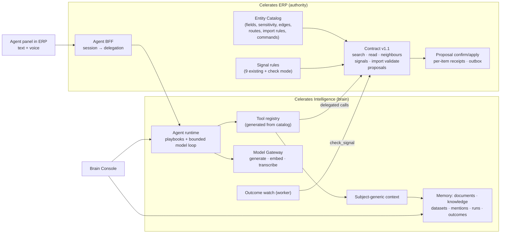

# Celerates Operating Substrate — Assessment and Next Platform Increment

Date: 2026-09-26
Baseline: `audit/erp-production-readiness` @ `8721132` (doc 14 added; application code unchanged since the deployed foundation).
Status: **architecture/product recommendation. M1 (§5) is implemented** — see [the M1 record](implementation/operating-substrate-m1.md). **The three Golden Journeys (ask, drop a table, signal → act → outcome) are implemented without a model** — see [the M2 record](implementation/operating-substrate-m2.md), and are extended in [the M3 record](implementation/operating-substrate-m3.md): optional bounded model reasoning, documents, Indonesian + English retrieval, name resolution, push-to-talk voice and the Brain Console Agent view. ADR-008 to ADR-014 are accepted; ADR-014 replaces the PydanticAI recommendation for the model loop.

North Star: [doc 14](14-celerates-enterprise-intelligence-operating-model.md). Grounded engineering audit: [doc 13](13-celerates-agent-audit-and-recommendation.md). Library/framework decisions: [doc 16](16-operating-substrate-build-reuse-adopt.md). Also relies on [ERP audit 04](erp-audit/04-production-readiness-audit.md) and [10](erp-audit/10-capability-decomposition-audit.md).

---

## 0. The argument in one page

**The three Golden Journeys are one machine with three entry points.**

```text
            A. Ask anything        B. Drop anything        C. Signal / ask → act
                  │                      │                          │
                  ▼                      ▼                          ▼
          resolve subject(s)      profile + map dataset      resolve target set
                  └──────────────┬───────┴──────────────┬───────────┘
                                 ▼                      ▼
                    gather evidence across typed sources (ERP facts, documents,
                    approved knowledge, observations, signals) under user authority
                                 │
                                 ▼
                    optional PROPOSAL = batch of typed ERP commands over targets
                                 │    (ERP validates, stores, previews)
                                 ▼
                    user confirms (text, click or voice → still a click)
                                 │
                                 ▼
                    ERP applies per item, idempotent receipts
                                 │
                                 ▼
                    OUTCOME WATCH re-checks the same deterministic condition
                    → "9 selesai, 3 belum" → new signal → loop
```

If we build that machine once, the journeys differ only in how the subject/target set is produced (search, dataset mapping, signal) and which commands are allowed. That is the difference between an operating system and three bespoke workflows.

**The single most leveraged missing piece is an ERP-owned, declarative Entity Catalog.** The repository already contains its raw material scattered in five places:

| Where the knowledge lives today | What it encodes |
| --- | --- |
| 10 bespoke Sheet importers, 2,671 lines of `*/sheet-sync/actions.ts`, all disabled | per-entity importable fields, required flags, value normalisation maps, lookup keys |
| 10 `target-fields.ts` files | field labels in Bahasa Indonesia with lookup hints ("cari Employee yang cocok") |
| `operations/reader.ts` | 9 signal predicates, each returning entity IDs and labels |
| `operations/policy.ts` `operationalContext` | path → module parsing, with a UUID regex that never resolves the entity |
| `lib/integration/service.ts` | one hand-written projection (`sales_opportunity`) with quality/unknown markers |

One catalog, owned and enforced by ERP and exported read-only to Intelligence, can drive:

- search;
- entity reads with field sensitivity;
- relationship traversal;
- page → entity context;
- import mapping targets and validation;
- the command allowlist.

Everything the Agent does then becomes composition over the catalog, not new `if/else`.

**Recommendation:** the next increment is *Operating Substrate v1*. It has three layers:

- **Built once:**
  - ERP delegation;
  - Entity Catalog;
  - federated search/read/neighbours;
  - ERP-held command-batch proposals;
  - outcome watch;
  - subject-generic context;
  - agent run/tool registry;
  - dataset profiling and mapping;
  - a gateway with generation, embedding and transcription split.
- **Shown through:** a thin version of all three journeys in the embedded Agent, with `Perlu perhatian` and `Masukan` preserved as its first capabilities.
- **Visible in:** a Brain Console re-scoped around memory, entities, imports and agent runs.

It deliberately does **not** add a graph database, a connector framework, a new application service, token streaming, spoken responses, or any sensitive-domain write. The only infrastructure addition is the already-configured LiteLLM Proxy, enabled when real model providers are evaluated ([doc 16](16-operating-substrate-build-reuse-adopt.md)).

---

## 1. What the repository supports, and what it contradicts

| Doc 14 ambition | Repository evidence | Consequence |
| --- | --- | --- |
| Agent for ERP users | ERP middleware admits **only active Owners** on every non-contract route | Today's users are Owners. Multi-role rollout (ERP audit F04, row authorization) is the biggest gate to an "operating system for everyone". Design for divisions now; do not claim broad rollout. |
| Ask across ERP facts | Client identity is free text in 8+ tables; `crm_clients` matches by exact name "without FK"; separate `clients` table with codes | Universal search needs **name normalisation and resolution as evidence**, not a merged customer master. |
| Relationships / graph | Real FKs: lead → tracker → requisition → assignment → employee; tracker → commercial PQ → contracts, documents, invoices, handoffs | Enough for 1–2 hop traversal from relational edges. **No graph database is justified.** |
| Drop a sheet → ERP | 10 disabled Sheet importers that match by name and clear-then-write (F05, F09); `intake.py` handles CSV/XLSX but only for 3 demo entities, CLI-only, with headers equal to field names | Strong evidence of real demand **and** of the anti-pattern to replace. One staged, validated, previewed import path should supersede them. |
| Google Sheets as a source | OAuth tokens stored in plaintext (F06); Sheets sync disabled at server level | File upload first. A Sheets connector comes after F06, feeding the same dataset pipeline. |
| Ask → action → outcome, e.g. timesheet reminders | Timesheets keyed to `users` with no user ↔ employee mapping; talents cannot log in (Owner-only); outbound reminders disabled (F07); WhatsApp is a stub | **The timesheet example is not truthfully deliverable now.** Prove Journey C on signals whose target sets are already deterministic (the 9 existing rules), using internal tasks and notifications. |
| Proactive signals | 9 code-owned rules, exact counts, repeatable-read snapshot, ≤5 samples | Reuse as-is. Add `entity_type` and a `check(ids)` mode for outcome watch. |
| Enterprise search quality | `to_tsvector('english')`; score = `ts_rank + cosine` (different scales); demo hash embeddings; one `MODEL_MODE` switch for generation and embeddings | Must be fixed before any "search the business" claim. PostgreSQL ≥ 12 ships an Indonesian Snowball stemmer ([release notes](https://www.postgresql.org/docs/release/12.0/)); both stacks run PG16. |
| Load on ERP | ERP pool max 5, statement timeout 15 s | Federated reads must be bounded (limits, read-only snapshot, per-request budget). |
| Brain Console | Intelligence web in HTTP mode shows Exceptions / Human Service / Management fed by `/api/support`, which returns nothing live ("outside the live ERP contract") | Those pages are hollow in production and duplicate ERP operation. Re-scope the web (§6). |

---

## 2. Capability-by-capability assessment

### 2.1 Ingestion and connectors — challenge "generic connectors"

- A connector framework is premature. **File upload covers the stated journeys** (Excel/CSV/TOR). The only thing that must be generic is the *output contract*: every source produces either a **Document version** (existing governed path) or a **Dataset version** (new), with checksum, owner, scope and classification.
- Keep `intake.py`'s `SourceAdapter` idea, but **never expose** `RestSource` (arbitrary URL) or `PostgresSource` (arbitrary DSN/table) to the Agent or UI. They are exfiltration/SSRF surfaces; keep them operator/CLI-only.
- Order: upload → Google Drive/Sheets picker (after F06, read-only scope, exported to XLSX into the same pipeline) → approved APIs.

### 2.2 Schema understanding and mapping — generic proposal, deterministic validation

Split responsibilities:

| Step | Owner | Needs a model? |
| --- | --- | --- |
| Profile: sheets, header-row detection, types, nulls, distinct values, samples | Intelligence | No |
| Target suggestion (which catalog entity) | Intelligence | No: header/label similarity + enum overlap. The model improves it. |
| Column mapping + value normalisation proposal, with confidence | Intelligence | No for known headers (catalog labels + synonyms + prior approved templates). Model for unfamiliar sheets. |
| Row validation: required, types, enums, lookups (`opty_no`, `employee_no` exist?), duplicates by business key, field sensitivity | **ERP**, dry-run against the catalog | Never |
| Apply | **ERP**, per-row command with receipt | Never |

Approved mappings become **mapping templates keyed by header fingerprint** — reusable memory that makes the second import of the same client's sheet one click. This is a concrete, measurable "learning" signal that needs no model.

### 2.3 Entity resolution — resolution as evidence, not as truth

- Normalise names: case, unaccent, whitespace, and legal forms such as `PT`, `Tbk`, `(Persero)`, `CV`.
- Candidates come from ERP catalog search (trigram similarity + exact normalised match), scored and explained ("sama setelah normalisasi", "mirip 0.82").
- Store Intelligence-side `entity_mentions`: document chunk or dataset row → candidate ERP refs → state `proposed | confirmed | rejected` with who confirmed. Confirmed mentions become the document ↔ entity edges that make documents findable by entity.
- **No auto-merge and no crosswalk authority in Intelligence.** Source/crosswalk mappings are a prohibited AI write (ERP audit 10 §10). A canonical client + alias table in ERP (building on `crm_clients`) is an ERP data-maturity item that search will visibly benefit from.

### 2.4 Universal, multilingual search — federated, not replicated

- **ERP facts are searched in ERP**, through the catalog, under the user's delegated authority. Freshness, authorisation and the "not every ERP row in pgvector" principle all hold.
- **Intelligence indexes only what it governs:** documents, knowledge, dataset profiles, agent runs and outcomes.
- The Agent fans out, merges with **reciprocal-rank fusion** (not summed raw scores), groups hits by resolved entity, and labels every hit by evidence type.
- Retrieval fixes are part of the increment, not follow-ups:
  - dual lexical vectors (`indonesian` + `english`, over `unaccent`);
  - `GENERATION_MODE` / `EMBEDDING_MODE` split;
  - a multilingual embedding model when enabled;
  - an explicit re-embed job (today, switching modes silently hides all demo-embedded chunks because retrieval filters on `embedding_model`);
  - a 40–60 query Indonesian/English relevance set to measure before and after.

### 2.5 Relationships / graph

Catalog-declared edges, each marked `fk` (trusted) or `name_match` (shown with caution), plus confirmed `entity_mentions`, traversed 1–2 hops on read. The Console renders a neighbourhood view from the same API. Revisit a graph store only if traversal depth, entity volume or relationship analytics outgrow SQL. Nothing in the current data suggests that.

### 2.6 Subject-generic context

Replace the Pre-Sales-bound signature with `build_context(subject, purpose, principal)`, where `subject` is an entity ref, an entity set, or a dataset version. Sections:

- `erp_facts` (typed reads with version/as-of);
- `neighbours`;
- `documents` (via scope or confirmed mentions);
- `knowledge`;
- `signals` touching the subject;
- `observations` (prior runs and outcomes).

`context_snapshots` gains nullable `subject_type/subject_id/purpose`; Pre-Sales calls the new function with `sales_opportunity`. The foundation is extended, not rewritten.

### 2.7 Agent runtime and tool registry

Keep doc 13's design (bounded loop, persisted runs/steps, typed tools with risk class and required module/level), with two additions.

**Tools operate on sets.** Journeys B and C are batch by nature.

**Tools are generated from the catalog**, not hand-written per entity:

- `search`, `read_entity`, `neighbours`, `resolve_entity`;
- `list_signals`, `check_signal`;
- `profile_dataset`, `propose_mapping`, `validate_import`;
- `propose_commands`, `check_outcome`, `build_context`, `search_memory`;
- `start_workflow` (Pre-Sales).

About 13 generic tools replace what would otherwise be dozens of entity-specific ones.

### 2.8 Deterministic playbooks vs model-driven orchestration

| Situation | Mechanism |
| --- | --- |
| Known condition or known flow (signal explanation, follow-up batch, import) | Playbook: fixed tool sequence, deterministic rendering |
| Open question, unfamiliar sheet, document extraction, synthesis across sources | Model plans tool calls and writes the narrative, citing tool results |
| Anything that changes ERP | Deterministic ERP validation + human confirmation, regardless of who planned it |

Without a model, Journey A degrades to grouped keyword search, B to heuristic mapping, and C is fully functional. **Model evaluation must start in this increment** in a non-production environment with synthetic data, because free-form Ask and unfamiliar-sheet mapping are where the model earns its place. Production stays `demo` until the eval and the data-handling decision (§9) pass.

### 2.9 ERP delegation and controlled action

Keep doc 13 (ERP-issued Ed25519 delegation; authority = user ∩ allowlist ∩ context; ERP-held proposals; ERP-side execution), generalised in two ways:

- **Proposal = batch of typed commands** with per-item validation state (`ok | warning | invalid | duplicate`). The user confirms all or a subset; ERP applies per item idempotently with per-item receipts. The import (B) and the follow-up batch (C) are the same mechanism.
- **Outcome watch**: a proposal can register a watch, either "re-check signal R on these target IDs" or "task statuses of these receipts". The existing worker ticks; ERP answers `check_signal(rule, ids)` deterministically; results return as a new attention group, *Tindak lanjut berjalan*.

The Pre-Sales review/command flow stays untouched. It can migrate onto proposals later.

### 2.10 Text + voice

- One input surface: text box + push-to-talk mic.
- **Voice path:** audio → ERP BFF → Intelligence `transcribe` through the Model Gateway (LiteLLM exposes a provider-neutral `transcription()`; see [docs](https://docs.litellm.ai/docs/audio_transcription)) → **editable transcript** → the same run, with `modality=voice` recorded.
- Browser server-side recognition is not used (audio would leave governance to the browser vendor). On-device browser recognition (`processLocally`, [MDN](https://developer.mozilla.org/en-US/docs/Web/API/Web_Speech_API/Using_the_Web_Speech_API)) can be an optional private path where an `id-ID` pack is available. Feature-detect it and never depend on it.
- Voice never confirms a write. Proposals always need an explicit tap.
- No audio retention by default (transcript only). No spoken responses in v1.
- Provider choice by a test of ~50 recorded Indonesian operational utterances with code-switching and business terms (PQ, BAST, client names), measuring word and entity error rate plus latency.

### 2.11 `Perlu perhatian` and `Masukan` — non-regression plus evolution

- **`Perlu perhatian`:** identical rules, counts, wording and links. Additions per group: *Tanyakan* (explain via context), *Tindak lanjuti* (batch proposal), and *Tindak lanjut berjalan* groups from outcome watch. Agent-inferred findings appear separately as **Insight Agent**, never mixed into rule counts.
- **`Masukan`:** the existing Feature Request path and fields stay. Add intent routing across the five doc-14 intents:

| Intent | Route |
| --- | --- |
| Feature request | existing FR, previewed |
| Business-data correction | task to the data owner with the record linked, or a deep link to the edit form. No direct field edit by the Agent. |
| Knowledge correction | observation against the knowledge version → curator queue in the Console |
| Agent feedback | run feedback |
| Operational action | Act flow |

Without a model the user picks the intent; with a model it is pre-selected and still confirmed. **A complaint never becomes an FR without preview.**

---

## 3. The substrate, component by component



| Component | ERP or Intelligence | New or extended | Notes |
| --- | --- | --- | --- |
| Entity Catalog v1 | ERP | new (code-owned TS module + `GET catalog`) | Seed from `target-fields.ts`, normalisation maps and the Drizzle schema. Every field gets a sensitivity: `public`, `internal`, `commercial`, `pii`, `restricted`. The Agent never reads `restricted`, never imports `commercial`/`pii` in v1. |
| Delegation + BFF | ERP issuer, Intelligence verifier | new | as doc 13 |
| Contract v1.1 | ERP | extends `/api/integration/v1` | Delegated mode alongside machine grants. Bounded: ≤50 hits, read-only snapshot, 15 s statement timeout already enforced. |
| Signals `check` | ERP | extends `operations/reader.ts` | Add `entity_type` per spec and an ID-restricted evaluation. |
| Proposals (batch) + receipts | ERP | new tables | Tasks and Feature Requests first; requisition and lead create for import. |
| Import validate/apply | ERP | new, catalog-driven | Create-only in v1; updates need per-row `expected_version`. |
| Agent runs/steps/tools | Intelligence | new `cdi/agent/` | Interactive runs in the API process, bounded; watches and long work in the existing worker |
| Context | Intelligence | extend `context.py` | §2.6 |
| Datasets + mapping templates + mentions | Intelligence | new tables; reuse object storage and `openpyxl` | Dataset versions are immutable, like knowledge versions |
| Search fusion + multilingual FTS | Intelligence | extend migration/retrieval | §2.4 |
| Gateway | Intelligence | extend `gateway.py` | `complete()`, `transcribe()`, mode split |

---

## 4. Brain Console — re-scope, don't rebuild

Keep the app, its nginx, auth and Knowledge/Outcomes screens. Change what it is *for*:

| Section | Content | Source |
| --- | --- | --- |
| Overview | brain health: indexed sources, freshness, pending curation, runs today, failed ingestion | existing `/system` + new counts |
| Memory | Knowledge (existing), Documents, Lessons, **mapping templates** | existing + new |
| Entities | **Search lab** (universal search with ranking explanation and evidence types); entity page = ERP facts + neighbours + mentions + documents; **resolution queue** | new, same APIs the Agent uses |
| Ingestion | datasets, profiles, mappings, failed/ambiguous rows | new |
| Agent | runs, step traces, tool catalog (generated), playbooks, proposals ↔ receipts | new |
| Models | aliases, provider, eval results, cost/latency | new, small |
| Learning | Outcomes & feedback (existing), knowledge corrections, proposed lessons | existing + new |
| Workbenches | Pre-Sales (existing) | unchanged |

Remove the Exceptions / Human Service / Management pages from HTTP mode, or label them "Demo". They are empty against the live ERP and duplicate operational work that belongs in ERP + Agent.

Access: Console users sign in from ERP via a one-time code over the same delegation issuer. Curator/admin remain configured roles. The shared workspace token becomes a break-glass fallback.

---

## 5. The next increment: *Operating Substrate v1*

Four milestones, each demoable, each leaving reusable substrate. No milestone depends on a model provider to be useful.

### M1 — Shell, identity, catalog, signals (keeps everything that works)

- Delegation + BFF.
- Catalog v1 for 8 entity types, read-only:
  - `lead`, `sales_opportunity`, `commercial_pq`, `requisition`, `crm_client`;
  - `employee` (minimal: number, name, position, status);
  - `task`, `feature_request`.
- Contract search/read/neighbours; page → entity resolution from catalog routes.
- Agent panel replaces Bantuan: `Perlu perhatian` and `Masukan` unchanged, plus a context chip and suggested actions.
- *Tanyakan* on a signal, answered with ERP facts + neighbours + knowledge, each labelled by evidence type.

**Demo:** open a qualified opportunity → the panel knows it → "Kenapa perlu perhatian?" → evidence-backed explanation with links.

### M2 — Journey A (ask anything) + voice

- Federated universal search across catalog entities + documents/knowledge + runs/outcomes; entity grouping; name-normalised resolution with explanations.
- Retrieval fixes (§2.4) and the relevance set.
- Push-to-talk → transcript → same run.
- Console: Search lab + Agent runs.

**Demo:** "Cari semua yang kita punya tentang Astra" by voice → grouped leads, trackers, PQs, requisitions and account, plus matching documents/knowledge and prior outcomes → each tagged *Fakta ERP / Dokumen / Pengetahuan / Observasi*.

### M3 — Journey C (signal/ask → act → outcome)

- Batch proposals (tasks, Feature Request); ERP confirm/apply with per-item receipts; outcome watch via `check_signal`.
- *Tindak lanjut berjalan* group.
- `Masukan` intent routing.

**Demo:** *Requisition belum memiliki TA PIC* (7) → *Tindak lanjuti semua* → 7 task proposals with assignee and due date → confirm → next check shows "5 selesai, 2 belum" → *Tindak lanjuti sisanya*.

### M4 — Journey B (drop anything)

- Dataset upload (XLSX/CSV) → profile → target suggestion → editable mapping with confidence → ERP dry-run validation → preview (new / duplicate / invalid / warning) → confirm subset → per-row receipts with dataset-version provenance → mapping template saved (curator can approve).
- Targets v1: `requisition` (the "manpower planning" example) and `lead`, create-only, non-commercial/non-PII fields.
- Console: Ingestion.

**Demo:** drop a client manpower sheet → "Ini manpower planning" → mapped to Requisition, 2 invalid rows explained, 1 duplicate flagged → confirm 12 → created in TA → the same sheet next month maps instantly from the template.

**Parallel track from M2 — model evaluation** (non-production, synthetic data):

- `complete()` with tools; free-form Ask; unfamiliar-sheet mapping;
- TOR → requirement extraction, feeding the "TOR asks 8, requisition covers 5" **Insight Agent** as the first inferred-insight demo;
- two providers compared on the §2.8 eval set.

### Acceptance applying to every milestone

- `Perlu perhatian`: identical groups, counts and links for the same database state (snapshot test against the current reader).
- `Masukan`: existing FR creation still works with the model disabled.
- Existing Pre-Sales loop and ERP contract tests unchanged.
- Delegation negatives: bad signature, wrong audience, expired, revoked user, non-owner synthetic claims.
- Proposal negatives: stale version, expired, partial confirm, replay returns same receipts.
- Voice cannot confirm.
- Model disabled: every milestone demo still runs (A as keyword search).
- No `restricted` field ever in a tool output; no `commercial`/`pii` field importable.

### Rough effort (one experienced engineer, excluding BA/business waiting)

| Milestone | Engineering weeks |
| --- | --- |
| M1 | 2–2.5 |
| M2 | 1.5–2 |
| M3 | 1.5–2 |
| M4 | 2–3 |
| Model evaluation track | 1–1.5 + evaluation time |

Roughly 8–11 weeks in total. M1 + M3 alone (≈4 weeks) already show proactive signal → explanation → confirmed batch action → tracked outcome.

---

## 6. Reuse / extend / retire

| Existing | Decision |
| --- | --- |
| Governed knowledge lifecycle, object storage, parsers, pgvector | **Reuse**. Add multilingual FTS and RRF. |
| ERP contract mechanics (hashed tokens, audience, idempotency, receipts, outbox, advisory locks) | **Reuse pattern**; add delegated mode and new tables |
| `operations/reader.ts` rules | **Reuse unchanged**; add entity type + check mode |
| Pre-Sales LangGraph, reviews, commands, Outcomes | **Keep**; becomes a workbench launched from the Agent; migrate onto proposals later |
| `context.py`, `gateway.py`, `identity.py` | **Extend thinly** (§2.6, §2.8, doc 13 §4.2) |
| `intake.py` | **Keep the protocol idea**; demo-ERP intake superseded by datasets; REST/Postgres sources stay CLI-only |
| 10 ERP Sheet importers | **Retire after parity**: their target fields and value maps seed the catalog; per-module removal once the dataset path covers that entity |
| `FeatureRequestFab` (unmounted) | Remove |
| Console Exceptions / Human Service / Management | Hide in HTTP mode or label Demo |
| LiteLLM proxy, n8n, Langfuse | LiteLLM Proxy is **adopted when real providers are enabled** (model-evaluation track), because PydanticAI and transcription both route through it. n8n and Langfuse stay optional. See [doc 16](16-operating-substrate-build-reuse-adopt.md). |

---

## 7. ERP maturity the substrate depends on

| Item | Needed by | Note |
| --- | --- | --- |
| Task hardening: record link via existing `(source_type, source_id)` convention, creator user ID, safe `task_no`, record authorization (F04) | M3 | first write |
| Requisition/lead create via a command path with idempotency and sequence-safe numbers | M4 | import writes |
| Canonical client + aliases (building on `crm_clients`) | improves M2 | ERP-owned stewardship, not Intelligence |
| User ↔ employee mapping | later Journey C consumers (timesheet) | ERP audit entity table |
| Multi-role rollout + row authorization | making the Agent useful beyond Owners | largest product gate |
| Encrypted OAuth tokens, scoped consent (F06) | Sheets/Drive source | before any connector |
| Entity-level audit trail (F16) | "what changed" | still deferred |

---

## 8. Answers to doc 14 §12

| # | Question | Answer |
| --- | --- | --- |
| 1 | Minimum generalisation | Subject columns on context snapshots, new agent runs/steps, ERP proposals; Pre-Sales tables untouched |
| 2 | Universal search with authorisation/provenance | Federated: ERP catalog search under delegation + Intelligence memory search; RRF merge; evidence type on every hit |
| 3 | Entity resolution model | Relational: catalog edges + `entity_mentions` with confirmation; no graph DB, no auto-merge |
| 4 | Connector architecture | Sources emit Document or Dataset versions; upload first; Sheets after F06; no framework yet |
| 5 | Generic mapping, deterministic validation | Intelligence proposes (heuristics → templates → model); ERP dry-runs against catalog rules |
| 6 | Initial tools across ≥2 domains | ~13 catalog-generated tools over Sales, TA, Marketing, cross-module tasks/FR |
| 7 | `Perlu perhatian` as proactive signals | Same rules + entity type + check mode; Insight Agent separate |
| 8 | `Masukan` evolution | 5-intent routing, FR path unchanged, preview always |
| 9 | Typed + voice share one run | Transcript enters the same run with `modality=voice`; confirmation stays a tap |
| 10 | Speech approach | Gateway-routed server transcription chosen by an Indonesian WER test; optional on-device browser path; no audio retention |
| 11 | Evidence types in UI | Badges: Fakta ERP, Dokumen, Pengetahuan disetujui, Observasi, Sinyal (rule), Inferensi (model) |
| 12 | ERP vs Intelligence vs Console | ERP: catalog, rules, validation, execution, receipts. Intelligence: memory, resolution, context, runs, mapping, watch. Console: inspect and govern those. |
| 13 | Early model evaluation without dependency | Parallel non-production eval track from M2; playbooks keep every milestone model-free |
| 14 | Multilingual retrieval + embedding migration | Indonesian + English FTS, RRF, mode split, explicit re-embed job, relevance set |
| 15 | Smallest shared increment for all three journeys | Operating Substrate v1 (§5) |

---

## 9. Decisions and ADR proposals

| Proposal | Changes |
| --- | --- |
| **ADR-008** ERP-issued user delegation (from doc 13) | Interactive reads under user authority; record grants remain for unattended service access |
| **ADR-009** ERP Entity Catalog and federated search | ERP facts are never bulk-copied into Intelligence; catalog is the single declaration of fields, sensitivity, edges, routes, import rules and commands |
| **ADR-010** ERP-held command-batch proposals with outcome watch | Generalises ADR-007's action boundary for interactive and batch use; Pre-Sales flow unchanged |
| **ADR-011** Datasets and imports | Intelligence profiles/maps; ERP validates/applies; bespoke Sheet importers retired after parity |
| **ADR-012** Speech via Model Gateway | Transcription is a gateway alias; no audio retention; voice never confirms |
| **ADR-013** Agent interaction protocol and runtime libraries | AG-UI as the event format; assistant-ui primitives for the Ask thread; PydanticAI for the bounded model loop; LangGraph narrowed to durable workflows; LiteLLM Proxy as provider egress; CopilotKit and LiveKit not adopted. Framework approvals never authorize ERP writes. Evaluated in [doc 16](16-operating-substrate-build-reuse-adopt.md). |

Product-owner decisions needed:

1. Accept the catalog as the substrate. It is ERP work, not Intelligence work.
2. Choose first import targets: requisition and lead are proposed.
3. Choose which signal groups Journey C demonstrates.
4. Approve a non-production model and speech evaluation, with provider data terms reviewed against Indonesia's Personal Data Protection Law (UU 27/2022) before production.
5. Accept hiding the hollow Console pages.
