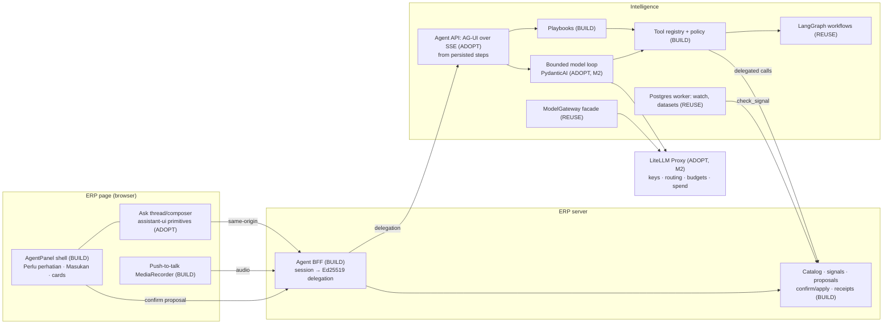

# Operating Substrate v1 — BUILD / REUSE / ADOPT Evaluation

Date: 2026-09-26
Companion to [doc 15](15-operating-substrate-assessment-and-next-increment.md). Also relies on [doc 13](13-celerates-agent-audit-and-recommendation.md) and [ADR-003](adr/ADR-003-model-gateway-litellm.md) / [ADR-004](adr/ADR-004-langgraph-workflows.md).
Status: **recommendation for review. No dependency has been added.** External facts were checked against vendor documentation on 2026-09-26 (sources in §7). Each adoption is gated by a timeboxed spike (§5).

Candidates evaluated:
- `assistant-ui`
- CopilotKit
- the AG-UI protocol
- LiveKit
- PydanticAI
- the repository's existing LangGraph (`1.2.12`) and LiteLLM (`1.102.0`)

Repository context: ERP runs Next `15.5.24`, React `19.2`, Tailwind 4 and NextAuth 4. Intelligence runs FastAPI, Pydantic 2.13 and a Postgres-backed worker.

---

## 0. Verdict

| Candidate | Decision | One-line reason |
| --- | --- | --- |
| **AG-UI protocol** | **ADOPT** (wire format only) | Open event vocabulary for runs, tool calls, state and interrupts. It keeps the panel, BFF and agent engine independently replaceable, and both PydanticAI and LangGraph already speak it. |
| **assistant-ui** | **ADOPT, spike-gated** (UI primitives only) | MIT, headless React primitives for the Ask thread/composer, with a tool-UI registry for evidence and proposal cards. We keep our own shell, state and storage. Its hosted cloud is not used. |
| **PydanticAI** | **ADOPT, spike-gated, from M2** (model loop only) | Typed tools, dependency injection, structured-output validation, deterministic test models, an AG-UI adapter and a LiteLLM provider. It fits a Pydantic/FastAPI codebase. It is not our tool registry, not our playbook engine, and **its approval mechanism is never ERP authority**. |
| **LangGraph** (existing) | **REUSE, narrowed** | Keep for durable, multi-day, human-paused workflows (Pre-Sales). Do not use it for the interactive agent loop, playbooks, outcome watch or imports. |
| **LiteLLM SDK** (existing) | **REUSE** | Remains the gateway implementation for completion, embedding and transcription behind `ModelGateway` aliases. |
| **LiteLLM Proxy** | **ADOPT when real providers are enabled** (M2 eval track) | One place for provider keys, alias routing, fallbacks, budgets and spend. PydanticAI and transcription both target it. This revises doc 15's "optional" note. |
| **CopilotKit** | **DO NOT ADOPT now** | Its recommended Node runtime would sit where our ERP BFF must mint delegation. Its frontend-action model pulls authority toward the browser. Release cadence and managed-feature direction add churn. We take its protocol (AG-UI), not its stack. |
| **LiveKit** | **DEFER** | A WebRTC SFU plus voice-agent framework. Push-to-talk followed by one transcription needs neither rooms nor streaming turn detection. Reconsider for full-duplex spoken conversation or telephony. |

The recurring theme: **adopt protocols and narrow libraries; build the domain and the authority; reject anything that moves authority, state or transport out of ERP/Intelligence.**

---

## 1. Evaluation criteria (from docs 13 and 15)

Every candidate is judged against the substrate's non-negotiables, not general popularity.

| # | Criterion | Why it matters here |
| --- | --- | --- |
| C1 | **ERP-held authority.** Confirmation of a write is an ERP record the user confirms, never a client-supplied resume payload. | A framework's human-in-the-loop "approval" must not become the thing that authorizes an ERP write. PydanticAI's own tracker states the risk: approvals over UI adapters are reconstructed from client-submitted resume data, with no server proof the pause was real (issue #6452, open). |
| C2 | **Useful with no model.** Playbooks run deterministically. | Production is `MODEL_MODE=demo`. A framework must not force every interaction through an LLM loop. |
| C3 | **State in our Postgres.** Runs, steps, proposals, receipts. | Evaluation, audit and the Console read them. No mandatory vendor cloud. |
| C4 | **Same-origin transport via the ERP BFF.** | The browser never holds an Intelligence credential. The BFF mints the ERP delegation. |
| C5 | **Not chat-first.** The panel is mostly structured cards: signals, evidence, proposals, receipts. | A chat-shaped framework that owns the whole panel would regress `Perlu perhatian` and `Masukan`. |
| C6 | **Portable deployment** (Railway today, VPS later), small ops footprint. | One small team; the MinIO image incident shows how pinned third-party images become release blockers. |
| C7 | **Fits the stack**: Next 15 / React 19 / Tailwind 4; FastAPI / Pydantic 2. | Avoid parallel abstractions (e.g. LangChain chat models alongside LiteLLM). |
| C8 | **Exit cost is low.** | Anything adopted sits behind our own interface or a standard protocol. |

---

## 2. Candidate assessments

### 2.1 AG-UI protocol — ADOPT as the event format

**What it gives:** a standard event stream:
- run lifecycle (`RunStarted`, `RunFinished`, `RunError`);
- text messages;
- tool calls;
- state snapshots/deltas;
- message snapshots;
- custom events.

It also defines interrupts: a run ends with an `interrupt` outcome, and a new run on the same thread resumes it.

**Fit:**
- Maps directly onto doc 13's persisted step log.
- Works over SSE, so it passes through the Next BFF and nginx (with `X-Accel-Buffering: no`).
- Consumed by assistant-ui and CopilotKit; produced by PydanticAI and the LangGraph integration.

**How we use it:**
- **Persist first, stream second.** Intelligence writes steps to `agent_steps`, and the AG-UI stream is rendered from that log. `Last-Event-ID` resume and Console replay use the same data.
- **Custom events** for Celerates semantics: `celerates.evidence` (with evidence type), `celerates.signal`, `celerates.proposal` (ERP proposal ID only), `celerates.receipt`.
- **Interrupts are presentation, not authority.** A pending ERP proposal may be surfaced as an interrupt so the UI shows a confirm card. Confirmation still goes to the ERP `confirm` endpoint with the stored digest. **No AG-UI resume payload is ever accepted as approval** (C1).

**Exit cost:** low. It is a documented event schema; our step log stays canonical.

### 2.2 assistant-ui — ADOPT the primitives, spike-gated

**What it gives:**
- MIT-licensed React primitives: thread, message, composer (with attachments), tool-call rendering and a tool-UI registry.
- Runtimes for AG-UI, LangGraph, AI SDK and others, plus an `ExternalStoreRuntime` that leaves state with the app.
- Its hosted *assistant-cloud* (thread persistence, paid tiers) is optional.

**Fit:**
- Solves the unglamorous parts we would otherwise build: streaming message rendering, composer keyboard/attachment handling for Journey B drops, auto-scroll and accessibility.
- The tool-UI registry maps cleanly to our evidence badges, proposal cards and receipt cards.

**Boundaries:**
- Used **only inside the Ask area** of our own `AgentPanel`. The launcher, context chip, `Perlu perhatian`, `Masukan`, proposal and receipt flows remain our components (C5).
- Runtime: `ExternalStoreRuntime` over our run store, or its AG-UI runtime if the spike shows it handles our custom events. **No assistant-cloud** (C3).
- Lazy-load the panel bundle so ERP pages that never open the Agent pay nothing.

**Risks:** another fast-moving dependency in a Next 15 app. The AG-UI runtime's maturity is not labelled either way in its docs, and its interrupt handling is not documented. **Exit cost:** medium-low. Our cards are ordinary React components; only thread/composer wiring would be rewritten.

**Fallback if the spike fails:** build the composer and message list ourselves. This is about 1–1.5 extra engineering weeks in M1–M2.

### 2.3 CopilotKit — do not adopt now

**What it gives:** a full frontend-agent stack (React/Angular SDKs, chat components, generative UI, shared state, frontend actions), a **Copilot Runtime** (Node server endpoint) recommended between the UI and agents, and AG-UI, which it created.

**Why not now:**
- **C4:** the Copilot Runtime is "the recommended way" and provides auth/middleware/routing. Our ERP BFF must own exactly that layer: session → delegation, origin checks, per-user limits. Running both duplicates the security boundary. Running CopilotKit without its runtime goes against its own production guidance.
- **C1:** its signature pattern lets the agent invoke **frontend actions** registered by the page. Our design keeps every ERP effect in the server-side tool registry and ERP-held proposals. Browser-side actions would be a second, weaker write path to police.
- **C5/C6:** opinionated sidebar/popup components and shared-state model would own more of the panel than we want. Release cadence is high (1.69.0 → 1.70.0 within about ten days), and releases reference managed/entitlement features, signalling the commercial direction.

**What we keep:** AG-UI. Because we speak its protocol, adopting CopilotKit later is additive rather than a rewrite.

**Revisit if:** we need generative UI across several host apps (Angular, Teams/Slack channels), or its runtime can sit behind our BFF without owning auth.

### 2.4 LiveKit — defer

**What it gives:** an Apache-2.0 WebRTC SFU (Go), an Agents framework (Python/Node) with STT/LLM/TTS pipelines and turn detection, client SDKs, and LiveKit Cloud/Inference.

**Why not now:**
- Doc 15's voice design is **push-to-talk → one transcription → editable transcript → the same run**. That is a request/response upload, not a real-time media session. Rooms, SFU routing, turn detection and TTS solve problems we deliberately excluded: always-on listening, spoken replies, barge-in.
- **C6:** it adds a media server (or a LiveKit Cloud dependency) and real-time networking (UDP/TURN) to a stack that is otherwise HTTP-only on Railway, plus a Python agent worker process.
- LiteLLM already exposes provider-neutral transcription, so STT choice stays in the Model Gateway.

**Revisit if:** the product wants conversational voice (full duplex, spoken answers), mobile field workers, or telephony. At that point LiveKit is the leading open option, and our run/tool/authority model stays unchanged beneath it.

### 2.5 PydanticAI — ADOPT for the model loop, from M2

**What it gives:**
- Typed agents and tools on Pydantic models, dependency injection, structured and validated output, retries;
- deterministic `TestModel`/`FunctionModel` for tests;
- deferred/approval-required tools;
- an AG-UI adapter (`AGUIAdapter` for FastAPI/Starlette);
- a `LiteLLMProvider` for a LiteLLM proxy.

**Fit:**
- **C7:** the Intelligence service is already FastAPI + Pydantic. Tool schemas we define for the registry become PydanticAI tools without a second schema language. LangGraph's prebuilt agents would instead pull in LangChain chat-model abstractions: `langchain-core` is only a transitive dependency today and nothing in `cdi/` imports it.
- **C2:** deterministic test models let CI exercise the loop without a provider, and playbooks call the same tool functions directly with no agent involved.
- **Deps injection** carries the principal, delegation and ERP client into tools without globals. This matters for the authority rule.

**Boundaries (non-negotiable):**
- **Our registry stays the source of truth** for tool metadata: risk class, required module/level, field sensitivity, resource types, output caps. A small adapter exposes the allowed subset to PydanticAI per run (user ∩ allowlist ∩ context). Playbooks never go through PydanticAI.
- **Do not use `requires_approval` / deferred-tool approvals for ERP writes** (C1). The agent's only write-shaped tool is `propose_commands`. It creates an ERP-held proposal (no effect) and returns its ID. Confirmation and execution happen in ERP outside the agent run. PydanticAI's approval-provenance gap (#6452) then does not apply to ERP authority.
- **Bounded loop:** max tool calls, wall clock and output tokens set per run; the loop runs in the API process as doc 13 describes.
- **Do not adopt its durable-execution integrations** (Temporal/DBOS/Restate) now. Interactive runs are short; long work already has the Postgres worker and LangGraph.
- Prefer the `pydantic-ai-slim` distribution with only the providers we use.

**Exit cost:** medium-low. Tools and playbooks are ours; the loop is replaceable behind `AgentEngine.run(...)`.

### 2.6 LangGraph (existing) — REUSE, with a narrower scope

- **Keep** for what ADR-004 intended: stateful, checkpointed, human-paused workflows that span sessions or days. Pre-Sales ingest → analyze → review → close-loop is the model example, and its Postgres checkpointer is already in production.
- **Don't use** for the interactive agent loop: its prebuilt agent would bring LangChain model wrappers beside LiteLLM, and our loop is short and bounded.
- **Don't use** for playbooks (plain Python is clearer and testable).
- **Don't use** for outcome watch or dataset imports: the existing Postgres queue/lease worker is simpler, already operated, and each step is short.
- The Agent **starts** LangGraph workflows through a `start_workflow` tool and reads their status. An `ag-ui-langgraph` integration exists if a workbench later wants to stream a graph into the panel.

### 2.7 LiteLLM (existing SDK) and LiteLLM Proxy

- **SDK — REUSE** inside `ModelGateway` for demo/local and for `embed`/`transcribe` until the proxy exists. Keep the facade: product code asks for aliases (`agent-reasoning`, `agent-summary`, `embedding-multilingual`, `transcribe-id`), never provider model names (ADR-003).
- **Proxy — ADOPT when the model-evaluation track starts.** It becomes the single egress to providers:
  - keys live only in the proxy;
  - alias routing and fallbacks are configuration;
  - budgets and rate limits per alias/team;
  - spend and latency logs feed the Console "Models" page.

  PydanticAI (`LiteLLMProvider`), `ModelGateway` and transcription all call it. `infra/litellm/config.yaml` already exists as a starting point.
- **Hardening:** replace the floating `ghcr.io/berriai/litellm:main-stable` tag in `infra/docker-compose.yml` with a pinned version and digest; run the proxy on the private network only; keep the SDK lockfile pinned.

---

## 3. BUILD / REUSE / ADOPT matrix by substrate component

Legend: **BUILD** = our code (domain or authority). **REUSE** = already in the repository. **ADOPT** = new external dependency or protocol. **DEFER / REJECT** as stated.

| Substrate component (doc 15 §3) | Decision | With | Notes |
| --- | --- | --- | --- |
| Agent panel shell: launcher, context chip, suggested actions | **BUILD** | ERP Tailwind components | Replaces Bantuan; lazy-loaded |
| `Perlu perhatian` group rendering | **REUSE** | `AttentionGroup`, `operations/reader.ts` | Unchanged output; adds *Tanyakan* / *Tindak lanjuti* |
| `Masukan` (Feature Request path) | **REUSE + BUILD** | `ContextualFeedback`, `createFeatureRequest` | Adds 5-intent routing around it |
| Ask thread, composer, streaming messages, attachments | **ADOPT** | assistant-ui primitives | Spike S1; no assistant-cloud |
| Evidence / proposal / receipt / signal cards | **BUILD** | as assistant-ui tool UIs or plain components | Evidence-type badges are ours |
| Panel ↔ BFF ↔ Intelligence event stream | **ADOPT** | AG-UI over SSE | Custom `celerates.*` events; interrupts are display-only |
| ERP BFF + delegation issuer | **BUILD** | Node `crypto` Ed25519, NextAuth session | No Copilot Runtime |
| Delegation verification (Intelligence) | **BUILD** | `cryptography` (new small dependency) | ADR-008 |
| Entity Catalog, federated search/read/neighbours | **BUILD** | ERP TS + Postgres (`pg_trgm`, `unaccent`) | ADR-009 |
| Signals + `check` mode | **REUSE + BUILD** | existing rules | |
| ERP-held command-batch proposals, confirm/apply, receipts | **BUILD** | existing contract mechanics pattern | ADR-010; never framework approvals |
| Import validate/apply (catalog-driven) | **BUILD** | ERP | ADR-011 |
| Tool registry and policy (risk, module, sensitivity) | **BUILD** | Pydantic models | Source of truth; adapted to PydanticAI |
| Deterministic playbooks | **BUILD** | plain Python over registry tools | Model-free by design |
| Model-driven bounded loop | **ADOPT** (M2) | PydanticAI (`pydantic-ai-slim`) | Spike S3 |
| Long-running human-paused workflows | **REUSE** | LangGraph + Postgres checkpointer | Pre-Sales today |
| Outcome watch, dataset profiling jobs | **REUSE** | Postgres queue/lease worker | No Temporal/DBOS |
| Subject-generic context | **REUSE + BUILD** | extend `context.py` | |
| Search/retrieval: FTS, pgvector, RRF, multilingual | **REUSE + BUILD** | Postgres | No vector DB, no retrieval framework |
| Dataset profiling and mapping | **REUSE + BUILD** | `openpyxl`, `csv`, object storage | Heuristics first; model assist via registry |
| Model Gateway facade and aliases | **REUSE** | `gateway.py` + LiteLLM SDK | Adds `complete()`, `transcribe()`, mode split |
| Provider egress, keys, budgets, spend | **ADOPT** (M2) | LiteLLM Proxy, pinned | Revises doc 15 §6 |
| Push-to-talk capture | **BUILD** | `MediaRecorder` in panel → BFF upload | Voice never confirms |
| Transcription | **REUSE** | LiteLLM transcription via gateway alias | Provider chosen by Spike S4 |
| Real-time conversational voice | **DEFER** | LiveKit when needed | |
| Run/step store, Console traces | **BUILD** | Intelligence Postgres + `apps/web` | Optional OTel export later |
| Evaluation harness | **BUILD** | pytest + PydanticAI test models + recorded scenarios | Pydantic Evals can be considered after S3 |
| Brain Console UI | **REUSE + BUILD** | existing Vite app, nginx | No chat framework needed |
| Full-stack copilot framework | **REJECT for now** | CopilotKit | Revisit triggers in §2.3 |

---

## 4. Target stack in one picture

---

## 5. Spikes that gate each adoption

Each spike is timeboxed, runs on synthetic data, and has explicit exit criteria. A failed spike means **BUILD** for that component, not a looser standard.

| Spike | When | Timebox | Pass criteria |
| --- | --- | --- | --- |
| **S1** assistant-ui in ERP | start of M1 | 2 days | Builds under Next 15.5 / React 19.2 / Tailwind 4; runs with `ExternalStoreRuntime` over our run store; renders one evidence card and one proposal card as tool UIs; composer accepts a file drop and exposes a mic slot; keyboard/screen-reader pass; panel lazy-loaded with no measurable change to ERP page first load |
| **S2** AG-UI through BFF and nginx | M1 | 1 day | Python emits AG-UI events from persisted steps; Next route handler proxies SSE; reconnect resumes by `Last-Event-ID`; `celerates.*` custom events render; a forged "resume/approve" payload has no effect on ERP |
| **S3** PydanticAI over the registry | M2 eval track | 3 days | Registry adapter exposes only permitted tools per principal/context; deps carry principal and ERP client; `TestModel` CI passes; runs against two providers through LiteLLM Proxy; Indonesian eval subset runs; code review confirms no ERP mutation path inside the agent other than `propose_commands` |
| **S4** Speech | M2 | 2 days | ~50 recorded Indonesian operational utterances; two transcription providers via the gateway; word and entity error rate and latency recorded; audio discarded after transcription; transcript editable before run |
| **S5** LiteLLM Proxy hardening | M2 | 1 day | Pinned image and digest; private network only; per-alias budgets; spend visible to the Console; provider keys absent from API/worker environments |

---

## 6. Guardrails for any adopted dependency

- **Protocol over platform:** prefer libraries that speak AG-UI/OpenAPI and keep state with us.
- **No authority in third-party code:** approvals, proposals, receipts and delegation are ours. Framework HITL features may drive UI, never ERP writes.
- **No mandatory SaaS:** assistant-cloud, Copilot Cloud, LiveKit Cloud/Inference and Logfire stay optional and unused in v1.
- **Pin and review:** exact versions in lockfiles, image digests, and an upgrade PR with the spike tests re-run. The floating `main-stable` LiteLLM tag is fixed as part of S5.
- **Exit test:** each adoption lists what would be rewritten if removed. If the answer includes tools, playbooks, proposals or the run store, the adoption boundary is wrong.

---

## 7. Sources consulted (2026-09-26)

- AG-UI interrupts: https://docs.ag-ui.com/concepts/interrupts
- assistant-ui runtimes: https://www.assistant-ui.com/docs/runtimes/pick-a-runtime ; AG-UI runtime: https://www.assistant-ui.com/docs/runtimes/ag-ui/overview ; licensing and cloud tiers: https://www.assistant-ui.com/pricing
- CopilotKit Copilot Runtime: https://docs.copilotkit.ai/ms-agent-python/copilot-runtime ; releases: https://github.com/CopilotKit/CopilotKit/releases
- LiveKit repository/licence: https://github.com/livekit/livekit ; STT in Agents: https://docs.livekit.io/agents/models/stt/
- PydanticAI deferred tools: https://pydantic.dev/docs/ai/tools-toolsets/deferred-tools/ ; AG-UI integration: https://pydantic.dev/docs/ai/integrations/ui/ag-ui/ ; OpenAI-compatible and LiteLLM providers: https://pydantic.dev/docs/ai/models/openai/ ; approval provenance issue: https://github.com/pydantic/pydantic-ai/issues/6452
- LangGraph AG-UI integration: https://pypi.org/project/ag-ui-langgraph/
- LiteLLM transcription: https://docs.litellm.ai/docs/audio_transcription
