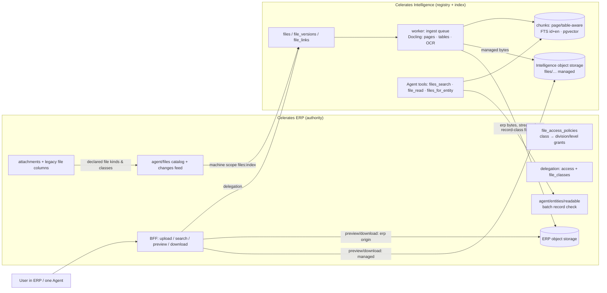

# Company Files — substrate audit and architecture recommendation (M6)

Status: **proposal for review, not implemented.** Date: 2026-09-27. Baseline: M5 (deployed).
Inputs:
- the North Star (docs [14](14-celerates-enterprise-intelligence-operating-model.md)–[16](16-operating-substrate-build-reuse-adopt.md));
- the M5 sequencing, in which M6 = Company Files, M7 = Insight Agent and M8 = operational shell;
- a read-only audit of `apps/erp`, `services/intelligence-api`, the migrations, the Dockerfile and the lockfile.

Proposed decision: **ADR-018 — Company Files registry** (§9). It is to be written only when M6 starts.

---

## 0. The recommendation in one page

Build **a governed file registry in Intelligence that indexes files wherever their bytes are owned**. It is not another upload box.

- **One registry and three origins.** The registry holds identity, versions, entity links, access class and derived text for every file. The bytes stay with the system that owns them:
  - `managed`: Celerates uploads to Company Files. The bytes live in Intelligence object storage.
  - `erp`: existing ERP attachments and file columns (CVs, PKS/PO/CR, BAST, …). The bytes stay in ERP storage, and ERP authorizes every read.
  - `external`: Drive or URL links. M6 stores the reference only; no content is fetched until F06.
- **Keep the S3 abstraction** (MinIO / S3-compatible) as the blob store on both sides.
  - Add `head`, streaming/range reads and a no-overwrite put.
  - Keep downloads **proxied and authorized per request**. Presigned URLs are an opt-in for large previews only, issued after authorization.
- **Access = ERP authority ∩ file access class ∩ linked-record visibility ∩ tool purpose.**
  - Classes are a small, fixed vocabulary of *risk*: `general`, `division`, `commercial`, `personal`, `identity`.
  - *Who* may read a class is **data in ERP** (Owner-editable grants), carried in the delegation. It is not hard-coded roles.
  - A class can be tightened automatically, but loosened only by a person.
- **One extraction pipeline.** The production image **already contains Docling 2.129 with RapidOCR, TableFormer and docling-core chunking**. They are simply switched off (`do_ocr=False, do_table_structure=False`, flat markdown).
  - M6 turns them on in the worker, keeps page provenance, and writes page- and table-aware chunks into the **existing `chunks` table** (extended). Lexical FTS, pgvector, RRF and `cdi.reembed` all keep working.
  - The duplicate pypdf/XML parser behind Agent drops is folded into the same extractor as its fast path.
- **Content of model-hidden classes never enters an Agent run.** For `commercial` and `personal` by default, the Agent finds and points to files, and the user opens them through an authorized preview. Snippets never enter events, model turns or the ledger. This keeps the M1 invariant "commercial values never leave ERP" true for files.
- **No new service is justified now.**
  - Justified later, on evidence: Tesseract `ind` (only if RapidOCR fails an Indonesian OCR spike), ClamAV (once files are shared beyond Owners), an HNSW index (at chunk volume), and a separate worker service built from the same image (if OCR contends for memory).
- **M6 = registry + ingestion + authorized search/read/preview.** M7 = structured file facts, entity-resolution suggestions, file ↔ ERP insights and CV matching.

---

## 1. Audit: what exists, and what it means for Company Files

### 1.1 Blob storage

| | ERP (`apps/erp`) | Intelligence (`services/intelligence-api`) |
| --- | --- | --- |
| Client | `src/lib/object-store.ts`, AWS SDK v3, path-style | `cdi/storage.py`, boto3; `FileStorage` for CI |
| Buckets | `{S3_BUCKET_PREFIX}-candidate-documents` for **every** module (CVs, KTP, BAST, selfies, signatures, LMS, timesheets); `-automation-documents` for templates and generated contracts | one bucket, `intelligence`: `documents/…`, `knowledge/{source}/{version}/{sha}/…`, `agent-datasets/…` |
| Put | `IfNoneMatch:*` (no overwrite), 20 MB | overwrites allowed; `ensure()` HeadBucket on every put; 10 MB |
| Read | buffered, 20 MB cap | buffered; no stream, range, head, list or presign |
| Download | `/api/documents?bucket=&path=`: **Owner check only**, no link to any record; inline, CSP sandbox | `/api/documents/{id}/download`: checks the knowledge scope or ERP opportunity; attachment; octet-stream |
| Deletion / retention | **none**; deleting a row orphans the object | agent datasets purged after 30 d; nothing else |
| Environment | MinIO locally; S3-compatible Supabase Storage in the pilot (doc `erp-audit/06`) | MinIO (ADR-005); filesystem in CI |

**Conclusion.** Both sides already speak S3, and both keep objects private and proxy downloads. The abstraction is sufficient. What is missing is capability, not a new store:
- streaming and range reads (preview of large PDFs);
- `head` (etag/size for change detection);
- no-overwrite put on the Intelligence side;
- a deletion/retention path.

**ERP's download route is the largest existing gap.** It authorizes by "is Owner", not by "can read the record this object belongs to". That is acceptable in the Owner-only pilot, but it must be fixed before files become searchable across roles (§6).

### 1.2 Where company files already are (ERP)

- The generic polymorphic `attachments` table has `(source_type, source_id, kind file|link, file_name, file_path, link_url, uploaded_by_name, created_at)`. It stores **no** mime type, size, hash, version or uploader id.
- Its `source_type`s span every risk level:
  - `candidate_cv_asli`, `application_cv_celerates`: CVs;
  - `project_doc_pks|po|cr|other`, `opportunity_po_doc|pq_doc`, `invoice_bast_doc`: commercial;
  - `onboarding_{ktp,npwp,kk,bpjs_*,diploma,…}`: identity;
  - `signature_request_document`, `timesheet_submission|export`, `school_lesson_*`, `feature_request`, `kanban_task`, …
- Legacy single columns hold **either an S3 key or a pasted URL**, with no marker of which:
  - `candidates.cv_asli_url`;
  - `applications.cv_asli_url|cv_celerates_url`;
  - `project_documents.pks_url|po_url|cr_url|other_doc_url`;
  - `project_invoices.bast_support_doc_url`;
  - `finance_document_handoffs.doc_url`;
  - the onboarding `*_file_path` columns;
  - `attendance_logs.check_*_photo_path`;
  - `signatures.image_path`.
- Generated documents: `automation_generated_documents` (contracts/offerings merged with decrypted PII).
- **There are no** proposal, SOP or manpower-sheet entities, no contract-file table, and no employee-document table.
- Google Sheet Sync is disabled. OAuth tokens are stored in plaintext (F06), and there is no Drive API.

**Conclusion.** Most "company files" that matter today (CVs, PKS/PO/CR, BAST) **already exist as ERP attachments**. A Company Files feature that ignored them would start empty and would create a second copy of truth. SOPs, proposals and manpower sheets have **no home** in ERP. Some are governed knowledge in Intelligence (SOPs); the rest live in people's drives.

### 1.3 Parsing and retrieval (Intelligence)

- **There are two parsers.**
  - `cdi/documents.py` (knowledge, opportunity evidence): Docling with **OCR off and table structure off**, exported to flat markdown, so page numbers are lost. It chunks by fixed 1,200-character windows.
  - `cdi/agent/documents.py` (Agent drops): pypdf page-aware extraction, a hand-rolled DOCX XML parser, paragraph packing, and refusal of scanned PDFs. Its lexical search is computed on the fly over `rows jsonb`, with no embeddings.
- **The image already has what page/table/OCR-aware ingestion needs.**
  - `Dockerfile` installs `docling==2.129.0` (CPU torch).
  - The lock resolves `docling-slim[standard]`: `rapidocr`, `docling-ibm-models` (layout + TableFormer), `docling-parse`, `pypdfium2`, `python-docx`, `python-pptx`, `docling-core[chunking]`.
  - There are no OCR system binaries, and none are needed for RapidOCR.
  - Model weights download **at first use**. That must move to image build time.
- **`chunks`** has `(id, document_id FK NOT NULL, ordinal, text, embedding vector (no dimension), embedding_model, search english, search_multi id+en+simple)`, with GIN indexes. There are **no page, heading, block-kind or metadata columns, and no ANN index**.
- **Retrieval**
  - `knowledge.search_for_principal` has access filters *before* ranking (lifecycle, classification, scope), lexical admission, RRF with the vector rank only for semantic models, and best chunk per source. Relevance set: 9/9.
  - `knowledge.retrieve` still uses an additive score. That inconsistency should be removed when touched.
  - `cdi.reembed` migrates chunks between embedding models.
- **Queues.** There is no generic job table. Knowledge ingestion is an implicit queue (`documents.state='REGISTERED'` plus a global advisory lock, one at a time). A failure stays `FAILED` until manual retry, with no attempts or backoff.

**Conclusion.** Reuse the `chunks` table, the multilingual FTS, the embedding/RRF/reembed machinery and Docling. The work is to **turn on and preserve** what Docling already produces (pages, tables, OCR) and to add a real ingestion queue. No new retrieval technology is needed.

### 1.4 Identity and authorization

- ERP authority: `users.is_owner`, `account_type backoffice|talent`, and `user_access(division, level viewer|editor|full)`.
- **There is no record-level authorization** beyond per-user tables. PIC columns are free text. The pilot is Owner-only in middleware.
- The Agent catalog has field sensitivity `internal | commercial (presence only) | pii | restricted (withheld)`. It applies to Agent reads only.
- The delegation (Ed25519, 300 s) carries `sub, owner, access[{division, level}], ctx`. ERP re-loads the actor on every contract call and does not trust the claims.
- In Intelligence, `DelegatedPrincipal.divisions` comes from the access list, and `restricted = owner`. Knowledge uses `classification internal|restricted` × `scope company|division|opportunity`.

**Conclusion.** Divisions × level plus Owner is the whole authority model today. File access must compose with it, and not invent roles. The "linked record" dimension should be decided by ERP (it owns records), in the same way ERP already decides entity reads.

---

## 2. Target architecture



**Ownership rules**

- **The registry lives in Intelligence** because it is an index plus metadata. It is not operational truth, and the knowledge governance, parsers, retrieval and worker already live there. AGENTS §2–3 are respected: files are indexed for search, but ERP records are not copied.
- **Bytes are owned by their origin.**
  - `erp`-origin bytes are never copied into Intelligence. They are streamed through ERP only for extraction, and at the user's request.
  - `managed` bytes live in Intelligence storage under immutable keys.
- **Access policy is authored in ERP** (the authorization authority) and enforced at both ends:
  - Intelligence pre-filters search.
  - ERP authorizes every `erp`-origin byte read and every record check.

---

## 3. Minimum schema (Intelligence migration `009_company_files.sql`)

```sql
-- One logical file. Identity, class and origin; never business truth about the linked records.
CREATE TABLE files(
  id text PRIMARY KEY,
  origin text NOT NULL CHECK (origin IN ('managed','erp','external')),
  origin_ref text,               -- erp: 'attachment:<uuid>' | 'column:<table>.<col>:<row uuid>'; external: URL / drive id
  kind text NOT NULL,            -- from the ERP-declared kind catalog (cv, contract, proposal, sop, bast, manpower, po, …)
  title text NOT NULL,
  access_class text NOT NULL CHECK (access_class IN ('general','division','commercial','personal','identity')),
  owner_division text,           -- required for 'division'; optional otherwise
  state text NOT NULL DEFAULT 'active' CHECK (state IN ('pending_review','active','withdrawn')),
  hold text,                     -- legal/retention hold note; blocks purge
  current_version int,
  knowledge_source_id text REFERENCES knowledge_sources(id),  -- set when promoted to governed knowledge
  created_by text NOT NULL,      -- principal sub, or 'erp' for declared files
  created_at timestamptz NOT NULL DEFAULT now(),
  withdrawn_at timestamptz,
  UNIQUE (origin, origin_ref)
);

-- Immutable versions. Managed: our object key. ERP/external: the origin's etag/size/hash as seen at extraction.
CREATE TABLE file_versions(
  file_id text NOT NULL REFERENCES files(id) ON DELETE CASCADE,
  version int NOT NULL,
  name text NOT NULL,
  media_type text NOT NULL,      -- sniffed from bytes, not trusted from the client
  size_bytes bigint NOT NULL,
  sha256 text NOT NULL,
  object_key text,               -- managed only: files/{file_id}/{version}/{sha256}/{name}
  origin_etag text,
  uploaded_by text NOT NULL,
  created_at timestamptz NOT NULL DEFAULT now(),
  -- ingestion (a real queue: lease + attempts, SKIP LOCKED)
  ingest_state text NOT NULL DEFAULT 'queued'
    CHECK (ingest_state IN ('queued','running','indexed','metadata_only','failed')),
  attempts int NOT NULL DEFAULT 0,
  lease_until timestamptz,
  error text,
  parser text, pages int, ocr_pages int, tables int,
  flags jsonb NOT NULL DEFAULT '{}',   -- e.g. {"pii": ["nik"], "scanned": true}; never the matched values
  extracted jsonb NOT NULL DEFAULT '{}', -- deterministic metadata (dates, record numbers); inference kept separate in M7
  PRIMARY KEY (file_id, version),
  UNIQUE (file_id, sha256)
);
CREATE INDEX file_versions_queue ON file_versions(created_at) WHERE ingest_state IN ('queued','failed');

-- Links to ERP records. 'erp_declared' links are facts from ERP; 'user' links were confirmed by a person;
-- 'extracted' links are suggestions (M7) and are never used for authorization.
CREATE TABLE file_links(
  file_id text NOT NULL REFERENCES files(id) ON DELETE CASCADE,
  entity_type text NOT NULL,
  entity_id text NOT NULL,
  basis text NOT NULL CHECK (basis IN ('erp_declared','user','extracted')),
  created_by text NOT NULL,
  created_at timestamptz NOT NULL DEFAULT now(),
  PRIMARY KEY (file_id, entity_type, entity_id)
);
CREATE INDEX file_links_entity ON file_links(entity_type, entity_id);

-- Who opened or downloaded what (content access), for personal/commercial accountability.
CREATE TABLE file_access_log(
  id bigint GENERATED ALWAYS AS IDENTITY PRIMARY KEY,
  file_id text NOT NULL, version int, principal_sub text NOT NULL,
  action text NOT NULL CHECK (action IN ('preview','download','agent_read')),
  via text NOT NULL,             -- 'erp_ui' | 'agent'
  at timestamptz NOT NULL DEFAULT now()
);

-- Reuse the existing chunk store: page/table-aware, same FTS + embeddings + reembed.
ALTER TABLE chunks ALTER COLUMN document_id DROP NOT NULL;
ALTER TABLE chunks ADD COLUMN file_id text, ADD COLUMN file_version int,
  ADD COLUMN page_from int, ADD COLUMN page_to int, ADD COLUMN heading text,
  ADD COLUMN block text NOT NULL DEFAULT 'text' CHECK (block IN ('text','table','ocr')),
  ADD CONSTRAINT chunks_one_owner CHECK ((document_id IS NULL) <> (file_id IS NULL)),
  ADD CONSTRAINT chunks_file_fk FOREIGN KEY (file_id, file_version)
      REFERENCES file_versions(file_id, version) ON DELETE CASCADE;
CREATE INDEX chunks_file ON chunks(file_id, file_version);
```

**Why this shape**

- **Reuse `chunks`.** Knowledge retrieval joins through `document_id`, so file chunks can never leak into `knowledge_search`. File chunks, meanwhile, get the multilingual FTS, embeddings, `reembed` and the relevance tooling for free.
  - Knowledge documents also gain `page_from/heading/block` once they move to the shared extractor.
- **A file is not knowledge.** Promotion to knowledge (SOPs) creates a `knowledge_sources` row whose version points at the **same object key**, with no copy, and goes through the existing curator approval. Knowledge stays the *authoritative guidance* layer; files are the registry.
- **Agent drops stay ephemeral** (`agent_datasets`, 30 days). **Simpan ke Company Files** turns a drop into a managed file after the user picks kind and class. The drop's table profile and mapping (ADR-011) remain the import path.
- **Deliberately absent in M6:**
  - typed "file facts" (contract value, parties, periods, manpower rows): M7;
  - an entity-graph table (links are enough; doc 15 §2.5);
  - per-file ACL lists (access derives from class + division + links);
  - folders (kind + links + search replace them).

**ERP additions (migration `0008`)**
- `file_access_policies(access_class, division_key NULL, min_level, model_visibility none|excerpt|full, indexing none|lexical|semantic, updated_by, updated_at)`: the grants and handling for each class. Default rows are seeded and the Owner edits them in ERP settings.
- `attachments` gains `uploaded_by_user_id`, `media_type`, `size_bytes` and `sha256` (nullable; filled for new uploads).

---

## 4. Access model

### 4.1 Classes: risk levels, not roles

| Class | Examples | Default grant (data in ERP, editable) | Indexing | Model sees | Preview / download |
| --- | --- | --- | --- | --- | --- |
| `general` | SOP, policy, templates, admin forms | any active backoffice user | lexical + semantic | full | yes |
| `division` | proposals (non-priced), manpower sheets, internal reports | read on `owner_division` | lexical + semantic | full | yes |
| `commercial` | PKS/contract, PO, CR, BAST, invoices, priced proposals | can read **a linked ERP record**, or `owner_division` editor when unlinked | lexical; semantic only if the embedding provider is approved for this class | **none** (default) | yes, logged |
| `personal` | CVs, appraisals, offering letters | can read a linked record **and** holds a `personal` grant (e.g. TA or HR editor) | lexical; semantic per policy | **none** (default) | yes, logged |
| `identity` | KTP, NPWP, KK, BPJS, bank docs, selfies, signatures | **not in Company Files** | none | none | ERP record screens only |

**Composition** for a principal *u*, file *f* and purpose *p*:

```
visible(u, f) = f.state = 'active'
              ∧ class_grant(u.access, f.access_class, f.owner_division)      -- ERP policy, carried in the delegation
              ∧ (f.access_class ∉ {commercial, personal} ∨ ∃ link ∈ f.links(basis ≠ 'extracted'): erp_can_read(u, link))
content_to_model(f) = policy(f.access_class).model_visibility ≠ 'none'       -- for p = agent
```

**How the terms are evaluated**

- **`class_grant`** is computed by ERP when it mints the delegation. A new claim, `files: {classes: {general: true, division: [...], commercial: [...], personal: [...]}}`, is derived from `file_access_policies × user_access`.
  - Intelligence turns it into a SQL pre-filter **before ranking**, like the existing knowledge `authorized` CTE.
  - Owners get every class except `identity`.
- **`erp_can_read`** is decided by ERP. A new delegated endpoint, `POST agent/entities/readable`, takes `{items:[{type,id}]}` and returns the readable subset.
  - Intelligence over-fetches (k×3), batch-checks the linked records of `commercial`/`personal` hits once per call, and drops the rest.
  - Counts are never reported for dropped hits.
- **Extracted links never grant access.** Only ERP-declared or person-confirmed links do.
- **Classification can tighten automatically but only loosen by a person.**
  - Kind → default class is declared by ERP.
  - An uploader may choose a stricter class. A looser one needs a class-policy editor (an Owner in the pilot).
  - The deterministic PII scan (NIK 16 digits, NPWP pattern, bank-account phrases, `KARTU TANDA PENDUDUK`) moves a `general`/`division` version to `pending_review`. It is then visible only to the uploader and curators until reclassified or withdrawn. **A model never sets or loosens a class.**
- **Model-hidden content never enters a run.** For classes with `model_visibility = none`:
  - tool results, AG-UI events, model turns and the evidence ledger carry only `file_id, title, kind, class, linked records, page numbers, matched fields`;
  - the user reads the content through the authorized preview.
  - This also keeps it out of the Brain Console trace, whose curators may lack the class grant.

### 4.2 Machine access, for indexing ERP-origin files

- The indexer has no user, so it uses a **new machine scope `files:index`** on the existing integration credentials pattern (`INTELLIGENCE_*_TOKEN`, audience/environment headers).
- ERP decides what is indexable. The kind catalog marks `indexable` per source type, and `identity` kinds are never offered.
- User-facing reads of `erp`-origin bytes (preview, download, "tanya file ini") always go **through ERP under the user's delegation**. The machine scope is never used to serve a user.

### 4.3 Fixes to existing ERP paths (part of M6, not optional)

- `/api/documents?bucket=&path=` must resolve the path to its `attachments` row (or declared legacy column) and apply the same class and record rules. The Owner-only check is the current stop-gap.
- Deleting an attachment must tombstone it in the changes feed. Object purge follows the retention policy (§7.4) instead of orphaning.

---

## 5. Extraction: Docling, page/table/OCR-aware

**One extractor** (`cdi/extract.py`) replaces both parsers and returns a normalized structure:

```
Extracted = {pages:[{no, blocks:[{kind: heading|text|table|ocr, text, rows?: [[cell]], heading_path}]}],
             parser, ocr_pages, tables, scanned, headings, chars}
```

| Input | Path |
| --- | --- |
| TXT/MD/CSV | UTF-8 (existing), one page |
| PDF with a text layer | **fast path**: pypdf per page (existing code). Docling runs only when table structure is wanted (`kind ∈ {contract, bast, manpower, proposal}`) or the text is sparse |
| PDF with no or sparse text layer | Docling `PdfPipelineOptions(do_ocr=True, do_table_structure=True)` with RapidOCR (already installed); full-page OCR only for pages without a text layer |
| DOCX / PPTX | Docling (already installed: `python-docx`, `python-pptx`); page = section/slide |
| XLSX | openpyxl (existing): each sheet is a page, rows become `table` blocks with the header repeated; structured rows are kept for M7 |
| Images (JPG/PNG) of documents | Docling image pipeline with OCR, **only** for `managed` uploads of non-identity kinds |

**Pages, tables and chunks**
- Page provenance comes from `DoclingDocument` items (`prov[0].page_no`), not from exported markdown.
- Tables become one `table` block per table: a markdown grid, with header rows repeated when a table is split.
- **Chunking** reuses the Agent's paragraph packer (≈900 characters, never across pages, headings carried in `heading`) over Docling blocks.
  - `docling-core`'s HybridChunker is available, but it needs a Hugging Face tokenizer download. The packer is deterministic and already tested.

**Operational requirements**
- **Pre-bake Docling models in the image**: layout, TableFormer and RapidOCR weights (`docling-tools models download …`, with `DOCLING_ARTIFACTS_PATH`), so the worker never downloads at runtime.
- **Worker queue.** `file_versions` rows are claimed with `FOR UPDATE SKIP LOCKED`, a 10-minute lease with heartbeat, and 3 attempts with backoff. Then the row is `failed`, with a curator retry in the Brain Console. This replaces the "one at a time forever, manual retry" knowledge pattern, which should move onto the same claim loop later.
- **Limits:** 20 MB (matching ERP), 300 pages, OCR on at most 50 pages per version, a per-version timeout, and a memory ceiling watched in the spike.
- **Agent drops keep the synchronous fast path.** A scanned drop no longer gets "OCR belum didukung". It gets "sedang dibaca (OCR)…", and the run resumes when the worker finishes.

**OCR language: a spike, not an assumption**
- RapidOCR ships PP-OCR Latin/English models, which are good on printed Latin script but untested on Indonesian scans.
- **Spike:** 10 real, non-identity scanned samples (BAST, SPK, stamped letters). Compare RapidOCR against Tesseract `ind` through Docling's `TesseractCliOcrOptions`. Tesseract would add `apt: tesseract-ocr tesseract-ocr-ind`, about 30 MB.
- Adopt Tesseract only if character accuracy or layout is materially better.

**Retrieval changes**
- `files_search` follows the `search_for_principal` shape: an authorized CTE (class grants + division + state), lexical admission on `search_multi`, RRF with the vector rank for semantic models, and best chunk per file.
- Metadata filters: kind, linked entity, date range, origin.
- The relevance set gains a files suite: synthetic CV, PKS, BAST (scanned), SOP and manpower sheet, with ID/EN queries including "kontrak Astra berakhir", "CV Java senior" and "BAST Maret".
- Remove the additive-score path in `knowledge.retrieve` while this code is being touched.
- **An HNSW index waits for volume.** `embedding` has no fixed dimension, so an index must be a partial expression index per model: `(embedding::vector(1024)) WHERE embedding_model = …`. Add it when file chunks exceed about 50k.

---

## 6. Agent tools and surfaces

**Tools** (registry risk classes stay `read` / `propose`; no tool changes class, shares, deletes or downloads)

| Tool | Risk | Returns | Guard |
| --- | --- | --- | --- |
| `files_search(query, kinds?, entity?, since?, until?)` | read | hits with `file_id, title, kind, class, origin, linked records, page, match` and a **snippet only if `model_visibility ≠ none`** | class pre-filter; ERP record check for commercial/personal |
| `file_read(file_id, query?, pages?)` | read | page-cited passages as D-evidence (`file:{id}@v{n}#p{page}`) | same as above; refused (metadata only) for model-hidden classes; logged `agent_read` |
| `files_for_entity(entity_type, entity_id)` | read | files linked to a record, including ERP attachments | ERP entity read + class |
| `file_link_propose(file_id, entity)` | propose | Intelligence-held draft (ADR-017 pattern); the user confirms | confirmed links become `basis=user` |
| `file_save_draft(dataset_id, kind, class)` | propose | turns a drop into a managed file draft; the user confirms class | class tighten/loosen rule |

**Planner and fallback**
- The planner may call `files_search`, `file_read` and `files_for_entity`.
- The deterministic router sends "cari/berkas/dokumen/file/kontrak/CV/BAST/SOP…" questions to `files_search`, grouped by kind.
- An attached Company File works like an attached drop: questions search it, and answers cite pages.

**Surfaces, all in the one ERP shell**
- **The one Agent:**
  - "Cari kontrak Astra yang berakhir tahun ini";
  - "tanya file ini";
  - "simpan ke Company Files";
  - file cards with a class badge, page and **Buka**.
- **ERP `/files` (Company Files explorer):**
  - search, filters (kind, class, linked record, origin, date), preview (PDF/images inline and sandboxed; Office as extracted text), versions, links, upload and **Jadikan pengetahuan**.
  - It lives in ERP, not the Intelligence web: it is an operational surface, and it inherits ERP sessions, delegation and the future PWA.
- **Record pages:** a **Berkas** panel listing linked files, including ERP attachments.
- **Brain Console** (curators): ingestion queue and failures, OCR stats, `pending_review` PII holds, access log, class-policy view (read-only; policy is edited in ERP).

---

## 7. Coexistence of origins

| | `managed` | `erp` | `external` |
| --- | --- | --- | --- |
| System of record for bytes | Intelligence storage | ERP storage | the external system |
| Created by | upload in `/files`, the Agent's "simpan", promotion from a drop | ERP-declared file kinds, via the changes feed | a link added by a user (URL / Drive link) |
| Versions | new upload → new version (sha dedupe) | origin etag/size change → new version | none in M6 |
| Class | chosen by the uploader (default from kind) | declared by ERP from `source_type` | chosen by the user |
| Links | user-confirmed | ERP-declared (`source_type/source_id`, FK columns) | user-confirmed |
| Content indexed | yes, per class policy | yes, per class policy (never `identity`) | **no** in M6: title/URL/links only; "import a copy" makes it `managed` with `source_url` provenance |
| Delete / withdraw | withdraw → hidden now, purged after retention unless `hold` | an ERP delete becomes a tombstone in the feed → chunks removed at the next sync (≤ 15 min) | remove the link |
| Read path | Intelligence proxy via ERP BFF (delegation) | ERP proxy (ERP authorizes) | opens the external URL |

### 7.1 Invariant

**A derived index never outlives the source's access.**
- Every `erp`-origin read re-checks in ERP.
- Tombstones remove chunks.
- A withdrawn managed file disappears from search immediately.

### 7.2 Legacy mixed columns

ERP's catalog view normalizes them:
- a value that parses as an allowed S3 key becomes `erp` origin;
- an `http(s)` value becomes `external`;
- anything else is ignored and reported to the Brain Console as an unrecognized reference.

### 7.3 Connectors (Drive/Sheets)

These wait for F06: encrypted tokens, read-only scope. They then feed the same `external` → `managed`-copy or `external`-indexed path.

### 7.4 Retention

- Class policy carries `retention_days` for withdrawn versions.
- A `hold` on the file blocks purge (e.g. contracts under dispute).
- Purge deletes the object (managed) and the chunks. The registry row is kept as a tombstone, for the audit log.

---

## 8. What goes in M6, and what waits for M7

### M6 — Company Files v1 (registry, ingestion, authorized find/read/preview)

1. **Schema:**
   - Intelligence `009` (files, versions, links, access log, `chunks` extension);
   - ERP `0008` (`file_access_policies`, `attachments` metadata).
2. **ERP contract and policy:**
   - kind catalog (`source_type` → kind, default class, entity type, indexable);
   - changes feed with tombstones (`files:index` machine scope);
   - streamed content endpoint;
   - `agent/entities/readable`;
   - `files` claim in the delegation;
   - class-policy settings page (Owner);
   - **record-level authorization on `/api/documents`**.
3. **Storage:** `head`, streaming/range read and no-overwrite put in `cdi/storage.py`; `files/{id}/{version}/{sha}/{name}` keys; magic-byte sniffing for the allowlist (PDF, OOXML, PNG/JPEG, CSV/TXT).
4. **Extraction:** the shared extractor (pypdf fast path + Docling with OCR/tables/pages); pre-baked models; lease/attempt queue in the worker; the PII hold scan.
5. **Search and tools:** `files_search`, `file_read`, `files_for_entity`, `file_link_propose`, `file_save_draft`; deterministic routing; page-cited file evidence; model-hidden content kept out of runs.
6. **Surfaces:** ERP `/files` explorer; record **Berkas** panel; Agent file cards, **Buka**, "tanya file ini", "simpan ke Company Files"; Brain Console ingestion/holds/access log.
7. **Initial indexed kinds:**
   - ERP: CVs (`candidate_cv_asli`, `application_cv_celerates`, `candidates.cv_asli_url`), `project_doc_pks|po|cr|other`, `opportunity_po_doc|pq_doc`, `invoice_bast_doc`, `project_invoices.bast_support_doc_url`;
   - managed: SOP, proposal, manpower, admin.
   - Not indexed: onboarding identity documents, selfies, signatures, timesheet exports, LMS media, feature-request and task attachments (all can be added later by declaring them in ERP).
8. **Evaluation:**
   - the files relevance suite;
   - access tests per class: grant, no grant, linked-record denial, `pending_review`, tombstone, model-hidden content absent from events and turns;
   - the OCR spike result recorded.

**Acceptance for every M6 journey:**
- `Perlu perhatian`, Masukan, proposals and imports do not regress;
- deterministic mode finds and opens files without a model;
- no `identity` file reaches the registry;
- no model-hidden content appears in any `agent_steps` or `agent_model_turns` row.

### M7 — Insight Agent on files

- **Typed file facts** (inference until confirmed): contract parties, value, start/end, notice period; BAST period and scope; manpower rows (role × qty × level × date); CV skills, years and employers.
- **Entity-resolution suggestions** from content: client names and record numbers become `extracted` links, which a person confirms to `user`.
- **File ↔ ERP comparisons as stored insights with a lifecycle:** TOR/manpower vs requisitions, a contract end date vs a project's status, BAST vs invoice periods.
- **CV ↔ requisition matching**, limited to `personal`-granted users, with explainable criteria.
- **Near-duplicate and version detection** across origins.
- **Model classification suggestions.** These can only tighten a class, as a suggestion.

### Later (M8+)

Drive/Sheets connectors after F06, ClamAV, a dedicated OCR worker service, HNSW, retention/hold UI, e-sign stamping, multi-role rollout of `/files`.

---

## 9. Library and service evaluation

| Candidate | Verdict | Reason |
| --- | --- | --- |
| MinIO / S3-compatible via boto3 and AWS SDK | **Keep** | Both apps already use it; private objects; proxied downloads; immutable keys. Only interface gaps (head, stream, range, no-overwrite). |
| Docling 2.129 (+ RapidOCR, TableFormer, docling-core) | **Keep; turn on** | Already in the production image; covers pages, tables, OCR, DOCX and PPTX. Weights must be pre-baked. |
| pypdf, openpyxl | **Keep** | Fast path for text PDFs and XLSX; already in use and tested. |
| PostgreSQL FTS (id+en+simple) + pgvector + RRF | **Keep** | Relevance set 9/9; access filters in SQL before ranking; pilot scale fits. |
| Tesseract (`ind`) | **Conditional** | Only if the OCR spike shows RapidOCR inadequate for Indonesian scans. One apt package; Docling already supports it. |
| ClamAV (clamd sidecar) | **Later (M8)** | Justified once files are shared beyond Owners or come from external parties. M6 mitigations: allowlist + magic bytes, sandboxed inline preview, Office never rendered in the browser. |
| HNSW index | **Later** | At about 50k file chunks, as a partial expression index per embedding model. |
| Separate OCR worker service | **Later, same image** | Only if OCR memory or latency contends with the existing worker. No new technology. |
| Elasticsearch / OpenSearch / Meilisearch, a separate vector DB, a graph DB | **Not justified** | Duplicate what PostgreSQL does at this scale. They would split access filtering from the source of truth. |
| Unstructured, Apache Tika, LangChain loaders | **Not justified** | Duplicate Docling and would add a third parser. |
| python-magic / libmagic | **Not justified** | A handful of allowlisted signatures are checked in code. |
| Airbyte | **No** | Excluded by the baseline (AGENTS §9). |

**Proposed ADR-018 — Company Files registry**, to be written at M6 start:
1. the registry in Intelligence over three origins, with bytes owned by their origin;
2. access classes with grants in ERP policy, carried in the delegation;
3. the ERP-decided linked-record check;
4. "model-hidden content never enters a run";
5. the shared extractor with pages, tables and OCR on Docling;
6. `chunks` reused, with file ownership.

It amends ADR-011 (a drop can be saved as a file) and keeps ADR-002, ADR-005 and ADR-007 unchanged.

---

## 10. End-to-end journeys (M6 acceptance)

1. **Find a contract** (commercial, ERP origin).
   - PMO asks the Agent "kontrak Astra yang berakhir tahun ini".
   - `files_search` pre-filters by the `commercial` grant, and ERP confirms the user can read the linked projects.
   - Result: PKS for project X (ERP attachment, hal. 3 matched "jangka waktu") and a CR.
   - The card shows title, kind, class, record and page, with **no snippet**, because the class is model-hidden by default.
   - **Buka** opens an ERP-authorized, logged preview at page 3.
   - With an Owner policy enabling `excerpt` for `commercial`, the same question returns a page-cited answer instead.
2. **Scanned BAST** (commercial, ERP origin, OCR).
   - PMO attaches a scanned BAST to an invoice in ERP.
   - The changes feed registers it, and the worker runs Docling OCR (3 pages) → `indexed`, `ocr_pages=3`.
   - "BAST Maret PT Synthetic" finds it within one sync interval.
   - Deleting the attachment removes it from search.
3. **SOP to knowledge** (general, managed).
   - A curator uploads the SOP in `/files` with kind SOP and class `general`. The PII scan is clean, and it is indexed with headings and pages.
   - **Jadikan pengetahuan** creates a knowledge draft on the same object key, which is approved in Knowledge.
   - The Agent now cites it both as approved knowledge and as a file.
4. **CV search** (personal, ERP origin).
   - A TA editor with the `personal` grant asks "CV Java senior pernah di Astra". Hits are lexical, restricted to CVs linked to candidates they can read, with no snippets to the model.
   - A Sales viewer asking the same gets "tidak ada berkas yang dapat Anda akses". No counts are shown and nothing appears in the trace.
5. **Manpower sheet** (division, managed, table).
   - Sales drops a client manpower XLSX and chooses **Simpan ke Company Files** → kind `manpower`, class `division` (sales).
   - Each sheet is indexed as table blocks.
   - The existing import path (ADR-011) still creates requisitions from it. The comparison with requisitions is M7.
6. **Mistaken identity document** (PII hold).
   - A user uploads a KTP scan as `general`. The scan finds a 16-digit NIK and holds the version in `pending_review`: invisible to others, and flagged in the Brain Console.
   - The uploader withdraws it; it is purged after retention.
   - `identity` kinds from ERP never enter the registry at all.
7. **External link** (external).
   - A user adds a Drive link to a client proposal and links it to an opportunity.
   - It is findable by title and link, with no content indexed.
   - **Import a copy** (the user uploads the file) turns it into a managed version with `source_url` provenance.

---

## 11. Decisions needed before M6 starts

1. **Default class grants.**
   - Who holds `personal` and `commercial` by default: which divisions, and at what level.
   - The Owner-only pilot makes this safe to start with Owners only, but the defaults should be decided now.
2. **`model_visibility` defaults for `commercial` and `personal`.**
   - The recommendation is `none` for both, which keeps "commercial values never leave ERP".
   - Enabling `excerpt` is a data-processing decision about the model provider (Cloudflare Workers AI).
3. **Semantic embeddings for `personal`/`commercial` text.** Embeddings are also sent to the provider. The recommendation is lexical-only until the provider is approved for these classes.
4. **ERP object storage in the pilot.** Confirm the bucket, encryption at rest, and backup for the S3-compatible ERP storage, and for Intelligence MinIO (ADR-005 volume) before indexing `personal` text. Derived chunks of CVs are personal data held in the Intelligence database.
5. **Retention defaults** per class for withdrawn files, and who may set a `hold`.
