# 18 — Mobile/PWA shell: three concrete directions

Date: 2026-09-27
Status: §1–§10 are the discussion record. **§11–§14 (2026-09-27, evening) are the verified ERP inventory, the revised mobile IA and the MS1 scope that is implemented.** The visual foundation is locked to Iteration 1 · Jernih.
Branch: `audit/erp-production-readiness`, after M6.x (`48a4105`).
Inputs:
- the product discussion of 2026-09-27 (summarised in §1);
- the exploration baseline, [mobile-operational-shell-baseline.md](exploration/mobile-operational-shell-baseline.md);
- the current ERP implementation, inspected in code and captured at phone width (§2).

Sequencing: the Insight Agent (M7) is **on hold**. The Mobile/PWA shell is the next increment once a direction is chosen.

## 1. What was agreed

**Pilot.**
- Users: Owner and management.
- The architecture is **role-aware from day one**:
  - visible modules = the user's authority;
  - visible content = record and data authority, enforced on the server;
  - no per-role Home yet.
- Multi-role use is on the near roadmap but does not block the pilot. Access-rule discovery runs in parallel (§7).

**Three mobile behaviours**, equally first-class:
1. **Go to a module fast by tapping**: Talent, PMO, Sales, Contract, Timesheet, BAST… as far as RBAC allows.
2. **Check, review and respond**: records, Agent proposals, follow-ups (*tindak lanjut*) and feedback drafts (*masukan*), with confirm, reject or follow up.
3. **Find, capture and ask**:
   - search records and Company Files;
   - upload or photograph documents;
   - ask the Agent (questions, voice, cross-module questions, controlled actions).

**UX constraints.**
- Home is an **operational app home**, not a chatbot.
- The module launcher is **prominent**.
- The Agent is **one integrated capability**, easy to reach, **not the Home hero**.
- Proactive attention (*Perlu perhatian*) does not have to be the top hero.
- Company Files is a module capability; its placement is open.
- Not locked: bottom navigation, module arrangement, card hierarchy, role personalisation.
- The baseline image in the repository is a reference, not the final IA.

## 2. The current ERP at phone width

Captured on 2026-09-27 at 390 × 844, logged in as the Owner, with the synthetic data of the integration harness. The files are in `exploration/evidence/mobile-shell/`.

| Home | TA · Requisition | Company Files | Agent |
|---|---|---|---|
| 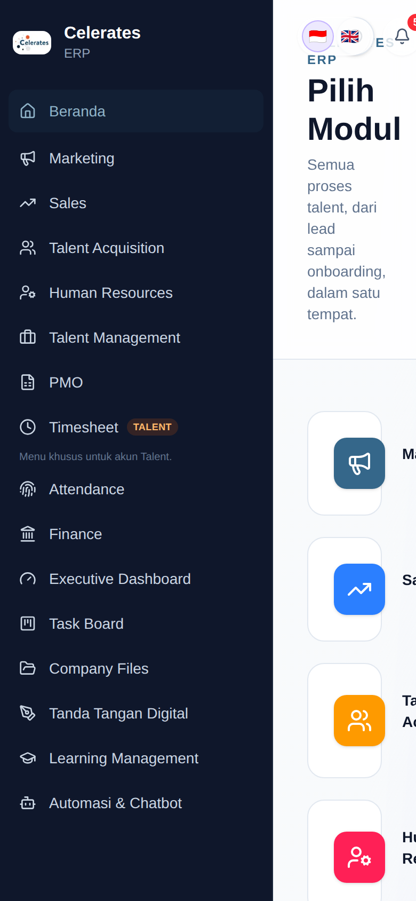 | 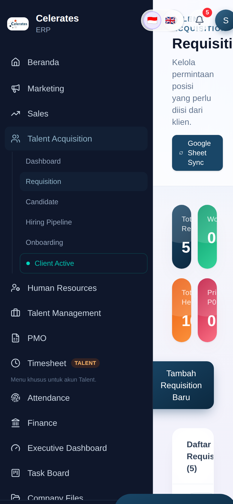 | 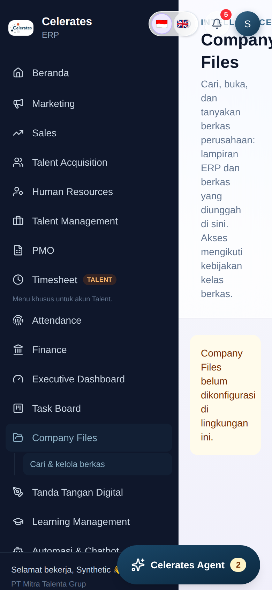 | 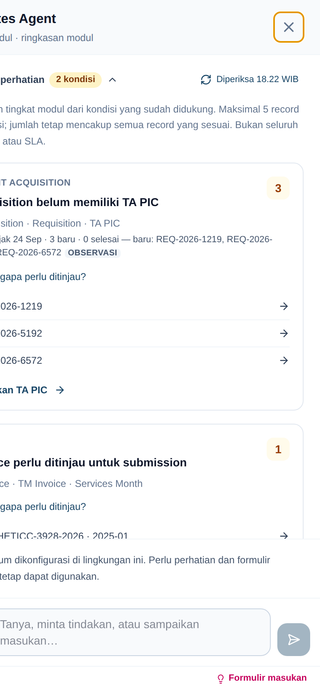 |

### Findings

1. **The shell is not responsive at all.**
   - `AppShell` always adds `ml-64` (`ml-16` when collapsed), and `Sidebar` is a fixed `w-64` panel at every width. That leaves about 134 px for content on a phone.
   - The document overflows horizontally: 463 px on Home, 420 px on Requisition, 397 px on Company Files.
   - The fixed top-right controls (activity log, language, bell, user menu) overlap the page headers.
   - This is the first thing any direction must fix.
2. **The Agent is already a full-screen phone surface** (M5, `sm:` breakpoints in `agent-panel.tsx`). But the page underneath overflows, so the mobile browser widens the layout viewport and the "full-screen" panel is clipped (fourth capture). It will be correct once the shell stops overflowing.
3. **Module visibility is computed in three places, and they disagree.**
   - `sidebar.tsx`: Talent accounts see only Timesheet and Attendance. Timesheet requires PMO *full*. Executive is Owner-only.
   - `app/page.tsx`: the same filters without the Talent rule, plus `DIVISION_GATED_MODULE_KEYS`, which shows locked cards.
   - `middleware.ts`: the whole app is Owner-only in the pilot.
   - Server pages enforce access separately (`require-division-access`, `DIVISION_PATHS`, `CROSS_DIVISION_PATHS`).
   - A role-aware mobile launcher needs **one** function for this, not a fourth copy.
4. **Module pages are desktop pages:** KPI tiles, wide tables and filter rows. There is no list → detail pattern that works on a phone. This is the largest piece of work in any direction, and it scales with how many modules are made mobile-ready.
5. **What already exists and can be reused as is:**

| Capability | Where |
|---|---|
| Actor-scoped record search, typo-tolerant (`pg_trgm`) | `lib/agent/reads.ts` `search()`; name resolution, ERP migration 0006 |
| Company Files search, open (logged), upload, and attachment → file | `/api/files/*`, M6 and M6.x |
| Notifications table and bell | `lib/notifications.ts`, `notification-bell.tsx` |
| Approval flows with a named approver per step | extension/increment (`approval-journey.ts`), time-off approval, TTD signature requests, PQ/contract setup |
| Agent proposals and feedback drafts, with confirm/reject | `/api/agent/proposals`, `/api/agent/submissions` |
| Perlu perhatian signals and follow-ups | `/api/operations/context`, the Agent brief |
| Push-to-talk voice | `components/agent/voice.tsx`, `/api/agent/transcribe` |

6. **Nothing PWA exists yet.** There is no web manifest, no service worker, no installable icons (only `logo-celerates.jpg` and a favicon), and no `theme-color`. The only metadata is the title `Celerates ERP`.

## 3. Foundation needed by every direction

These items are the same whichever direction is chosen. They are what makes the ERP usable on a phone at all.

**F1 — Responsive app frame.**
- Below `md`: no sidebar; a compact top bar plus the chosen mobile navigation.
- At `md` and above: today's sidebar, unchanged.
- The same routes and URLs on both, so a notification deep link works on either.
- The fixed corner controls move into the top bar and the account screen.

**F2 — One module-access function.**
- `moduleAccess(session)` returns, for each module, one of `hidden | read | full`, with the reason. It is built from the existing session claims: `isOwner`, `accountType`, `access[{divisionKey, level}]`, and the cross-division paths.
- The desktop sidebar, desktop Home, the mobile launcher and the Agent all use it.
- It decides **visibility only**. Record and data authority stay in the existing server guards and the record-level document route (ADR-018 decision 8).

**F3 — Mobile record pattern.**
- A list becomes cards with a key identifier, a status pill and one or two facts.
- A detail page shows ERP facts first, then linked Company Files, then activity.
- Actions sit in a bottom bar and show only what the user may do. **Tanya tentang ini** opens the Agent with the record as context.
- The pattern is applied module by module, starting with the pilot's first-class modules (§8).

**F4 — Capture.**
- Camera or file input always asks where the file goes:
  - **Company File**: persistent and governed; recommended for scans because it gets OCR;
  - **Agent attachment**: working context, which can be saved later through M6.x.
- No new storage path: this is M6 plus M6.x.

**F5 — PWA baseline.**
- Web manifest: name and short name, `display: standalone`, theme and background colours, 192/512 and maskable icons, apple-touch-icon.
- The service worker caches **the static shell only**. It bypasses every authenticated request: ERP responses, files and Agent streams are never cached, whatever their headers say.
- An offline fallback page.
- Install guidance: Android prompt; iOS via Share → Add to Home Screen.
- **Web push is later**, not the pilot. On iOS it works only for an installed PWA (16.4+).

**F6 — "Waiting for me" aggregation (*Tinjau*).**
- One ERP BFF read merges:
  - approval steps assigned to the user;
  - time-off and signature requests awaiting them;
  - their pending Agent proposals and feedback drafts;
  - unread notifications.
- Each item carries its source, record reference, deep link and allowed actions.
- Actions call the owning flow's existing server action or endpoint, so **no new authorisation path** is created.
- An inline decision is offered only where the owning flow already has a simple decision. Otherwise the item offers **Buka**.

## 4. Three directions

The directions differ in **information architecture**: what Home is, where each behaviour lives, and where the Agent sits. All of them sit on §3.

The wireframes are low fidelity, use synthetic data, and are not a visual system. Source: `exploration/mobile-shell/wireframes.html`; render with `node docs/exploration/mobile-shell/render-captures.mjs`.

### Direction A — Operational Home + tab bar

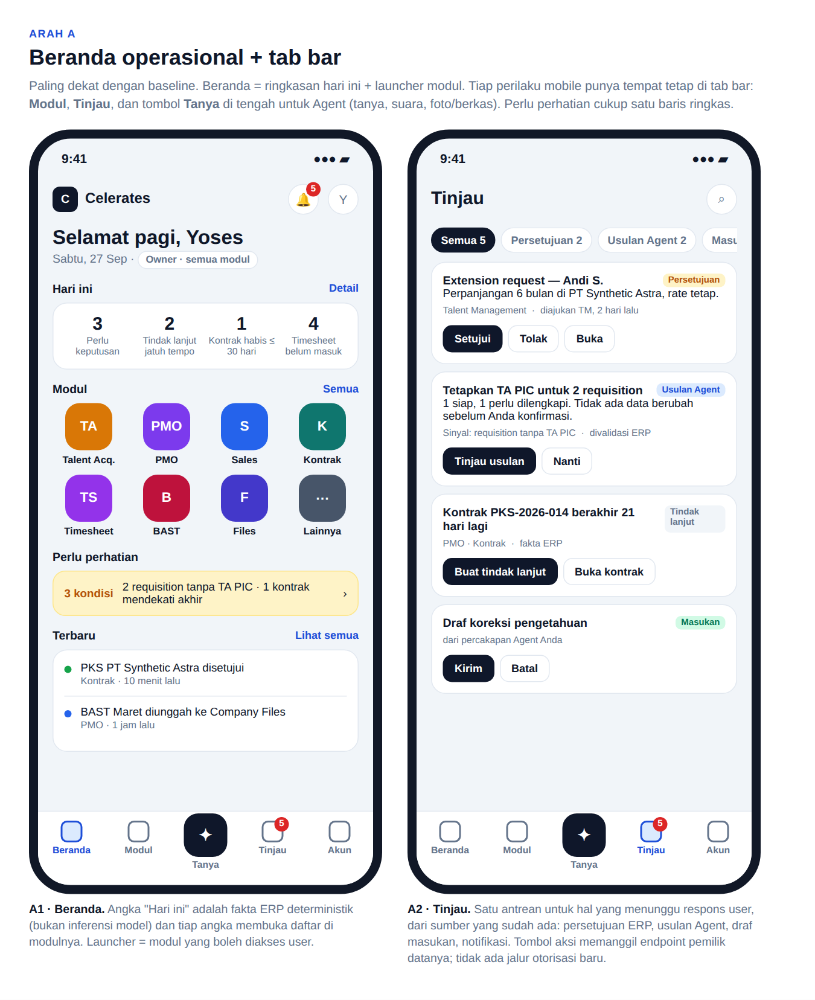

**Idea.** Closest to the baseline image.
- Home shows greeting and role, a "Hari ini" row of 3–4 deterministic ERP counts, the module launcher (8 slots, "Semua"), one compact Perlu perhatian row, and recent activity.
- Tab bar: **Beranda · Modul · Tanya (centre) · Tinjau · Akun**.

**Where the behaviours live.**
1. **Go to modules:** the Home launcher and the Modul tab.
2. **Review and respond:** the Tinjau tab (F6).
3. **Find, capture, ask:** split. Asking, voice and capture are under Tanya (the Agent). Search sits inside Modul or behind a top-bar icon.

**Strengths.**
- The most familiar enterprise-app pattern.
- Every behaviour has a permanent place.
- "Hari ini" gives management an at-a-glance view.

**Risks.**
- Five tabs lock the most navigation decisions.
- The centre Agent button tends to read as the hero, against the agreed constraint.
- **There are two places to type (search and Tanya).** M5 removed exactly this "where do I type" split inside the Agent.
- The "Hari ini" counts need per-role definitions early.

### Direction B — Launcher + one Find / Ask / Capture bar

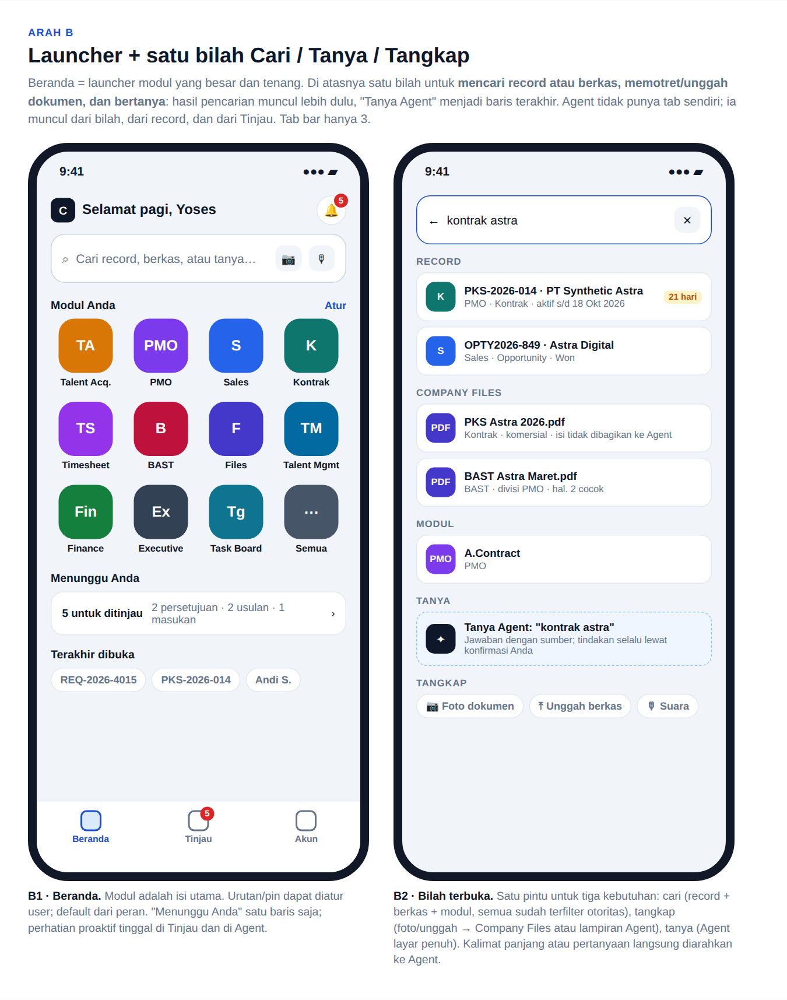

**Idea.**
- Home is the **module launcher** (12 slots, pinnable, with a role default). Above it sits **one bar** with a camera and a microphone.
- Typing shows results grouped as **Record · Company Files · Modul**, all already filtered by authority.
- The last row is always **Tanya Agent: "…"**. A long sentence or a question goes straight to the Agent.
- One "Menunggu Anda" row links to Tinjau.
- Tab bar: **Beranda · Tinjau · Akun**.

**Where the behaviours live.**
1. **Go to modules:** Home itself.
2. **Review and respond:** the Tinjau tab (F6).
3. **Find, capture, ask:** the bar, one entry point. The Agent also opens from **Tanya tentang ini** on a record and from Tinjau items.

**Strengths.**
- Satisfies every UX constraint literally: Home is operational, the launcher is the content, and the Agent is integrated with no tab and no hero.
- Extends the M5 "one surface, routing to capability" principle from the Agent to the whole app.
- Locks the fewest decisions, with three tabs.
- Reuses the existing actor-scoped record search and Company Files search.

**Risks.**
- The Agent is less visible for people who have never used it. Mitigations: the placeholder *atau tanya*, the microphone icon, and record entry points.
- The unified result list needs a small merge contract (records + files + modules) and fast search on phone networks.
- There are no at-a-glance numbers unless an optional row is added later.

### Direction C — Work-first: the response queue is Home

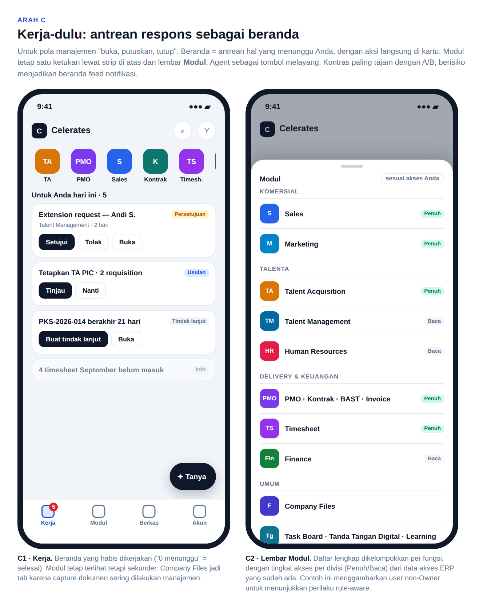

**Idea.**
- Home is the **Tinjau queue**, with inline actions and a "done when empty" feel.
- Modules are a horizontal strip plus a full **Modul** sheet grouped by function, with the access level (Penuh/Baca) shown.
- The Agent is a floating **Tanya** button. Company Files gets its own tab.
- Tab bar: **Kerja · Modul · Berkas · Akun**.

**Where the behaviours live.**
1. **Go to modules:** the strip and the sheet.
2. **Review and respond:** Home.
3. **Find, capture, ask:** the Berkas tab and the floating button.

**Strengths.**
- The fastest "open, decide, close" loop for management.
- The Modul sheet shows role-awareness explicitly.

**Risks.**
- Conflicts with "module launcher prominent" and "attention is not the hero".
- Home is nearly empty for users with little to approve, which is most roles once multi-role arrives.
- Drifts toward a notification feed.

Its **queue card design and the Modul sheet** are worth keeping as components inside A or B.

### What all three share (wireframe "Berlaku untuk semua arah")

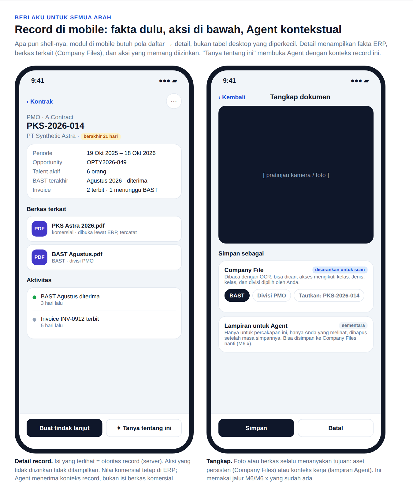

- The record detail pattern (F3).
- The capture sheet (F4).

## 5. Comparison

| | A · Home + tabs | B · Launcher + one bar | C · Work-first |
|---|---|---|---|
| Home is an operational app home | Yes | **Yes, the launcher is Home** | Partly (queue) |
| Launcher prominent | Yes | **Most** | Secondary |
| Agent integrated, not hero | Centre tab leans hero | **Yes (bar, record, Tinjau)** | Floating button |
| Attention not the hero | Yes (one row) | **Yes (one row)** | No, it is the hero |
| One place to type | No (search + Tanya) | **Yes** | No |
| Role-aware via F2 | Yes | Yes | Yes, most visible |
| Navigation decisions locked | 5 tabs | **3 tabs** | 4 tabs |
| New contracts beyond §3 | "Hari ini" definitions | Search merge | none |
| Closest to baseline image | **Yes** | Partly | No |

## 6. Recommendation

**Pilot Direction B, and borrow from the others:**
- from **C**: its queue cards and the grouped **Modul** sheet with access levels, used as B's Tinjau and "Semua";
- from **A**: an optional "Hari ini" row, added only if the Owner pilot asks for at-a-glance numbers.

**Why:**
- B is the only direction that meets every agreed constraint without exception.
- It keeps the M5 lesson of a single entry that routes to a capability.
- It commits to the fewest navigation decisions while multi-role access is still being discovered.

**What would change this:**
- Owners repeatedly look for a persistent Agent tab → move to A's tab bar. The foundation is the same, so this is a small change.
- Management mostly opens the app to approve → promote C's queue to Home.

**Validate before building screens.**
1. Put the wireframes into a clickable prototype.
2. Run six tasks with 2–3 Owner/management users:
   - open a contract;
   - approve an extension;
   - confirm an Agent proposal;
   - find a BAST scan;
   - photograph and save a document;
   - ask a cross-module question.
3. Measure time and misroutes (typing into the wrong place, looking in the wrong tab).

## 7. Parallel track: multi-role access discovery (not a blocker)

Pilot middleware stays Owner-only. F2 and F3 are built so that non-Owner users work the moment the middleware opens. What must be learnt in parallel:

1. **Role inventory.** Which job roles use mobile first: sales, TA, PMO, TM/HR, finance, management other than the Owner, talents.
2. **For each role:** its division access (`read`/`full`), cross-division paths, and which approvals it receives. Build this from `access_management` data and the approval flows, not from assumptions.
3. **Record-level gaps.** Where ERP today checks only division, not record ownership (see `docs/erp-audit`). This decides what a non-Owner may see in search results and in Tinjau.
4. **Talent accounts.** Today they see only Timesheet and Attendance. Is mobile their primary surface (self-service), and does that need a different Home later?
5. **Output:** an access matrix (role × module × level × record rule) reviewed by the Owner. It feeds F2 unchanged.

## 8. Decisions requested

1. The direction for the pilot: B (recommended), A or C.
2. The first-class modules for pilot mobile record views (F3). Proposed six, based on the discussion:
   - Talent (TA/TM);
   - PMO · Contract;
   - Sales · Opportunity;
   - Timesheet;
   - BAST;
   - Company Files, which is already mobile-shaped.
3. Whether the Owner pilot wants "Hari ini" numbers, and which three.
4. Whether the prototype test (§6) runs before implementation. Recommended.

## 9. Proposed slicing once a direction is chosen (for planning only)

1. **MS1 — Foundation:**
   - F1 responsive frame;
   - F2 `moduleAccess`, with desktop sidebar and Home migrated to it;
   - F5 PWA baseline;
   - the overflow fixes above, which also un-clip the Agent.
2. **MS2 — Home and the find/ask/capture entry** for the chosen direction, with F4 capture.
3. **MS3 — Tinjau:** the F6 aggregation and queue cards.
4. **MS4 — Mobile record views** for the modules agreed in §8.2, one at a time, each with its read-only list/detail first, then the actions it already has.

Each slice keeps the standing invariants:
- ERP is the authority, and the model never applies changes;
- deterministic mode works without models;
- Perlu perhatian and Masukan do not regress;
- unit, PostgreSQL, cross-stack and browser tests run at 390 px as well as desktop.

## Captures in this record

| File | What |
|---|---|
| `current-home-390.png`, `current-ta-requisition-390.png`, `current-company-files-390.png`, `current-agent-390.png` | The current ERP at 390 × 844 (§2) |
| `direction-a-app-home-tabs.png` | Direction A wireframes |
| `direction-b-launcher-universal-bar.png` | Direction B wireframes |
| `direction-c-work-queue-home.png` | Direction C wireframes |
| `common-record-and-capture.png` | Record detail and capture, common to all directions |

## 10. High-fidelity visual iterations (2026-09-27)

After the direction discussion there are three high-fidelity visual iterations. They build on the existing product and the baseline reference image, and they are meant for **mix-and-match** before implementation. They are visual exploration only: nothing here changes the app.

**The architecture is the same in all three.**
- Destinations: Beranda · Modul · Agent · Tinjau · Akun.
- Beranda has one bar for Cari / Tanya / Tangkap, the "Hari ini" deterministic ERP counts, the module launcher (filtered by access), one Perlu perhatian row, and recent activity.
- Records go list → detail: ERP facts come first, then linked Company Files, the allowed actions, and **Tanya Agent** with the record as context.
- The Agent is one conversation with evidence badges (Fakta ERP / Pengetahuan disetujui). A proposal needs the user's confirmation before anything changes.
- Capture always asks where the file goes: a Company File (OCR, access class) or an Agent attachment (temporary).

This follows the reference image's tab structure and adds Direction B's single find/ask/capture bar on Beranda.

**Seven screens per iteration:** Beranda, Modul (navigation), Kontrak list, Kontrak detail, Agent, Company Files, and Tangkap dokumen.

| Iteration | Look | Navigation and Agent entry |
|---|---|---|
| 1 · Jernih | Closest to the reference: light, blue accent, tinted module tiles, Plus Jakarta Sans | Standard tab bar with a raised Agent tab in the centre; camera capture with a bottom sheet |
| 2 · Tenang | Warm neutral ground, deep-teal accent, serif display (Fraunces) over DM Sans, launcher-first | Floating dark tab pill (4 destinations) plus a separate round Agent button; Agent opens as a modal with a floating composer; capture reviewed after the shot |
| 3 · Navy Pro | Dense and data-forward: navy header band, IBM Plex Sans/Mono, table-like lists | Tab bar with a top indicator and a centre Agent circle; dark Agent with numbered sources; multi-page capture |

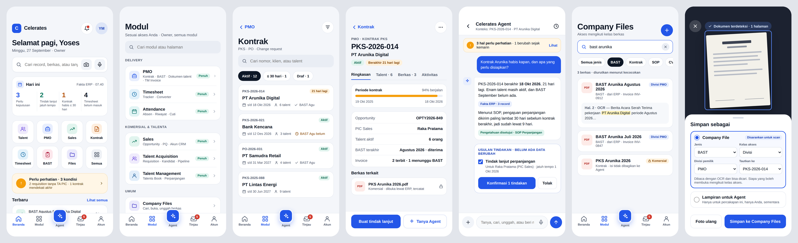
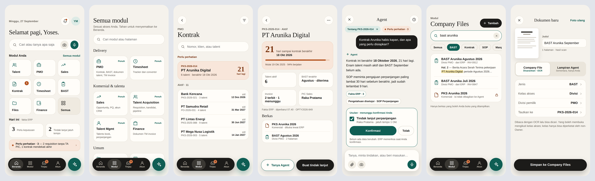
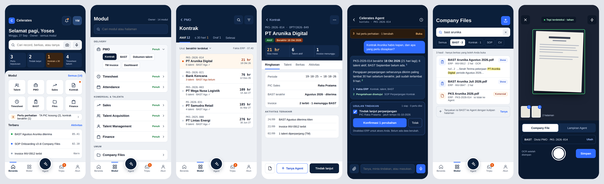

**Source.** `exploration/mobile-shell/hifi/`: one `.dc.html` per screen plus `canvas.json`. This is a copy of the design canvas; the live canvas is the editable version. All data is synthetic and the client names are fictional.

**Pick per element, not only per iteration.** For example:
- the Beranda structure from 1 and the list density from 3;
- the Agent's numbered sources from 3 and the Tangkap review from 2;
- the tab-bar treatment decided separately from the palette.

## 11. Verified ERP module inventory (2026-09-27)

§10 simplified the module set: "Talent", "Kontrak" and "BAST" were drawn as top-level tiles. **The ERP does not have those modules.** This section is the product model taken from the code as it is today.

Sources:
- `src/lib/modules-config.tsx` (registry);
- `src/components/sidebar.tsx` and `src/app/page.tsx` (visibility);
- `src/lib/require-*-access.ts`, `school-access.ts`, `division-map.ts` and `middleware.ts` (authority);
- every `page.tsx` and `actions.ts` under `src/app`;
- `src/db/schema.ts`;
- `src/lib/pq-approval.ts`, `approval-journey.ts` and `operations/*`.

### 11.1 Authority as implemented

- **Pilot gate.** `middleware.ts` admits active **Owners only**. Every non-Owner rule below is already in code, but it is not reachable until multi-role opens (§7).
- **Division access.** `user_access` rows `{divisionKey, level}` with level `viewer | editor | full` (`requireDivisionAccess`):
  - `viewer` reads only;
  - `editor` creates and updates;
  - `full` also deletes.
  - The Owner passes every check.
- **The actions are the authority.** Every mutating server action calls `requireDivisionAccess(<division>, level)` or a module-specific guard. The navigation only decides what is shown.
- **Account types.** `talent` accounts see only Timesheet and Attendance (self-service). `backoffice` accounts see the rest.
- **Special guards:**
  - Timesheet: talents act on their own records; backoffice needs PMO `full`. The converter needs PMO `full` or `canUseTimesheetConverter`.
  - Attendance: every active user checks in as themselves.
  - School: `editor`/`full` manage courses; `viewer` learns.
  - Executive Dashboard: Owner only.
  - Access Management and Intelligence Review: Owner only.
  - Company Files: ERP class policy (ADR-018).
- **Visibility was computed in four places before MS1:**
  - the sidebar;
  - desktop Home, with locked cards (`DIVISION_GATED_MODULE_KEYS`, which omits `automation` although its actions are division-gated);
  - `operations/policy.ts#canReadModule` for signals;
  - the pilot middleware.

  MS1 replaces the first two with one registry function (§14).

### 11.2 Seven core business modules

| Module (division) | Submodules / routes | Primary records | Primary intent | Key actions (server) | Mobile representation |
|---|---|---|---|---|---|
| **Marketing** (`marketing`) | Dashboard `/marketing/dashboard`; Leads `/marketing`, `/marketing/[id]/edit`; Account CRM (Sales-owned) | `leads` | Qualify leads and hand them to Sales | `createLead`, `updateLead`, `convertLeadToOpportunity`, `deleteLead`; sheet sync | Landing with the qualified-lead signal; lead list → detail; **Konversi ke Opportunity** as a sticky action |
| **Sales** (`sales`) | Dashboard; Opportunity Tracker `/sales/opportunity-tracker`; PQ Tracker `/sales`; Account CRM `/sales/accounts[/id]`; collab: Client Active (TA), Overtime & Business Trip (PMO), Profitability Tracker | `sales_opportunity_trackers`, `opportunities` (PQ), `crm_clients`, contacts, activities | Move opportunities, send the PQ for signature, keep accounts | `createOpportunityTracker`, `updateOptyStatus`, `convertToRequisition`, `updatePipelineStage`, `sendPqForSignature`, `createExtensionRequestFromSales`, CRM `createClient`/`createContact`/`createActivity` | Landing: pipeline summary and signals; opportunity list by stage (segmented); opportunity detail with a PQ status block; account detail with contacts and activity; **Kirim PQ untuk TTD**, **Konversi ke Requisition** |
| **Talent Acquisition** (`ta`) | Dashboard; Requisition `/ta`; Candidate `/ta/candidates[/id]`; Hiring Pipeline `/ta/pipeline`; Onboarding `/ta/onboarding`; collab: Client Active (TA+Sales) | `requisitions`, `candidates`, `applications`, `onboarding_requests` | Fill requisitions: candidates → pipeline → offer → employee | `createRequisition`, `createCandidate`, `createApplication`, `updateHiringStatus`, `sendOfferingLetterForSignature`, `promoteToEmployee`, `updateClientSubmissionStatus` | Landing with requisitions missing a TA PIC; requisition → candidates; pipeline as stage tabs (not a board) with **Pindahkan tahap** in a sheet; candidate detail (CV via Company Files); onboarding checklist |
| **Human Resources** (`hr`) | Dashboard; Employee `/hr`, `/hr/[id]`; Extension Request `/hr/extension-requests`; Attendance Log; Attendance Settings (leave types, approval steps); collab: Special Notes (TM-HR), Overtime & Business Trip | `employees`, `employment_contracts`, `bpjs_registrations`, `leave_types`, `attendance_approval_steps` | Keep employee records, acknowledge extensions, run attendance policy | `updateEmployee`, `addContract`, `updateBpjsStatus`, `processExtensionRequest`, leave types and approval-step admin | Employee list → detail (contract, BPJS); extension acknowledge as a review item; settings stay desktop |
| **Talent Management** (`tm`) | Dashboard; Talents Book `/tm`, `/tm/employee/[id]`; Talent Database & Salary; COGS Calculator; Extension & Increment Request; Special Notes (TM-HR); collab: Profitability | `talent_assignments`, `extension_increment_requests`, `extension_request_special_notes` | Place talents, extend or increment, track notes | `createTalentAssignment`, `createExtensionRequest`, `rejectExtensionRequest`, `ownerOverrideExtensionRequest`, `applyCogsToTalentAssignment`, `createSpecialNote` | Talent list → talent detail (assignment, client, period); **extension request = multi-step review** (approver 1–3 → HR acknowledge); COGS and salary stay desktop |
| **PMO** (`pmo`) | Dashboard; A.Contract `/pmo/contracts` (+ billing schedule); Talent Document Tracker `/pmo`; TM Invoice `/pmo/invoices`; collab: Dokumen Finance, Overtime & Business Trip, Profitability | `project_contracts`, `project_monthly_billings`, `project_invoices` (with **BAST support document**), `project_documents`, `finance_document_handoffs`, `overtime_business_trip_claims` | Contract setup, billing → invoice → finance handoff, talent documents, claims | `createProjectContract`, `syncBillingScheduleToInvoices`, `createProjectInvoice`, `upsertFinanceHandoff`, `createProjectDocument`, claims `createClaim` → `forwardToSales` → `submitToFinance` → `markInvoiced` | **The densest module.** Landing with four signals (invoice submission, missing invoices, ambiguous billing, missing documents); contract list → contract detail (billing months, invoices, documents); invoice detail with BAST and the finance-handoff state |
| **Finance** (`finance`) | Dokumen Finance (TM Invoice) `/finance`; collab: Overtime & Business Trip | `finance_document_handoffs` | Receive PMO documents; accept or send back | `acknowledgeFinanceHandoff`, `requestRevisionFinanceHandoff` | Review queue (handoffs awaiting finance) → detail → **Terima** / **Minta revisi** (sticky, with a note) |

### 11.3 Shared and operational modules

| Module | Visibility today | Records / key actions | Mobile representation |
|---|---|---|---|
| **Timesheet** `/timesheet`, converter | Talent (own) or PMO `full`; converter by flag | `timesheet_submissions` (`createTimesheetSubmission`, `approveTimesheetSubmission`), holidays, Astra converter | Talent: submit month (self-service). PMO: approval queue. Converter stays desktop |
| **Attendance** `/attendance`, live, history, time-off | Every user (self-service) | `attendance_logs` (`checkIn`/`checkOut`), `time_off_requests` → `approveTimeOffStep`/`rejectTimeOffStep` | Mobile-first: check-in, time-off request, approvals in Tinjau |
| **Executive Dashboard** | Owner | read-only KPIs | Landing-style summary only |
| **Task Board** `/tasks` | All backoffice | `kanban_tasks` (move, comment) | Status tabs + task detail; **Pindahkan** via sheet |
| **Company Files** `/files` | All backoffice; content by class policy | files registry (M6/M6.x) | Search → file detail/preview; **Tangkap** (camera/upload) |
| **Tanda Tangan Digital** `/ttd-online` | All (requests addressed to the user) | `signature_requests` (`signRequest`, `rejectRequest`); feeds PQ and offering letters | Signature queue → document → **Tanda tangani** / **Tolak** |
| **Learning Management** `/school` | Division `school` (viewer = learner) | courses, enrollments, progress, quizzes | My Learning + lesson reader |
| **Automasi & Chatbot** `/automation` | Division `automation` | reminders, document templates | Desktop only for now |
| **Feature Request** `/feature-requests` | Hidden from navigation; reached through Masukan (ADR-017) | `feature_requests` | Via the Agent only |
| Account areas (not modules) | Access Management and Intelligence Review (Owner), Profile, Activity Log, Notifications | — | Under **Akun** |

### 11.4 Cross-module journeys (verified in code)

1. **Lead → Opportunity → Requisition.** Marketing `convertLeadToOpportunity` → Sales tracker → `convertToRequisition` → TA requisition. The `opty_no` business key is shared.
2. **PQ signature → setup.** Sales `sendPqForSignature` → TTD `signRequest` → `onPqSigned`:
   - sets the approval date;
   - once an employee exists, notifies **TM** ("Talent siap di-setup") and **PMO** ("Project siap di-setup ke A.Contract").
3. **Hiring.** TA requisition → candidate → application (`updateHiringStatus`) → onboarding with the offering letter signed in TTD → `promoteToEmployee` (HR employee) → `onTalentPromoted` → TM Talents Book and PMO A.Contract setup.
4. **Client submission.** TA Client Active status is shared with Sales.
5. **Extension / increment.** TM (or Sales) creates the request → named approvers 1–3 → HR `processExtensionRequest` acknowledges. The Owner can override. TM and HR exchange Special Notes.
6. **Billing → Finance.** PMO billing schedule → monthly billing → `syncBillingScheduleToInvoices` → TM Invoice (BAST support document) → `upsertFinanceHandoff` → Finance `acknowledge` / `requestRevision` → PMO (the `finance-revision` signal).
7. **Overtime & business trip claims.** PMO `createClaim` → `forwardToSales` → `submitToFinance` → `markInvoiced`, plus talent payment.
8. **Profitability.** Sales Profitability Tracker, synced from TM assignments; the view is shared with PMO.
9. **Timesheet.** A talent submits → PMO `full` approves.
10. **Time off.** An employee requests → the steps HR configured → approve or reject each step → notifications.

### 11.5 Desktop pattern → mobile pattern

| Desktop pattern in the ERP | Mobile pattern |
|---|---|
| Module dashboard (KPI cards + charts) | **Module landing**: 3–4 facts, the module's Perlu perhatian signals, submodule entries. Charts later |
| Tracker tables (leads, trackers, PQ, requisitions, candidates, contracts, invoices, employees, talents) | **List cards**: identifier, title, status pill, two facts. Filters as chips, sort and filter in a **bottom sheet**. No shrunken tables |
| `[id]/edit` long forms | **Read-first record detail**: facts, related records, Company Files, activity. Quick edits and status changes in a **sheet**; long edit forms stay desktop until converted |
| Kanban boards (hiring pipeline, task board) | **Stage tabs + list**; move with a sheet |
| Multi-step approvals (extension request, time off, timesheet, finance handoff, TTD, PQ) | **Tinjau item → detail → sticky approve/reject** with a reason sheet |
| Admin and power tools (sheet sync, attendance settings, access management, COGS, converter, automation templates) | **Desktop only**: listed under the module as "di desktop" |
| Self-service (check-in, time-off request, timesheet submit, sign) | **Full-screen mobile-first flows** |

## 12. Revised mobile information architecture

This is traceable to §11. The Jernih visual language is unchanged.

- **Tab bar (locked):** Beranda · Modul · Agent · Tinjau · Akun.
  - **Agent** opens the existing full-screen Agent (M5/M6), taking context from the current route.
  - **Tinjau**, in MS1, is the user's existing notifications, which the approval flows already emit. In MS3 it becomes the F6 aggregation: approval steps assigned to me, TTD requests, finance handoffs, Agent proposals.
  - **Akun** is a sheet: profile, activity log, language, Access Management (Owner), logout.
- **Beranda:**
  - greeting and access summary;
  - the Cari / Tanya / Tangkap bar;
  - **Perlu perhatian**: the existing deterministic signals, RBAC-filtered (`/api/operations/context`);
  - **Modul bisnis**: the accessible core modules, in registry order;
  - **Operasional**: the accessible shared modules;
  - **Terbaru**: the latest notifications.

  **No fixed icon count and no invented tiles**: the grid is whatever the registry grants. Modules without access are hidden on mobile. Desktop keeps its locked cards.

  The "Hari ini" counts from §10 are dropped until their metrics are defined; this is question 3 in §8, still open.
- **Modul:** the full directory, grouped *Bisnis* / *Operasional*.
  - Each module shows its access level (Penuh / Editor / Lihat / Mandiri) and its real submodules, from the registry.
  - A cross-division submodule shows its owning module (for example Sales › Client Active is TA's).
  - Admin tools are marked **Desktop**.
- **Module landing:** in MS1, a generic landing sheet built from the registry: submodules, access level, and the module's signals. MS2 converts representative modules into full landings.
- **Records:** list → detail → contextual action (sheet or sticky) → **Tanya Agent** with the record's context (the Agent already resolves entity context per route). Delivered from MS2.
- **Company Files:** a module and the **Tangkap** destination. It stays governed persistent content (ADR-018), never a generic attachment bucket.

**Representative modules for MS2** (hardest first):
1. **PMO**: contract → billing → invoice (BAST) → finance handoff, the densest cross-module chain.
2. **TM extension request**: multi-step approval ending in an HR acknowledgement, the Tinjau pattern.
3. **TA hiring pipeline**: a board converted to stage tabs.

## 13. Review of the §10 high-fidelity work

| Keep (Jernih, locked) | Remap | Discard |
|---|---|---|
| Visual language: surface, tinted tiles, Plus Jakarta Sans, radii and borders, tab bar with the raised Agent, Agent conversation (evidence badges, proposal card), record-detail anatomy (fact rows, linked files, sticky actions), capture sheet, Company Files result card | "Kontrak" list/detail → **PMO › A.Contract** (`project_contracts`) with billing and invoices as related records; "BAST" → **supporting document of a TM Invoice** (class **commercial** in the ERP declaration, not "Divisi PMO"); "Talent" tile → three modules (**TA**, **HR**, **TM**); "Files" → **Company Files**; the Modul screen's groups → §12 groups with the real submodules | Top-level "Kontrak", "BAST" and "Talent" tiles; a fixed 8-tile launcher; the "Hari ini" metrics that are not ERP signals (e.g. "Timesheet belum masuk"); Iterations 2 and 3 as directions (their ideas may return as components only) |

No new visual reference screens were needed: the one interaction question (what a module tile opens before MS2 builds real landings) is answered by the registry-driven landing sheet, which uses Jernih's existing sheet anatomy.

## 14. MS1 — implemented scope

1. **One canonical module access mechanism**, `src/lib/module-access.ts`:
   - A pure function over the session claims returns, per registry module, its group (bisnis / operasional), whether it shows in navigation, and its access (`full | editor | viewer | self | open | none`).
   - Desktop sidebar, desktop Home (locked cards), mobile Home, mobile Modul and the landing sheet all use it.
   - Server actions keep their own guards.
   - A unit test pins it to the previous sidebar/Home behaviour and to `canReadModule` for the division modules.
2. **Responsive shell:**
   - Below `md`: no desktop sidebar, no fixed corner controls, no left margin; a mobile tab bar with safe-area insets; the floating Agent trigger replaced by the Agent tab.
   - At `md` and above: unchanged.
3. **Mobile Beranda** (Jernih) on `/` below `md`: greeting, bar, Perlu perhatian, registry-driven grids, Terbaru. Desktop `/` is unchanged.
4. **Mobile Modul** directory (`/modules`) and the **module landing sheet**.
5. **Tinjau** (`/notifications`): the notification list, full-screen, using the existing actions.
6. **Akun sheet.**
7. **Jernih tokens and primitives:**
   - tokens: colours, radii, shadows, module tints, Plus Jakarta Sans bundled via `@fontsource`;
   - primitives: `MobileScreen`, `Tile`, `ListCard`, `FactRows`, `BottomSheet`, `StickyActions`, `StatusPill`, `SectionHeader`.
8. **PWA foundation:**
   - `manifest.webmanifest` (standalone, Jernih theme) with icons derived from the Celerates logo, maskable included;
   - apple-touch-icon;
   - a service worker that only serves an offline page for failed navigations and **never caches authenticated responses**;
   - public paths allowlisted in the middleware.

**Not in MS1:**
- real module landings and record screens (MS2);
- the Tinjau aggregation (MS3);
- record search in the bar (MS2; the bar opens the Agent);
- capture sheet (MS2; the camera opens Company Files upload);
- web push;
- any M7 work.

## 15. MS1 record (2026-09-27)

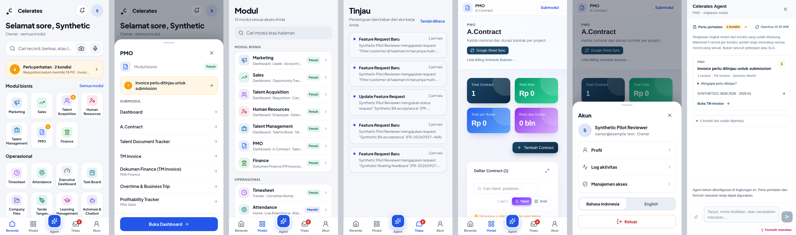

Left to right, at 390 × 844 as the Owner: Beranda, the PMO landing sheet, Modul, Tinjau, a PMO desktop page inside the shell (with the module context bar), the Akun sheet, and the Agent. Desktop `/` is unchanged: `exploration/evidence/mobile-shell/ms1-desktop-home-unchanged.png`.

**What changed.** No mobile code existed before MS1.

| Area | Implementation |
|---|---|
| Canonical access | `src/lib/module-access.ts` (`resolveModules`, `navModules`, `openModules`, `claimsOf`) now feeds `components/sidebar.tsx`, desktop `app/page.tsx` and every mobile surface |
| Shell | `app-shell.tsx`: `md:` margins, bottom inset, `MobileContextBar`. Sidebar and corner controls are `hidden md:*`. Toasts sit above the tab bar |
| Navigation | `components/mobile/tab-bar.tsx`: Beranda · Modul · Agent · Tinjau · Akun, plus the Akun sheet (profile, activity log, Access Management for the Owner, language, sign out) |
| Surfaces | `mobile-home.tsx` (on `/` below `md`), `module-directory.tsx` (`/modules`), `review-list.tsx` (`/notifications`), `ModuleLandingSheet` |
| Shared data | `components/mobile/data.tsx`: notifications and the `/api/operations/context?path=/` signals, fetched only for phone widths or on the two mobile pages |
| Agent | `agent-panel.tsx` opens on the `celerates:agent-open` event. The floating trigger shows at `md` and above only |
| Tokens and primitives | `globals.css` `--color-j-*`, `--radius-j-*`, `--shadow-j-*`, `--font-sans` (Inter via `@fontsource-variable/inter`; Plus Jakarta Sans replaced 2026-10-07 by the one ERP font). `components/mobile/primitives.tsx`: `MobileScreen`, `ScreenTitle`, `SectionHeader`, `GroupLabel`, `Card`, `StatusPill`, `ListCard`, `RowList`/`Row`, `FactRows`, `StickyActions`, `BottomSheet`, `buttonClass`. `modules.tsx`: tinted `ModuleTile`/`ModuleGlyph`, `AccessPill` |
| PWA | `app/manifest.ts`, `public/icons/*` (the "C" mark from the Celerates logo, maskable included), `public/sw.js` (offline fallback for navigations only, no caching of ERP responses), `public/offline.html`, the `viewport` export (cover, theme colour). The middleware allows only these static public paths |
| i18n | `mobile` namespace in `messages/id.json` and `messages/en.json` |
| Hardening | `markNotificationRead` now updates only the caller's own notification (it previously accepted any id) |

**Decisions made while implementing.**
- **A module tile opens its landing sheet, not the first desktop page.** Desktop pages are not converted yet; the sheet gives the real submodules, their ownership and the signals first.
- **Mobile hides modules without access**, while desktop keeps them locked.
- **Desktop Home now locks Automasi & Chatbot for users without the `automation` division**, matching its actions. This is the only desktop behaviour change and is invisible in the Owner pilot.
- **Legacy desktop pages opened on a phone** get the module context bar and no horizontal page scroll. Their tables remain desktop layouts until MS2 converts them.

**Verification.**
- `tests/module-access.test.ts` pins the canonical function to the previous sidebar and Home rules for Owner, editor/viewer, PMO full, converter-flag, no-access and talent actors, and to `canReadModule` for the division modules.
- ERP unit: 16/16.
- `next build`: clean.
- Full harness (unit, PostgreSQL, cross-stack, browser, model path): 15 PASS, exit 0.
- The Agent browser journey now checks the mobile shell: no sidebar, tab bar, full-screen Agent from the tab, no horizontal scroll, registry-ordered Beranda, PMO landing sheet with the Finance-owned submodule, context bar, Modul, Tinjau, the manifest, the registered service worker, and the desktop layout restored at 1440 px.
- Evidence: `implementation/evidence/ms1-mobile-*.png`, `agent-m1-mobile.png`.

**MS2, next.**
1. Real module landings and list → detail → contextual action for **PMO** first: A.Contract → billing → TM Invoice with BAST → finance handoff. Then the **TM extension request** as the first Tinjau review flow, and **TA pipeline** stage tabs.
2. Record search in the Beranda bar, over `lib/agent/reads.ts#search`, which is actor-scoped, together with Company Files search.
3. The capture sheet (Company File vs Agent attachment) and **Tanya Agent** with record context from a detail page.
4. Then MS3: the Tinjau aggregation (F6).

Open product questions:
- the "Hari ini" metrics (§8.3);
- the multi-role access matrix (§7) before the pilot middleware opens.

## 16. MS2 — contextual Agent and PMO as the reference workflow (2026-09-27)

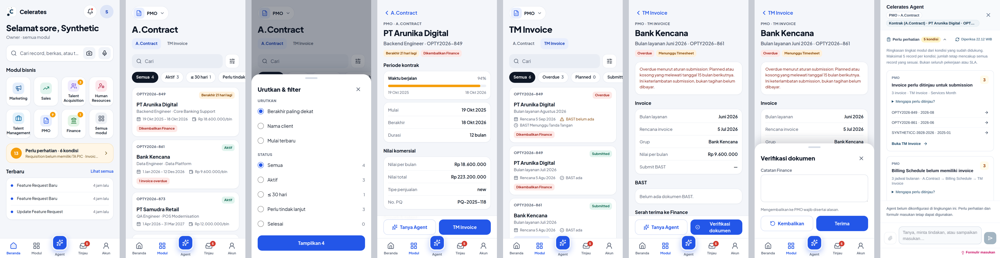

Left to right, at 390 × 844 as the Owner:
- Beranda (launcher-first);
- A.Contract list and its sort/filter sheet;
- a contract record;
- TM Invoice list;
- an invoice record and its Finance verification sheet;
- the Agent opened from the contract, showing the context chips.

All data in the captures is synthetic.

### 16.1 Contextual Agent contract

**What travels.** Opening the Agent anywhere means "about this page". The envelope is:

| Field | Source |
|---|---|
| route | the page path, normalised by `operationalContext` (query strings dropped; known record ids kept) |
| module | `operationalContext`, the same module keys as division access |
| submodule | `submoduleFor(path)`: the longest matching registry submodule, e.g. `/pmo/contracts/<id>` → A.Contract |
| entity type, id, label | `resolvePageEntity(path)` from the Entity Catalog routes, loaded only if the actor may read that module (`canReadEntityModule`), else none |

**Rules.**
- ERP derives every field server-side (`pageContext`, `lib/agent/bff.ts`) from the route, under the user's authority. **The client never supplies an entity, a label or record content.**
- The envelope goes into the signed delegation. Intelligence reads the record only through the governed catalog read: internal fields as values, commercial fields as presence, PII and free text withheld.
- No screenshots and no page content are sent.

**Visible to the user.** The Agent header shows two chips: `Module › Submodule` and, when there is one, `Record type · label` (`data-agent-context`, `data-agent-entity`).

**Entry points.**
- The Agent tab: the current route.
- **Tanya Agent** in a record's sticky actions: the record.
- The Beranda bar: `/`.

**Deictic questions ("ini / tersebut / this").**
- With a page record, "ini" means that record. The deterministic path reads it and answers from the fields the question names, e.g. "Berakhir: 2026-10-18".
- Commercial fields answer "terisi di ERP; nilai komersial tidak dibagikan ke Agent".
- On a list page there is no record, and none is invented.
- The model path already receives the same page entity (M5).

**Feedback reuses Masukan (ADR-017).** A page complaint ("Tabel ini susah dipakai di HP", "Field tanggal berakhir harusnya lebih kelihatan") is detected as feedback, and the user picks its kind:
- **Feature Request**: an ERP proposal carrying `context_path` = this page;
- **Data correction**: a task on this record, never a direct edit;
- knowledge correction or Agent feedback, as before.

Nothing is drafted or changed until the user confirms. MS2 adds usability wording ("susah, sulit, ribet, bingung, kurang/tidak jelas, kurang/tidak kelihatan") to the feedback cues.

**Catalog v1.1.** `project_contract` and `project_invoice` are added: dates, status and issue are internal; values are commercial; notes are withheld; documents are never read. Edges link contract ↔ invoices ↔ the PQ.

### 16.2 Mobile list / record / action grammar

This is reusable for Sales, TA, HR, TM and Finance.

| Step | Pattern | Component |
|---|---|---|
| Module | Module chip (opens the landing sheet), page title, the module's mobile-native siblings | `ModuleHeader` |
| List | Search field, status tabs with counts (they double as the compact summary), sort and filter in a bottom sheet, cards with identifier, title, subtitle, 1–3 facts, a status pill and one follow-up flag | `FilterableList` (server-shaped `ListItem`s, no render props) |
| Record | Back link, eyebrow, title, subtitle, pills; grouped sections of fact rows; related records as tappable rows; documents as cards opened through the authorized document route | `RecordHeader`, `Section`, `FactRows`, `ProgressMeter`, `DocumentCard` |
| Action | Allowed actions pinned above the tab bar on a phone and inline on desktop. Forms in a bottom sheet with the business consequence stated once | `StickyActions`, `BottomSheet`, `buttonClass` (`styles.ts`) |
| Agent | **Tanya Agent** in the record's actions | `AskAgentButton` |
| Authority | A record page checks division read itself and 404s otherwise. Actions keep their own server guards | `requireDivisionRead` (`lib/module-guard.ts`) |
| Routing | Routes that render their own Jernih surface; other module routes keep the desktop page under the context bar | `isMobileNative(path)` |

**Removed on phones** (the desktop pages are unchanged):
- the A.Contract and TM Invoice tables and their KPI blocks (2×2 and 5-up);
- the header sheet-sync toolbars;
- long subtitles;
- the add-record modals;
- document URLs in table cells;
- the inline finance-handoff mini-form.

**Copy rule.** Explanatory text stays only where it states a rule or a consequence:
- the submission-overdue rule;
- "Kirim menandai invoice ini Submitted dan memberi tahu Finance";
- "Mengembalikan ke PMO wajib disertai alasan";
- "Satu serah terima per PQ".

### 16.3 PMO reference journey (verified in the browser at 390 px)

1. **Modul › PMO landing sheet → A.Contract.**
   - The list is cards: client, position · project, period, value per month, a status pill (Aktif / Berakhir N hari lagi / Selesai / Belum mulai) and one follow-up flag.
   - Follow-up flags, in the order PMO acts on them: Dikembalikan Finance → N invoice overdue → N bulan belum ada invoice → Menunggu Finance.
   - Tabs: Semua / Aktif / ≤ 30 hari / Perlu tindak lanjut / Selesai. Sort and status also live in the sheet.
2. **Contract record** (`/pmo/contracts/<id>`, new read-first route):
   - period with an elapsed meter;
   - commercial value;
   - project and talent (talent assignments on this PQ);
   - **Tagihan bulanan**: each billing month with its invoice state, or "Belum ada invoice";
   - TM Invoice list;
   - Document Tracker files (PKS/PO/CR/other with their status);
   - Finance handoff state and notes.
   - Sticky actions: **Tanya Agent**, **TM Invoice**. The full edit form stays on desktop (`/edit`).
3. **Invoice record** (`/pmo/invoices/<id>`):
   - invoice facts (with the derived overdue rule when it applies);
   - BAST documents;
   - Finance handoff;
   - the linked contract.
4. **Handoff.**
   - A PMO editor sees **Serahkan ke Finance** (link and notes; `upsertFinanceHandoff`), which marks the invoice Submitted and notifies Finance.
   - A Finance editor then sees **Verifikasi dokumen**: **Terima** or **Kembalikan** (reason required), via `acknowledgeFinanceHandoff` / `requestRevisionFinanceHandoff`.
   - The Owner has both. Each server action re-checks division access and state.

### 16.4 What MS2 proves for the other modules

- A module converts by adding three things:
  - a server read model (`lib/<module>/mobile-data.ts`);
  - `ListItem` shaping in a mobile list component;
  - a read-first record route.
- The shell, grammar, guard, Agent contract and Masukan need no change.
- Adding a record route to the Entity Catalog is what makes "ini" work for that module.
- Beranda is now **launcher-first**:
  - the business modules the user can open, plus **Semua modul**;
  - Perlu perhatian and Terbaru below, compact;
  - operational modules live in Modul;
  - a talent account, which has no business modules, gets its operational modules instead.

### 16.5 Deferred (explicitly)

- **Editing on mobile.** Contract and invoice forms, billing schedule generation and BAST upload stay on desktop. PMO's mobile write actions are the handoff only.
- **Other PMO submodules** (Talent Document Tracker, Overtime & Business Trip, Dashboard): they keep the desktop page under the context bar.
- **The Finance module list** (`/finance`) is still the desktop page. Finance reaches invoices through Tinjau notifications and the invoice record. *(Delivered in MS3, §17.)*
- **Signal ↔ entity mapping for PMO/Finance rules** (`SIGNAL_ENTITY`) stays unset until ERP audit F13 settles its semantics.
- **Record search in the Beranda bar and the Tinjau aggregation** (MS3). *(Delivered, §17.)*

**Decision needed before expanding to other modules.** Record-level authority for non-Owners. PMO pages gate on division access only (as the desktop does). Sales, TA and HR records may need row-level rules (ownership, PIC) before the pilot middleware opens to non-Owners (§7). The mobile guard is where those rules will plug in.

### 16.6 Verification

- **ERP unit, 16/16.** `agent.test.ts` covers:
  - catalog v1.1: routes resolve to `project_contract` / `project_invoice`;
  - `submoduleFor` maps `/pmo/contracts/<id>` to A.Contract;
  - PGlite reads: the contract label is correct, `end_date` is readable, and values, notes and PII never leave ERP;
  - the contract → invoices edge;
  - a TA-only user is refused (403, fails closed).
- **Python, 44 passed.**
  - `test_contextual_ask_uses_the_erp_resolved_page_record`: "Kontrak ini berakhir kapan?" answers from the page record; the value question gets presence only; page feedback offers a data correction on the record plus a Feature Request; a list page invents no record.
  - ruff: clean.
- **`next build`: clean.**
- **Full harness: 15 PASS, exit 0.** The Agent browser journey at 390 px:
  1. launcher Beranda with "Semua modul";
  2. PMO sheet → A.Contract card list, with no desktop table and no horizontal scroll, and the sort/filter sheet;
  3. full-screen contract record with all six sections;
  4. **Tanya Agent** → chips `PMO › A.Contract` and `project_contract`; "Kontrak ini berakhir kapan?" is answered about the open record;
  5. "Tabel ini susah dipakai di HP" → Masukan → Feature Request from this page → confirmed in ERP;
  6. related TM Invoice → **Serahkan ke Finance** → *Menunggu Finance* → **Verifikasi → Terima** → *Diterima Finance*;
  7. desktop layout restored at 1440 px.
- **Desktop at 1440 px:** the A.Contract page is unchanged (`exploration/evidence/mobile-shell/ms2-desktop-contracts-unchanged.png`). The record route renders as a read-first page in the desktop shell.

## 17. MS3 — Tinjau, Beranda search, Tangkap, Finance (2026-09-27)

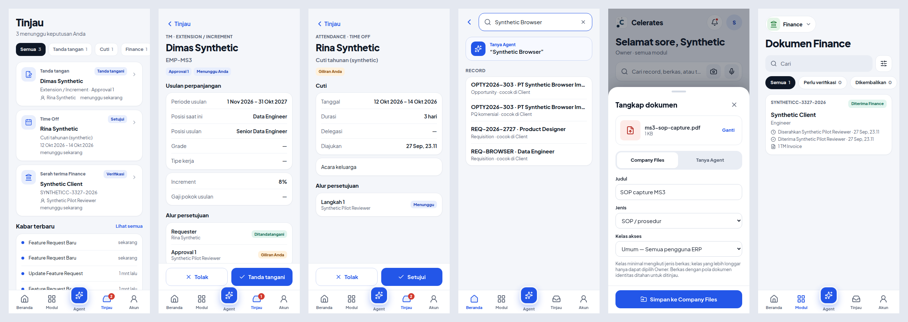

Left to right, at 390 × 844 as the Owner:
- Tinjau with three decisions waiting and the tab badge;
- an Extension/Increment signature step as a record;
- a Time Off step as a record;
- Beranda search: pages, records and **Tanya Agent**;
- the Tangkap sheet saving a photo or file to Company Files;
- Finance's handoff list.

All data in the captures is synthetic.

**Scope decision (user, 2026-09-27).** Visibility in MS3 is division-level only. Detailed and record-level RBAC is a later discussion (§16.5); every decision still runs through the existing server action and its guard.

### 17.1 Tinjau = "menunggu saya"

Tinjau is the queue of ERP records waiting for **this user's** decision. It never shows inferred tasks, and it is not a notification feed. `reviewQueue(sql, actor)` (`lib/review/queue.ts`) reads five existing flows, oldest waiting first:

| Source | In my queue when | Opens | Decision (existing action) |
|---|---|---|---|
| TTD `signature_requests` (Extension/Increment steps, PQ, ad-hoc) | `status = pending` and I am the signer | `/review/signature/<id>` | `signRequest` / `rejectRequest` (TTD Online) |
| Time Off `time_off_approval_steps` | the request is pending and the lowest pending step is mine | `/review/time-off/<id>` | `approveTimeOffStep` / `rejectTimeOffStep` |
| `timesheet_submissions` | status `review`, and I am PMO **full** (Owner counts as full) | a sheet on Tinjau | `approveTimesheetSubmission` |
| `finance_document_handoffs` | `notified` and I am Finance editor+, **or** `needs_revision` and I am PMO editor+ | the project's latest TM Invoice record (§16.3) | `acknowledgeFinanceHandoff` / `requestRevisionFinanceHandoff` / `upsertFinanceHandoff` |
| `agent_proposals` | mine, `pending`, not expired | `/review/proposal/<id>` (the ERP-held proposal card) | confirm / reject (ADR-010) |

**Rules.**
- A viewer is never queued for a decision the action would refuse (e.g. a Finance viewer does not see handoffs to verify).
- The Owner is not queued for other people's signatures or time-off steps. Those belong to the named signer or approver.
- A signature record opens only for its signer; a time-off record only for an approver in its chain. Anyone else gets 404, even the Owner.
- **Compensation stays with TM.** An Extension/Increment signer without TM access sees the talent, period, position and journey, but not the increment or salary.
- Approving is always a second, deliberate tap in a confirmation sheet. Rejecting takes an optional reason, as on desktop.
- Signing needs a saved signature. If there is none, the sheet says so and links to TTD Online; it does not fail silently.

**Surfaces.**
- The **Tinjau** tab goes to `/review` and its badge counts waiting decisions (`getReviewCount`), not unread notifications.
- Beranda shows one compact row, "N menunggu keputusan Anda", when there are any.
- Notifications become **Kabar terbaru**: a short list under the queue, plus the full list at `/notifications` (the bell still goes there).

### 17.2 Record pattern on approvals

The Extension/Increment step and the Time Off step reuse the §16.2 grammar: `RecordHeader`, `Section`, `FactRows`, `DocumentCard`, and `StickyActions` with **Tolak / Tanda tangani** or **Tolak / Setujui**.

The extension record has three sections:
- **Usulan perpanjangan**: period, current and proposed position, grade, employment type; compensation only for TM.
- **Alur persetujuan**: every configured step with its state, and **Giliran Anda** on mine.
- **Permintaan**: requester, date, notes, and the document or attachments.

After a decision the user returns to Tinjau, and the badge refreshes.

### 17.3 Beranda search

The Beranda field opens `/search`, a full-screen search with four parts:
1. **Tanya Agent: "…"**, always first. It opens the Agent and starts an ask run with the text (`openAgent({ ask })`).
2. **Halaman**: submodules of the modules the user can open, from the canonical registry.
3. **Record**: `/api/search`, which uses the governed Entity Catalog search (`reads.search`). It searches internal display fields only, is module-authorized per entity type, requires every term to match, and falls back to any term only when nothing matches.
4. **Company Files**: `/api/files?q=`, the existing ADR-018 search, authorized per file. Hidden when Intelligence is unavailable.

The query stays in the URL, so back and forward return to the same results.

### 17.4 Tangkap dokumen

The camera button on Beranda opens a sheet with **Ambil foto** (camera capture) and **Pilih berkas** (PDF, Word, Excel, CSV, image; 20 MB). The user then chooses the destination explicitly:
- **Company Files**: title plus the same `ClassFields` as the explorer. The kind's minimum class applies, only an Owner can loosen it, and identity-document patterns are held for review. It posts to `/api/files` and confirms with **Buka berkas**.
- **Tanya Agent**: the file is attached to the Agent conversation as working context (`openAgent({ file })` → the panel's existing `importFile`). It is not filed. A scan or an unreadable file shows as "Belum terbaca" with **Simpan ke Company Files**, as in M6.x.

### 17.5 Finance on a phone

`/finance` renders a card list of every project PMO has handed over:
- tabs **Perlu verifikasi / Dikembalikan / Diterima**;
- who handed it over and when, the Finance notes when returned, and the invoice count.

Each card opens the project's latest TM Invoice record, where **Verifikasi dokumen** already lives (§16.3). The desktop Finance page is unchanged.

### 17.6 Also in MS3

- `useOpenModules` returns nothing until the session is known. Before, a first paint could briefly show an anonymous user's operational modules, and "no modules" could flash.
- `isMobileNative` now includes `/review` (and its three record routes), `/search` and `/finance`, so they render without the desktop context bar.
- `ClassFields` accepts label and field classes, so the Jernih sheet restyles the same governed fields.

### 17.7 Deferred

- The TA pipeline and the other module conversions (§16.4 pattern).
- Record-level RBAC (§16.5): still division-level.
- Signing on the phone with a first-time signature drawn there. Today it links to TTD Online.
- Attendance check-in and self-service Time Off requests from the phone.
- A PQ-signature record view (it opens as a plain TTD request record).

### 17.8 Verification

- **ERP unit, 17/17.** The new `review.test.ts` (PGlite) covers:
  - the queue per user: signer, approver at the current step (not a later one), Finance editor vs viewer, PMO editor, Owner;
  - expired and other users' proposals excluded;
  - handoff links to the latest invoice, or the filtered list when there is no invoice;
  - an extension step titled by its talent;
  - signature record only for the signer, with compensation withheld outside TM;
  - time-off record only for the chain, with `my_turn` only for the current approver.
- **The action-coverage test** still holds: `getReviewCount` begins with `requirePilotActor()`.
- **Python: 44 passed. ruff: clean. `next build`: clean.**
- **Full harness: 15 PASS, exit 0.** The Agent browser journey at 390 px adds:
  1. Tinjau from the tab, with the badge;
  2. a notified handoff queued for Finance, then verified on the invoice record;
  3. **Lihat semua** → Kabar terbaru;
  4. Time Off record → **Setujui** → confirmed, and it leaves the queue;
  5. Extension record (talent, sections, **Giliran Anda**) → **Tolak** with a reason, and it leaves the queue;
  6. search "Synthetic Browser" → records → **Tanya Agent** starts the run;
  7. Tangkap → PDF → Company Files → saved;
  8. `/finance` card list with no table and no horizontal scroll.

  `agent-journey.mjs` then asserts in the database that the Extension request is `rejected` with the reason on its step, and the Time Off request is `approved`.
