# Celerates Digital Intelligence — Architecture Diagrams

Mermaid (`.mmd`) files in this directory are the **canonical source of truth**. SVG files under `rendered/` are generated automatically for presentation, review, and reuse in slides or Figma.

## 01 — Master Architecture


Source: [`01-master-architecture.mmd`](./01-master-architecture.mmd)

## 02 — Technology Architecture


Source: [`02-technology-architecture.mmd`](./02-technology-architecture.mmd)

## 03 — Pre-Sales Intelligence E2E


Source: [`03-presales-e2e.mmd`](./03-presales-e2e.mmd)

## 04 — Exception Management


Source: [`04-exception-management.mmd`](./04-exception-management.mmd)

## 05 — Human Services


Source: [`05-human-services.mmd`](./05-human-services.mmd)

## 06 — Management Intelligence


Source: [`06-management-intelligence.mmd`](./06-management-intelligence.mmd)

## 07 — Intelligence Layer Internal


Source: [`07-intelligence-layer-internal.mmd`](./07-intelligence-layer-internal.mmd)

## 08 — POC Deployment


Source: [`08-poc-deployment.mmd`](./08-poc-deployment.mmd)

## 09 — P0 Runtime


Source: [`09-p0-runtime.mmd`](./09-p0-runtime.mmd)

## 10 — P0 Review Lifecycle


Source: [`10-p0-review-lifecycle.mmd`](./10-p0-review-lifecycle.mmd)

## 11 — Intelligence Runtime Components

This diagram explains the responsibility boundaries between **LangGraph, PostgreSQL, pgvector, PostgreSQL FTS, LiteLLM, model providers, and Langfuse**.


Source: [`11-intelligence-runtime-components.mmd`](./11-intelligence-runtime-components.mmd)

Detailed explanation: [`../06-intelligence-stack-explained.md`](../06-intelligence-stack-explained.md)

## 12 — Current → Transition → Target

This diagram explains the transformation sequence clarified in the 2026-09-23 stakeholder discussion: fragmented operational sources are transitional, ERP maturity/user review is the critical foundation, and Intelligence builds on top of the Digital Operational Core.



Source: [`12-current-transition-target.mmd`](./12-current-transition-target.mmd)

Meeting alignment: [`../07-meeting-alignment-mas-abi-2026-09-23.md`](../07-meeting-alignment-mas-abi-2026-09-23.md)

## 13–15 — ERP independent audit

These diagrams distinguish observed ERP behavior from proposed deployment and feedback designs. The existing architecture decisions remain unchanged.

- Observed topology: [`13-erp-as-is.mmd`](./13-erp-as-is.mmd)
- Proposed Railway target: [`14-erp-railway-target.mmd`](./14-erp-railway-target.mmd)
- Proposed contextual feedback loop: [`15-erp-feedback-loop.mmd`](./15-erp-feedback-loop.mmd)

Evidence, scope, findings and implementation gates: [`../erp-audit/README.md`](../erp-audit/README.md).

## Workflow

```text
*.mmd (edit / review / Git diff)
   ↓
GitHub Actions — Render Mermaid diagrams
   ↓
rendered/*.svg
   ↓
GitHub docs / Slides / Figma / presentation
```

Do not edit generated SVG files manually. Change the `.mmd` source and let CI regenerate the presentation artifact.

## 16 — Embedded operational assistance (implemented)

[`16-erp-operational-assistance.mmd`](./16-erp-operational-assistance.mmd) shows the
session-bound ERP read boundary, explicit PMO commands and reused feedback flow.
This human-facing endpoint is not the proposed ERP-to-Intelligence machine API.
See [implementation and verification](../implementation/operational-assistance.md).
