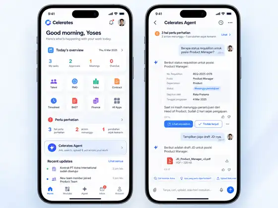

# Mobile Operational Shell — UX Exploration Baseline

> Continued in [doc 18 — Mobile/PWA shell: three concrete directions](../18-mobile-pwa-shell-directions.md) (2026-09-27).

Date: 2026-09-27  
Status: **exploration baseline, not a locked implementation spec**  
Branch context: `audit/erp-production-readiness` after M5.

## Why this note exists

This captures the current mobile/PWA discussion so it can be continued later without mixing it into the M5/M6 implementation thread.

The visual below is a **baseline reference only**. It is intentionally not a commitment to final navigation, module order, bottom navigation, file placement, or role-specific information architecture.

## Product principles currently agreed

- Celerates mobile should remain a **real operational application with discoverable business modules**. Intelligence must not replace familiar click/tap navigation.
- **Celerates Agent is an important integrated capability, not the entire product homepage.**
- Users who prefer traditional navigation should be able to tap modules and complete work without prompting an Agent.
- Intelligence should accelerate, connect, search, explain, propose, and surface attention across modules without forcing users to learn prompting.
- Mobile/PWA should use the **same product, same backend, same RBAC, same business rules and authority model** as desktop.
- Mobile should not merely shrink the desktop UI. It should prioritize mobile-appropriate work such as checking, searching, asking, reviewing, approving, uploading/capturing, and following up.
- RBAC should control visible data and capabilities from day one. A fully different product/navigation per role is **not yet decided**.

## Current visual direction

The baseline borrows the useful pattern of mature enterprise mobile apps:

1. greeting / personal context;
2. practical operational summary;
3. visible module launcher;
4. compact attention / recent-work surfaces;
5. Celerates Agent as a clear entry point;
6. recent updates/activity;
7. persistent mobile navigation.

The Agent screen itself is a unified work surface for text, voice, file, search, feedback, evidence, and controlled actions.

## Decisions intentionally still open

Do **not** treat any of these as locked yet:

- exact module names shown on Home;
- which modules deserve first-level shortcuts;
- whether Agent belongs in bottom navigation, Home only, a floating action, or another pattern;
- exact bottom-navigation items and count;
- whether Company Files / Knowledge Explorer becomes a top-level module;
- Home hero/primary card behavior;
- exact placement and density of `Perlu perhatian`;
- how much recent activity belongs on Home;
- whether role-specific navigation is ever needed beyond RBAC-filtered content/capabilities;
- desktop/mobile parity details;
- visual style, colors, iconography, spacing, and component system beyond the overall enterprise-mobile direction.

## Relationship to M5

M5 already established the interaction substrate that a future mobile shell can reuse:

- one Agent surface, without separate `Perlu perhatian / Tanya / Masukan` entry tabs;
- one composer for text, voice, files and send;
- proactive Ringkasan embedded in the Agent;
- free-text intent routing with user review;
- deterministic fallback;
- full-screen Agent layout on phones.

This note does **not** request changes to M5. Future mobile-shell work should reuse that substrate.

## Reference interpretation

The attached image is useful as a baseline because it demonstrates the desired balance:

- the **left screen** feels like an operational enterprise app with modules first-class;
- the **right screen** shows the Agent as a powerful dedicated work surface;
- neither side implies that AI replaces the ERP/module experience.

Future UX work should preserve this balance while exploring better alternatives rather than copying the baseline literally.
