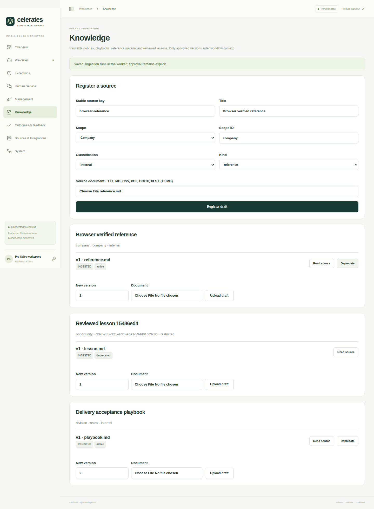
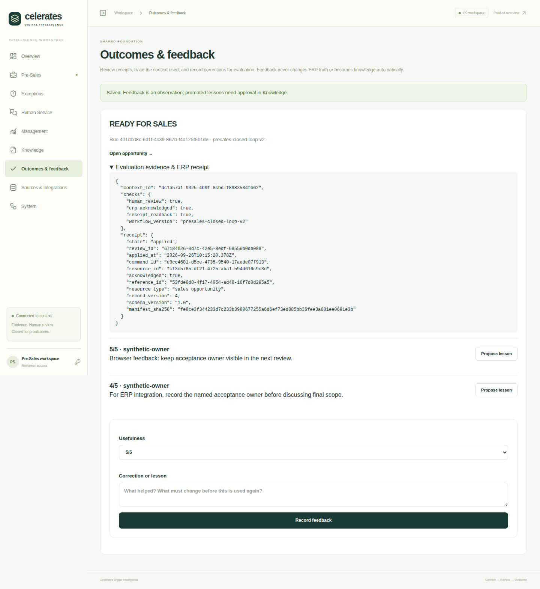
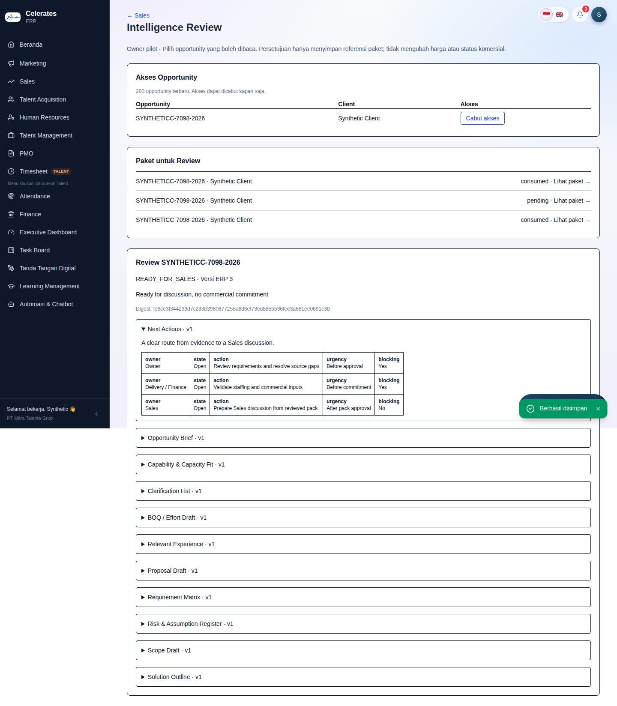
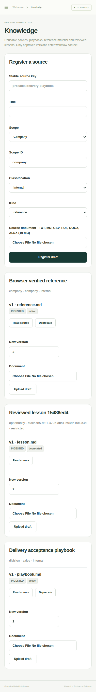

# Closed-loop Intelligence foundation — audit and execution record

Direction: docs/10-closed-loop-intelligence-and-erp-maturity.md. Implementation
baseline: audit/erp-production-readiness at 77076eb, including the embedded panel
and subsequent timezone fixes. ADR-001–006 remain in force.

## Deployed P0 audit (observed before changes)

Railway project celerates-digital-intelligence has API, integration-worker, web,
PostgreSQL/pgvector and persistent MinIO. Successful API deployment ea584953 was
built from 4949302 on feat/issue-1-functional-p0; service source still tracks that
branch. API/worker/web source code is unchanged between that revision and the
current branch. ERP is a separate project and database; no direct DB binding exists.
The API configuration exposes no API_ACCESS_TOKEN variable. The source defaults
unauthenticated operation to a demo reviewer; this must close before connecting ERP.

| Finding (fact) | File/function evidence | Consequence / chosen correction |
| --- | --- | --- |
| Documents require opportunity_id and a workspace | documents.register, 001 migration documents table | Generalize the existing document/chunk/parser path with a source registry, immutable versions and governed scopes. |
| Hybrid retrieval filters only opportunity and embedding model | documents.retrieve | Add approved lifecycle + classification/scope authorization before ranking. |
| Retrieved chunks are recorded as IDs but not used in narrative/requirements | workflow.analyze, artifacts.build_pack, gateway.narrative | Reusable context snapshots must actually feed evidence into output and record exact source versions. |
| HTTP ERP adapter points to a proposed contract, not an implemented ERP route | cdi.erp.HttpERP, packages/contracts/erp-http.md | Implement a narrow typed Sales Opportunity read and approved-artifact reference command in ERP. |
| Shared token maps to generic reviewer; default demo accepts no token | api.actor, config.Settings | Explicit configured principals, roles and knowledge scopes; connected mode fails closed. |
| Demo closed loop persists into demo_erp.objects/actions | erp.DemoERP.action | Demonstrate actual Next ERP handler, actual PostgreSQL receipt and read-back, no demo fallback in connected mode. |
| Review versions and LangGraph human interrupt already exist | api.review_pack/decide, workflow.graph | Reuse and extend; require ERP-owned human approval for exact action digest/source version. |
| Events record review decisions but no reusable evaluation dataset | workflow.event/close_loop | Persist context, feedback/corrections, command receipt and evaluation case; feedback remains unapproved evidence. |
| Migration runner has no lock/checksum validation | cdi.migrate.migrate | Add serialized, checksummed migrations before adding shared foundation state. |

ERP operational assistance c2c105d passed its PostgreSQL16, browser, HTTP and Docker
CI (run 36121326251) and deployed successfully as 6faa5792. New migration 0003 applied.
The unrelated original P0 Compose job failed twice pulling the pinned Quay MinIO
image (unauthorized); API/web jobs passed. Preserve running volumes/storage. A fresh
VPS/Compose install needs registry access or a separately reviewed image replacement;
this is not evidence that the running MinIO data service failed.

## Chosen first vertical slice (judgment)

Pre-Sales is the smallest complete workflow supported by existing executable P0 and
reliable ERP tracker IDs. Read explicitly granted Sales Opportunity records, combine
uploaded TOR with approved reusable knowledge, produce the existing editable pack,
review exact versions, request an ERP Owner's approval, persist an immutable approved
artifact reference, read back the command receipt, store outcome/evaluation evidence.
Do not automatically mark Proposal Sent, Win or update any commercial/HR fields.

Three distinct stores of meaning remain: current facts in ERP; approved knowledge
in source/document/chunk metadata + S3; observations/corrections/outcomes as signals.
No automatic promotion of feedback, tuning of model weights or broad ERP replication.

## Shared primitives and boundaries

- Source registry: company/division/opportunity scope, classification, source key,
  immutable numbered versions/checksum, ingestion job, approval/deprecation, provenance.
  Reuse existing parsers, object storage, FTS and pgvector; no new retrieval service.
- Context builder: typed ERP snapshot + authorized chunks + approved knowledge +
  prior outcome references, persisted policy/workflow/model versions and source digest.
  A changed/deprecated source invalidates a pending action until fresh review.
- Named configured Intelligence principals with role/scope policy; all external
  connected access authenticated. Model mode stays explicit; no hidden demo fallback.
- ERP machine boundary: separate read/action token hashes, audience/environment,
  explicit Owner-selected record grants. Only /api/integration/v1 delegates machine
  auth; the rest of the ERP keeps its current session/Owner guard.
- ERP pending review contains complete bounded artifact content/digests and source
  version. Only authenticated active Owner can approve it in ERP. A supplied
  'approved' flag, user ID or invented approval ID cannot authorize a command.
- One allowlisted command attaches the reviewed reference. Source version, review
  expiry, current approver authorization, idempotency hash, business effect, audit,
  receipt and outbox evidence are enforced in one ERP transaction.
- Feedback/output corrections/outcomes remain versioned evaluation signals. Explicit
  curator review may promote a correction to a new knowledge version for later runs.

## Deliberate initial boundaries

No unverified capacity/project/customer crosswalk; no payroll, invoice payment,
signature or hiring writes. No arbitrary SQL/source URLs or generalized update API.
No change to the embedded ERP assistance rules; it stays an ERP-owned signal surface.
No forced external messaging. No wide role rollout or SSO claim. The existing ERP
Owner pilot and a scoped Intelligence pilot are the initial deployment audience.
No real-business approval is fabricated during verification; full-loop tests use
clearly marked disposable synthetic fixtures through the real ERP HTTP handlers.

## Implemented baseline

The first shared foundation is functional, with the existing Pre-Sales workflow as
its first consumer. This extends the monorepo; it does not replace ERP workflows or
the embedded operational assistance already delivered.

| Delivered behavior | Implementation evidence |
| --- | --- |
| Upload-governed company/division/opportunity knowledge, immutable versions/checksums, explicit approval/deprecation and retryable ingestion | `cdi/knowledge.py`: `register_source`, `register_version`, `transition`, `tick`, `retrieve`; migration `002_closed_loop_foundation.sql` |
| Context separates ERP facts, customer TOR, approved knowledge and prior observations; persisted provenance and current authorization | `cdi/context.py`: `build_context`, `validate_knowledge`, `authorize_run`; `cdi/identity.py`: `actor`, `resolve` |
| Approved guidance actually contributes to the generated Solution with citations | `cdi/workflow.py`: `analyze`; `cdi/artifacts.py`: `build_pack`; existing Model Gateway |
| Real bounded ERP reads, independently approved artifact-reference command, atomic idempotency and receipt read-back | `cdi/erp.py`: `HttpERP`; `apps/erp/src/lib/integration/{contract,service}.ts`; ERP migration `0004_intelligence_contract.sql` |
| Eleven-artifact review, ERP approval checkpoint, outcome/evaluation and attributed feedback; explicit lesson promotion | `cdi/workflow.py`: `review`, `close_loop`, `execute`; API Knowledge/Contexts/Outcomes/Feedback routes; ERP `/intelligence` |
| Usable Knowledge and Outcomes screens, existing Pre-Sales integration, ERP-native grant/review screen, mobile layout | `apps/web`; `apps/erp/src/app/intelligence/page.tsx`; screenshots below |

Python paths above are relative to `services/intelligence-api/`. See the
[implemented ERP contract](../../packages/contracts/erp-http.md), generated
[OpenAPI](../../packages/contracts/openapi.json), [ADR-007](../adr/ADR-007-governed-closed-loop-foundation.md), and
[operator/demo flow](closed-loop-operations.md). Missing capacity, history and
commercial facts remain explicitly unknown rather than being invented.

## Maturity fixes delivered

- Migration execution now serializes concurrent starters and checks migration
  checksums. Existing name-only history is baselined once; later drift fails closed.
- ERP commands bind the exact reviewed manifest and source version, validate current
  grants/approver, and atomically store effect, receipt, audit and outbox. Concurrent
  identical keys produce one effect; conflicting payloads are rejected. Outbox IDs
  follow commit order through a transaction lock before allocation.
- Connected deployments require named authenticated workspace access and scoped
  machine credentials; demo records cannot substitute for inaccessible ERP records.
- Runtime verification exposed a web proxy timeout following independent API
  replacement. Nginx now refreshes upstream DNS using the container resolver and
  preserves request paths, queries and authorization. A Docker regression replaces
  the API IP without restarting web. The production probe subsequently passed.
- Earlier PMO read-safety/idempotent preparation and contextual Feature Request/BA
  completion work remains intact. No broad ERP redesign or business-stage rewrite.

## Verification completed, 2026-09-26 UTC

| Verification | Result and reproducible evidence |
| --- | --- |
| ERP native PostgreSQL, authorization/contract, real Next HTTP, full cross-stack workflow, browser desktop/mobile and ERP Docker build | PASS: [ERP CI 36205651566](https://github.com/yosdwi/celerates-digital-intelligence/actions/runs/36205651566), application commit `1ee00ef` |
| Intelligence API tests and Ruff | PASS: [P0 CI 36205651569](https://github.com/yosdwi/celerates-digital-intelligence/actions/runs/36205651569), API job; 14 passed, 1 optional local Docling test skipped |
| Web build and API-address replacement through actual nginx Docker image | PASS: same P0 run, web job `108301505762`; log records first and second upstream instances without web restart |
| Loaded mobile and complete workflow screenshots | PASS: [ERP CI 36205171194](https://github.com/yosdwi/celerates-digital-intelligence/actions/runs/36205171194), artifact `10893368492`; synthetic disposable data, not production screenshots |
| Full Compose boot | BLOCKED: P0 Compose job `108301505773` fails pulling pinned MinIO image with registry `unauthorized`; downstream Compose smoke tests did not run. API/web and independent native ERP tests passed. |
| Live Railway read-only probe | PASS at `2026-09-26T00:44:36.335595062Z`, worker probe deployment `2af7c531-4387-4313-a2e5-d49993f58ee3`; sanitized result below |

The cross-stack test uses real ERP handlers and separate PostgreSQL databases. It
reads a granted synthetic opportunity, ingests/approves knowledge, reviews all
artifacts, records ERP Owner approval, executes the reference action, verifies the
receipt/outcome, records feedback and retrieves an approved lesson on a later run.
Contract checks include scope rejection, stale versions, grant revocation, conflicting
and concurrent replay, and commit-ordered outbox. Production verification is read-only;
no production grant, artifact approval or synthetic business record was created.

```json
{"check":"closed-loop-runtime","status":"PASS","erp_mode":"http","model_mode":"demo","granted_opportunities":0,"migration":"002_closed_loop_foundation.sql","storage":"healthy","anonymous_access":401,"public_authenticated_routes":"opportunities, knowledge, outcomes"}
```

The probe additionally verifies pgvector and migration checksum presence. Railway
parses its JSON into log attributes, so the log message itself can appear empty.
Deployment SUCCESS alone was not accepted as proof of these checks.

## Final Railway deployment record

| Service | Successful deployment | Actual deployed commit |
| --- | --- | --- |
| ERP web | `02dd7799-ff1a-4654-a154-81b4aec189d9` | `21372be` |
| Intelligence API | `6475cee0-bc06-46e3-a480-2b2e17da44d6` | `21372be` |
| Intelligence web | `ca6e470f-176a-46ec-aadd-73761cd892fd` | `1ee00ef` |
| Integration worker | `9dc077ca-38b4-444b-b188-bdd2fc8933bb` | `1ee00ef` |

All use `audit/erp-production-readiness`. Actual commit values above come from
deployment metadata, not the staged source configuration. Later commits between
`21372be` and `1ee00ef` add verification/docs and the web proxy fix; the API/ERP
foundation application implementation is unchanged. The worker is restored to
`sh scripts/railway-worker.sh`, with no pre-deploy command or permanent public-probe
startup dependency. PostgreSQL and MinIO volumes/configuration were preserved.

Open [Intelligence](https://web-production-da384.up.railway.app) or
[ERP](https://erp-web-production-c725.up.railway.app). Workspace access requires the
configured pilot credential. ERP has zero granted opportunities until the Owner
explicitly grants an appropriate record. Model mode is still deterministic `demo`;
this is a real ERP contract and persistence baseline, not a paid-model rollout.

For VPS, retain Docker/PostgreSQL/pgvector/private S3, matching secrets and backups.
Fresh Compose deployment still needs authorized access to the pinned MinIO image
or a separately reviewed replacement. This gate is not hidden by successful Railway
checks. Wider roles/SSO, production LLM evaluation, additional ingestion connectors,
non-Sales consumers and commercial mutations remain outside this baseline.

## Browser evidence

These fixtures exercise the actual local application stack in CI.





