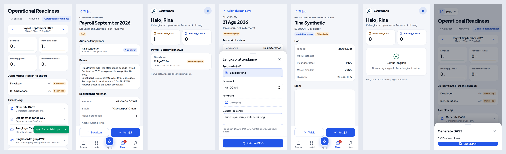

# ConForm integration v1: implementation record (2026-09-28)

This records the increment decided in [ADR-019](../adr/ADR-019-conform-bounded-operational-service.md) and specified in [doc 19](../19-conform-operational-readiness.md). The provider contract is in `celerates-bast-digital/docs/celerates-integration-v1.md`.

## Inspected

| Repository | Branch | Commit inspected |
|---|---|---|
| `yosdwi/celerates-digital-intelligence` | `audit/erp-production-readiness` | `49049b2` (MS3) |
| `yosdwi/celerates-bast-digital` (ConForm) | `chore/session-20260918-fixes` (= `main` + 435; the operational branch) | `49a13a4` |

**ConForm baseline before any change** (the branch as found):
- 4 unit tests failing (`test_completion`, `test_whatsapp`);
- 6 Postgres integration tests failing (CI skips these; there is no `TEST_DATABASE_DSN`);
- `ruff` 112 findings;
- `basedpyright` 66 errors.

The work below adds none of these.

## What was built

### ConForm (branch `feat/celerates-integration-v1`, off the operational branch)

- **Migration `20260928_0030`.** Adds `celerates_idempotency`, `celerates_integration_control` (kill switch), `celerates_campaigns`, `…_recipients`, `…_events` and `celerates_pmo_summaries`, with CHECK constraints for states, windows and bounds.
- **Settings.** `CELERATES_SERVICE_TOKEN(_FILE)` is a dedicated secret; the `_read_secret` rules apply. `CELERATES_PUBLIC_URL` is a link allow-list.
- **`application/celerates_campaigns.py`.** The campaign policy and state machine behind ports:
  - audience snapshot and eligibility;
  - approval, pause, resume and stop;
  - dispatch leasing, bounded batch, pacing, cooldown and window;
  - blocker re-check, cross-campaign dedupe and link expiry;
  - limited retry; `unknown` is never retried;
  - auto-pause on transport failure;
  - kill switch.
- **`infrastructure/celerates_integration_store.py`.** The psycopg store:
  - atomic lease through `next_dispatch_at`;
  - recipient claim `pending → sending`;
  - interrupted `sending → unknown`;
  - audit events;
  - idempotency, control and the PMO-summary ledger;
  - narrow reads: bound-JID boolean and correction status.
- **`web/celerates_router.py`.** `/api/celerates/v1`, about 25 routes. It only shapes requests over existing services:
  - `PayrollReadService`, `PayrollReviewService.bulk_decide` (staleness re-checked);
  - `AttendanceEvidenceService` and `AttendanceResolutionService` (the Talent Mobile rule set, anchored on the Payroll projection);
  - `BastWorkflowService` and `BastGenerationJobService` (jobs, document by job);
  - `PayrollExportService` (canonical CSV with history);
  - the bridge gateway, for the PMO group summary.
- **`flows/notifications.py`.** `pmo-notifications` runs one bounded campaign dispatch tick. It is a no-op when the integration is unconfigured.

### Celerates

- **Migration `0009_conform_integration.sql`.** Adds `talent_identity_links` and `talent_link_grants`.
  - Links: one active link per user and per employee.
  - Grants: SHA-256 only, `/me` targets only, capped at 7 days.
- **`lib/conform/client.ts`.** The one typed server-side client. Its only configuration is `CONFORM_BASE_URL` and `CONFORM_SERVICE_TOKEN`.
- **`lib/talent/identity.ts`.** Link and revoke; grant issue, peek and redeem. The redeem is one atomic UPDATE that requires an active, linked Talent account.
- **`lib/talent/actor.ts`.** `requireTalentActor()`: the ConForm employee id always comes from the link.
- **Auth and routing.**
  - NextAuth credentials provider `talent-link`: the only way a Talent session starts.
  - Middleware: a Talent may reach only `/me/**`, `/api/talent/**` and `/go/**`; other pages redirect to `/me` and APIs return 403.
  - Root layout: a Talent gets a frame with no sidebar, Agent, tab bar or backoffice widgets.
- **Talent.**
  - `/go/[code]`: GET never consumes the grant; same user continues; another user fails closed.
  - `/me`: **Kelengkapan Saya**, current and previous cycle.
  - `/me/attendance/[date]`: full-screen record plus the **Lengkapi** sheet.
  - Server action `submitAttendanceCorrection`.
- **PMO.**
  - `/pmo/readiness`: **Operational Readiness**, a PMO submodule. It shows the cycle, summary, BAST gate, freshness, talent list and actions.
  - `/pmo/readiness/talent/[ref]`: requirements, WhatsApp bound, Celerates account link (Owner).
  - Actions in `app/pmo/readiness/actions.ts`.
  - Binary pass-through: `/api/conform/{corrections/[id]/evidence, exports/attendance, bast/[job]}`.
- **Tinjau.** Adds kinds `correction` (PMO editor+) and `campaign` (PMO full), with records `/review/correction/[id]` (evidence, Tolak/Setujui) and `/review/campaign/[id]` (audience, message, policy, Setujui / Jeda / Hentikan). If ConForm is unreachable, Tinjau degrades to ERP items with a banner.
- **Action-coverage test.** It now also accepts `requireTalentActor()`. The migration test expects 74 tables.

## Verification (actual runs, 2026-09-28)

Left to right, at 390 px:
- PMO Operational Readiness;
- the draft campaign in Tinjau;
- Kelengkapan Saya opened from the WhatsApp link;
- the Lengkapi sheet;
- the correction record in Tinjau with its evidence;
- Kelengkapan Saya after approval;
- BAST generated by ConForm.

All data is synthetic.

### ConForm

**New tests:**
- `tests/unit/application/test_celerates_campaigns.py`, **12 passed**:
  - snapshot and eligibility; a draft never dispatches;
  - approval rejects foreign or over-long links; unlinked recipients are skipped;
  - bounded batch, pacing sleep, cooldown and completion;
  - sending window;
  - resolved-blocker skip;
  - cross-campaign dedupe;
  - transport failure auto-pauses, and retry is limited to `max_attempts`;
  - `unknown` is never retried;
  - an interrupted claim becomes `unknown` and pauses the campaign;
  - kill switch;
  - pause and stop are audited;
  - the message carries no ids or JIDs.
- `tests/integration/test_celerates_adapter.py` on PostgreSQL 16, **3 passed**:
  - service token required;
  - full correction loop through the adapter: readiness, requirements, campaign snapshot, idempotent submit with replay and conflict, queue, evidence, reject-needs-reason, approve with the Celerates actors recorded, re-projection to COMPLETE, the next snapshot excludes the Talent, and the canonical CSV carries 08:00;
  - a campaign without transport auto-pauses, and the kill switch works.

**Whole suite:** unit 543 passed / 4 failed; integration 23 passed / 6 failed; `ruff` 112; `basedpyright` 66. These are **identical to the baseline**: every failure is pre-existing, and every new file is lint- and type-clean.

### Celerates

- **ERP unit: 19/19.** New `talent.test.ts` (PGlite) covers:
  - linking creates a passwordless Talent account;
  - backoffice and Owner emails are never converted;
  - one active link each way;
  - grants: hash-only, `/me`-only, peek does not consume, user-bound, single-use, expired, revoked link, inactive account, 7-day cap;
  - the payroll cycle label.

  The action-coverage and migration tests were updated.
- **`next build`:** clean.
- **Intelligence Python:** 44 passed.
- **Full harness: 16 PASS, exit 0.** That is the 15 previous journeys plus **`conform-journey.mjs`**, which runs real ConForm (`uvicorn`, `alembic upgrade head`) behind `CONFORM_BASE_URL`, a recording bridge that speaks the whatsapp-web-session HTTP contract, and a renderer that speaks ConForm's `/internal/render-pdf` contract. The journey:
  1. ConForm projects one missing clock-in.
  2. PMO sees it in Operational Readiness (390 px, no horizontal scroll).
  3. The Owner links the Talent's Celerates account.
  4. The campaign draft appears in Tinjau and is approved; one grant is issued.
  5. The dispatcher tick sends **one personal DM** to the bound JID. It carries an opaque `/go/` link and no ids or phone number. The next tick is held by the cooldown.
  6. The link opens **Kelengkapan Saya** for exactly that Talent, with no backoffice navigation.
  7. The Talent submits "Saya bekerja, 08:00" with a photo. ConForm records `requested_by = celerates-talent:<uuid>`.
  8. A Talent gets 403 on backoffice pages and APIs.
  9. The link is single-use. An Owner session fails closed on a fresh grant, which is not consumed. The same Talent, already signed in, continues and consumes it.
  10. PMO opens the correction in Tinjau (evidence streamed through Celerates) and approves. ConForm records `reviewed_by = celerates:… <owner@…>`.
  11. ConForm reports COMPLETE with no requirements, and Kelengkapan Saya shows "Semua lengkap".
  12. A new campaign has an empty audience.
  13. The canonical CSV downloaded from Celerates carries 08:00 for that day, and `payroll_export_history.exported_by` is the Celerates actor.
  14. A BAST preview is generated by ConForm's assembler and renderer and downloaded as a PDF from Celerates; `bast_generation_audit.generated_by` is the Celerates actor.
  15. PMO sends one aggregate group summary with the Celerates readiness link.
  16. The desktop layout renders the same page.

### Found and fixed during the run

- **Timestamps come back as strings.** The shared postgres.js client returns `timestamptz` as strings (drizzle's parsers), so the dates are normalized.
- **Deep-link pages leaked the backoffice shell.** A no-session `/go` page rendered the full shell, whose widgets started calling Owner-only actions once the grant sign-in completed. `/go` now always renders bare.
- **Next rewrites same-origin redirects onto its bind host.** Next normalizes a same-origin middleware redirect to its bind host (`localhost`), which drops a session that belongs to another host. A Talent on a backoffice page therefore gets a 403 page with a same-origin refresh to `/me`. The pre-existing Owner redirect has the same latent behaviour behind some proxies; it is left unchanged and noted as a gap.

## Deployment requirements

- **ConForm (VPS).**
  - Run `alembic upgrade head` (0030).
  - Add the secret `/run/secrets/celerates_service_token` (≥ 32 characters, mode 0640) and set `CELERATES_SERVICE_TOKEN_FILE`.
  - Set `CELERATES_PUBLIC_URL=https://<celerates host>`.
  - Keep the ConForm Payroll/BAST Talent reminders disabled (`enabled=false`).
  - The Cloudflare Access policy must allow the Celerates service to reach `/api/celerates/v1/*`, for example with a service token or a bypass rule for that path plus the bearer token.
- **Celerates (Railway).**
  - Set `CONFORM_BASE_URL=https://<conform host>` and `CONFORM_SERVICE_TOKEN` (the same secret).
  - Set `CELERATES_PUBLIC_URL`, or rely on `NEXTAUTH_URL`.
  - Run `npm run db:migrate` (0009).
- **Co-location later.** Change the two ConForm URL/token values only.
