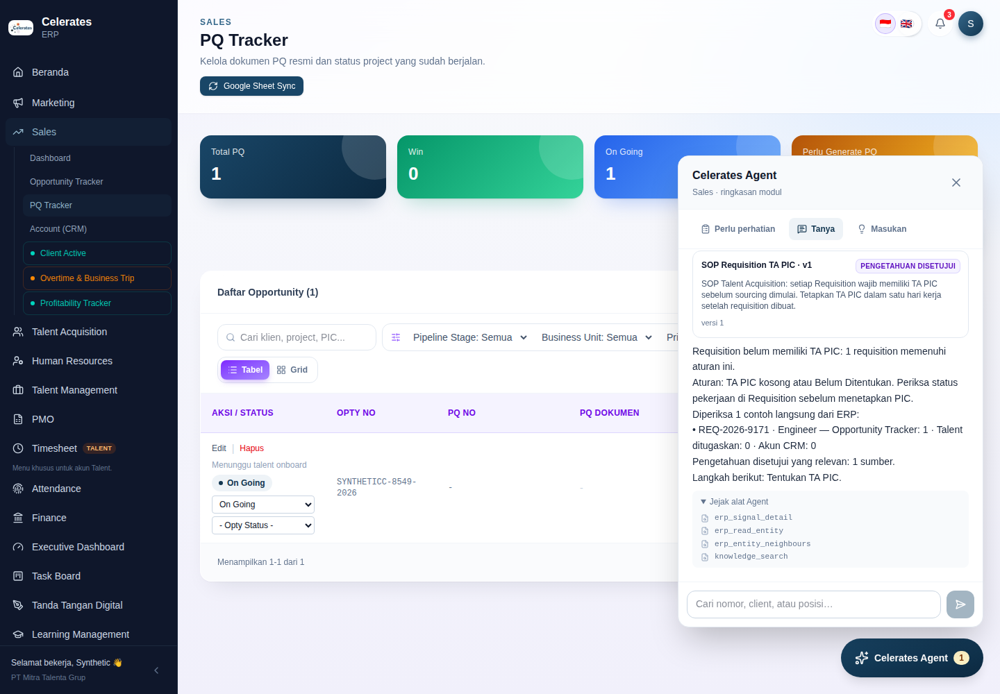
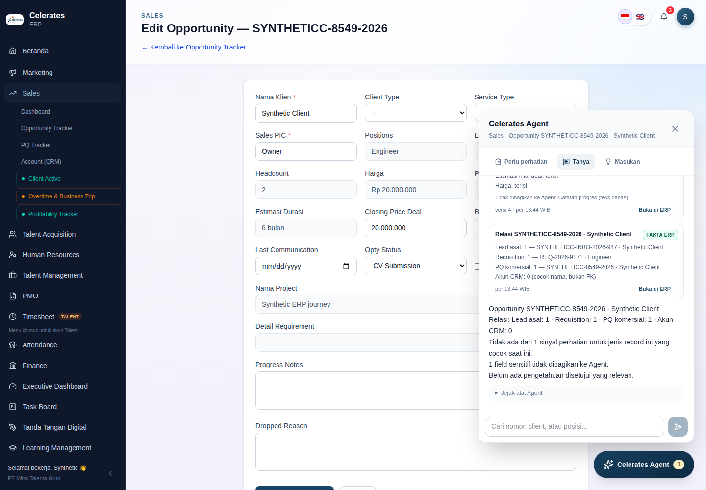
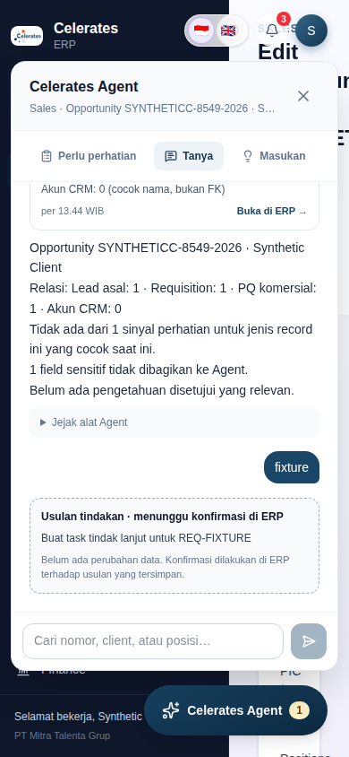

# Operating Substrate M1 — Celerates Agent shell: implementation record

Date: 2026-09-26. Branch: `audit/erp-production-readiness`.
Direction: [doc 14](../14-celerates-enterprise-intelligence-operating-model.md) (North Star), [doc 15 §5 M1](../15-operating-substrate-assessment-and-next-increment.md), [doc 16](../16-operating-substrate-build-reuse-adopt.md).
Decisions: [ADR-008](../adr/ADR-008-erp-issued-user-delegation.md), [ADR-009](../adr/ADR-009-erp-entity-catalog-and-federated-reads.md), [ADR-013](../adr/ADR-013-agent-interaction-protocol-and-runtime.md). ADR-010 (proposals), ADR-011 (imports) and ADR-012 (speech) are **not written**: M1 performs no writes, imports or voice, so nothing in the code depends on them yet.

## What M1 delivers

`Bantuan Operasional` became **Celerates Agent**. It is the same launcher position and the same deterministic content, now backed by the shared Intelligence Layer.

| Capability | Where | Behaviour |
| --- | --- | --- |
| **Perlu perhatian** (unchanged) | `components/agent/attention.tsx`, `lib/operations/reader.ts` | Same 9 rules, SQL, wording, counts and links. The rule-metadata hash is identical before and after the refactor (`08eeb5fd…`), and a test locks it. Each group gains **Tanyakan**. |
| **Masukan** (unchanged) | `components/agent/feedback.tsx` | Same Feature Request form and path, moved verbatim. The existing browser journey still files a contextual FR. |
| **Tanya** | `components/agent/agent-thread.tsx` | The assistant-ui thread and composer. Suggestions: explain the current record, and "why" for the top attention groups. Free text runs a keyword search. |
| **ERP-authenticated delegation** | `lib/agent/delegation.ts`, `cdi/delegation.py` | Ed25519, ≤ 5 min, issuer/audience/environment bound, rotation-aware. No workspace token and nothing secret reaches the browser. |
| **Entity Catalog v1** | `lib/agent/catalog.ts` | 8 types; field sensitivity; code-owned relationships (`fk` / `name_match`); page routes → entity. |
| **Delegated contract** | `lib/agent/{contract,reads}.ts` under `/api/integration/v1/agent/*` | `catalog`, `signals/{key}`, `entities/{type}/{id}`, `…/neighbours`, `…/signals`, `search`. Requires the machine read token **and** the delegation. The user is reloaded from the DB on every call. Read-only (405 on anything else). |
| **Agent BFF** | `app/api/agent/{context,ag-ui,runs/[id]/events}` | Same-origin, behind the existing Owner-pilot middleware, origin-checked POST. Resolves page context, mints the delegation and proxies SSE. |
| **Agent runtime** | `cdi/agent/{tools,playbooks,runs,api}.py` | Six read tools, three deterministic playbooks, bounded runs (12 calls / 60 s), and persisted AG-UI steps with resume. |
| **Evidence types** | `components/agent/evidence.tsx` | Badges: *Fakta ERP*, *Sinyal*, *Pengetahuan disetujui* (plus *Observasi* and *Inferensi*, reserved). Each card carries its version and as-of time, withheld field names, and a link back to the ERP page. |

### Sensitivity rules enforced in ERP

- `internal` fields are returned.
- `commercial` fields (prices, deal amounts) return presence only (`terisi`/`kosong`).
- `pii` fields are withheld and only their names are listed. This includes contacts, emails and every free-text notes/description field, as a conservative M1 choice.
- Salary, allowances, religion, tax, bank and signature fields are not declared at all, and a test fails if they appear.
- Module access is checked on every read, including relationship targets, so an edge to a forbidden module returns only `withheld: MODULE_FORBIDDEN`.

## Spike results

### S1 — assistant-ui in ERP: PASS with conditions → adopted, pinned `0.15.22`

| Exit criterion (doc 16 §5) | Result |
| --- | --- |
| Builds under Next 15.5.24 / React 19.2 / Tailwind 4 | Pass. `npm run build` and `tsc` are clean. |
| `ExternalStoreRuntime` over our run store | Pass. Our reducer (`lib/agent/run-state.ts`) produces `ThreadMessageLike`. assistant-ui holds no run state. |
| Evidence card and proposal card as tool UIs | Pass via data parts: `data-evidence`, `data-proposal`, `data-progress`, `data-error`. The proposal was moved out of tool UIs because `ToolGroup` collapses tool calls, which would hide a proposal. Verified in the browser with a transport-level fixture: the card renders read-only with no confirm control. |
| Composer accepts file drop; mic slot | API present (`ComposerPrimitive.AttachmentDropzone`, `Dictate`) but **not wired in M1**. Its built-in `WebSpeechDictationAdapter` uses browser server-side recognition, which doc 15 §2.10 rules out. M2 decides. |
| Keyboard / screen reader | Escape closes and focus returns to the launcher; tabs use `aria-pressed`; composer and send are labelled; no browser exceptions. No automated axe audit was run. |
| Lazy-loaded, no first-load change | Pass. First-load JS is unchanged (`/sales` 131 kB, `/pmo/invoices` 134 kB, `/tasks` 124 kB, shared 102 kB; `/marketing` +1 kB from the shell). |

Condition 1 — the thread chunk is heavy: about **105 kB gzip / 347 kB raw**, loaded only on the first `Tanya` open. The browser test asserts that it loads only then.

Condition 2 — the library is volatile: `ExternalStoreRuntime` ships from a `legacy-runtime` path, and some exported APIs carry removal dates already past. The version is pinned exactly and all semantics live outside the library. The fallback (build the thread and composer ourselves, about 1–1.5 weeks) remains open for M2.

### S2 — AG-UI through ERP BFF and Intelligence: PASS → adopted (protocol 1.0)

| Exit criterion | Result |
| --- | --- |
| Python emits AG-UI events from persisted steps | Pass. `ag-ui-protocol==1.0.0` models write to `agent_steps(run_id, seq)` first. |
| Next route handler proxies SSE | Pass. `POST /api/agent/ag-ui` takes `RunAgentInput` and streams back; `X-Accel-Buffering: no` is set on both hops. |
| Reconnect resumes by `Last-Event-ID` | Pass. `GET /api/agent/runs/{id}/events` returns exactly the tail after the given id. The reducer de-duplicates replays. |
| `celerates.*` custom events render | Pass. `celerates.evidence` renders as typed cards. |
| Forged "resume/approve" payload has no effect | Pass. A body with forged `resume`, `state.approved`, and a `tools` entry for `apply_command` ran a read-only playbook. Task, feature-request, command and requisition counts were unchanged. |
| Standard client conformance (added) | Pass. Every streamed event validates against `@ag-ui/core` 1.0 schemas, and the unmodified `@ag-ui/client` `HttpAgent` runs against the BFF and assembles the assistant message. |

Measured locally: an `explain_signal` run (4 tool calls, 3 delegated ERP reads, knowledge search) finished in about 0.6 s with 30 AG-UI events.

`@assistant-ui/react-ag-ui` was not used: it depends on `@ag-ui/client` 0.0.x (pre-1.0) and would own the transport.

## Deviations from docs 13–16, and why

1. **Floating panel kept, not a full-height right dock** (doc 12). This preserves tested behaviour (focus, mobile bounds, overlay without reflow) and only increases the height to `min(680 px, viewport)`. A docked mode is a presentation change for later.
2. **Free-text notes are `pii` (withheld)**: notes on leads, requisitions and CRM accounts, opportunity progress notes, and task/FR descriptions. Structured requirement fields (`requirement_summary`, `detail_requirement`) stay `internal`. This is stricter than doc 15, which proposed withholding only personal data. It is reversible per field once BA confirms the content.
3. **Agent knowledge search fixes two retrieval defects found during implementation.**
   - `ts_rank` returns a tiny non-zero value on no match, and `plainto_tsquery` ANDs every word, so the old "lexical > 0" check admitted everything.
   - Agent search now matches with `@@` over OR-joined terms, skips a small list of function words, and never admits passages on demo-hash "similarity".
   - The Pre-Sales retrieval (`documents.retrieve`, `knowledge.retrieve`) still has the quirk and is left unchanged here. It belongs to the M2 retrieval work (doc 15 §2.4).
4. **The `employee` projection has no name.** `employees` has no name column; names live on candidates/onboarding. Joining them would pull personal data into M1.
5. **Launcher renamed "Celerates Agent"**; the unmounted `FeatureRequestFab` was removed. The browser journey was updated for the new accessible names only; its behavioural assertions are unchanged.
6. **Record grants are not consulted for delegated reads** (ADR-008). Unattended Pre-Sales reads still require them.
7. **No Console changes, voice, model calls, PydanticAI or LiteLLM Proxy**, as scoped. `modality=voice` is rejected (422) until M2.

## Verification

All local verification ran on PostgreSQL 16 + pgvector, with Chromium via Playwright, against disposable synthetic data.

| Suite | Result |
| --- | --- |
| ERP `npm test` (10 tests incl. 4 new in `tests/agent.test.ts`) | 10/10 pass: delegation forgery/expiry/rotation, catalog routes and forbidden fields, AG-UI schema conformance + reducer, delegated reads (sensitivity, relations, search, module gating, revoked user), signal parity with `Perlu perhatian`, rule-metadata snapshot |
| ERP `tsc --noEmit`, `next build` | Pass |
| Intelligence `pytest` (20 pass, 1 optional Docling skip) incl. `tests/test_agent.py` | Pass: delegation verification/forgery, delegated principal scope, read-only registry, persisted run + resume + isolation + idempotent run id, stale run closed once, scoped knowledge search without padding |
| Intelligence `ruff check` | Pass |
| Web `npm run build` | Pass (unchanged) |
| Cross-stack harness `node tests/http-smoke.mjs` with `ERP_BROWSER_TEST=1 FOUNDATION_BROWSER_TEST=1` | Pass. All pre-existing journeys (ERP flows, Bantuan-now-Agent browser journey, machine contract, closed loop, foundation browser) plus the new `agent-journey.mjs` and `agent-browser.mjs` |

CI: `.github/workflows/erp-ci.yml` gains an `erp_agent_test` database (`AGENT_DATABASE_URL`) and uploads the Agent screenshots with the existing evidence.

## Deployment and runtime

I have no Railway access from this environment. **This increment has not been deployed or verified on Railway by me.**

If the Railway services auto-deploy from this branch, the push deploys code that is backward-compatible:
- Intelligence migration `003_agent_runs.sql` is additive and runs at start.
- There is no ERP schema change.
- New Python dependencies: `cryptography`, `ag-ui-protocol`.
- New ERP dependency: `@assistant-ui/react`.

**Without the configuration below**, `/api/agent/context` reports `enabled: false`. `Perlu perhatian` and `Masukan` work exactly as before, `Tanyakan` is hidden, and `Tanya` explains that the Agent is not configured.

To enable the Agent:

1. Run `node scripts/generate-agent-delegation-key.mjs erp-2026-09`. It prints nothing to disk.
2. ERP service: set `AGENT_DELEGATION_KID` and `AGENT_DELEGATION_PRIVATE_KEY` (secret), and `INTELLIGENCE_BASE_URL` (the Intelligence web origin; nginx forwards `/api/agent/*`).
   - The existing `INTELLIGENCE_READ_TOKEN_SHA256` and `INTELLIGENCE_ENVIRONMENT` are reused.
3. Intelligence API: set `ERP_DELEGATION_PUBLIC_KEYS` (the printed JSON).
   - The existing `ERP_MODE=http`, `ERP_BASE_URL`, `ERP_TOKEN` and `ERP_ENVIRONMENT` are reused; the environment must match the ERP issuer.
   - The worker does not need the key: interactive runs execute in the API process.
4. Verify:
   - log in as the Owner and open a Sales Opportunity edit page;
   - check the panel header names the record;
   - on `/sales`, press **Tanyakan** on *Requisition belum memiliki TA PIC*;
   - check evidence cards appear with *Fakta ERP* / *Sinyal* badges.

   The ERP must contain real or clearly marked synthetic records for a meaningful demo; production had zero Intelligence grants at the last probe, which no longer matters for Agent reads.

Rotation: add the new public key to `ERP_DELEGATION_PUBLIC_KEYS`, switch the ERP kid and key, list the old public key in `AGENT_DELEGATION_PREVIOUS_PUBLIC_KEYS` during overlap, then remove it.

## Visible demo (about 5 minutes)

1. Open `/sales`. The launcher reads **Celerates Agent** with the attention badge. The panel opens on **Perlu perhatian**, with the same groups as before.
2. On *Requisition belum memiliki TA PIC*, press **Tanyakan**. The **Tanya** tab shows live steps:
   - *Membaca sinyal ERP* → *Memeriksa REQ-…* → *Mencari pengetahuan yang disetujui*;
   - then evidence cards: the rule (*Sinyal*), the requisition facts with commercial presence only and withheld fields named (*Fakta ERP*), its relations such as "Opportunity Tracker: 1 · Talent ditugaskan: 0 · Akun CRM: 0 (cocok nama, bukan FK)", and the approved SOP (*Pengetahuan disetujui*, version 1);
   - then the deterministic summary and next step.
3. Open *Jejak alat Agent* to show the four typed tool calls.
4. Open an Opportunity edit page. The header names the record; **Jelaskan Opportunity …** shows facts, relations and which rules match.
5. Type a client name in the composer to run a keyword search across Lead, Opportunity, PQ, Requisition and CRM account (module-gated).
6. Switch to **Masukan** and file a Feature Request exactly as before.

## Handoff for the next implementer

Start with M2 (doc 15 §5), keeping these boundaries:

- **Retrieval first.**
  - Add `indonesian` + `english` (+ `unaccent`) lexical vectors and reciprocal-rank fusion.
  - Split `GENERATION_MODE` / `EMBEDDING_MODE`, with an explicit re-embed job.
  - Fix the `ts_rank`/`plainto_tsquery` defect in `documents.retrieve` and `knowledge.retrieve`.
  - Measure with an Indonesian/English relevance set before claiming universal search.
- **Search:** extend `reads.search` with normalized-name resolution (legal forms, unaccent, trigram) and `entity_mentions` confirmation. Keep search federated: never copy ERP rows into Intelligence.
- **Voice:** push-to-talk → `transcribe` gateway alias → editable transcript → the same run with `modality=voice`. Run S4 first. Do not use assistant-ui's `WebSpeechDictationAdapter`.
- **Model evaluation track:** S3 (PydanticAI over `cdi/agent/tools.py`, whose metadata stays the source of truth) and S5 (LiteLLM Proxy, pinned). A model may select tools and write narrative; every fact stays a tool result with an evidence type.
- **M3 writes need ADR-010 first.**
  - ERP-held proposals and ERP-side confirm/apply with per-item receipts; `jti` replay protection for write-scoped delegations; task hardening (`source_type/source_id`, creator id, sequence `task_no`, record authorization per F04).
  - The proposal card already renders from `data-proposal` and must stay read-only in the thread.
- **Console (M2):** add Agent runs/steps (`agent_runs`, `agent_steps`) and a search lab over the same APIs. Replace the workspace token with ERP sign-in over the delegation issuer.
- **Watch items:**
  - assistant-ui chunk size and upgrade churn;
  - the thread pool size (`AGENT_WORKERS`, default 4) against real concurrency;
  - the ERP DB pool (5) under Agent load;
  - PMO/Finance rules remain unmapped to entities until BAST/handoff semantics are settled (F13).
