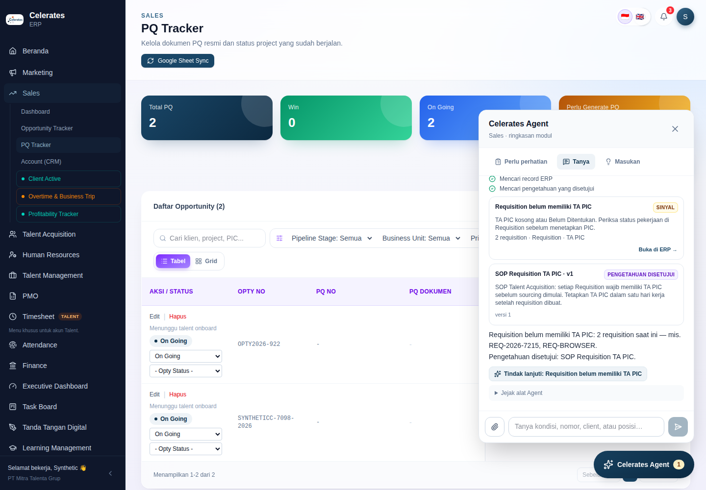
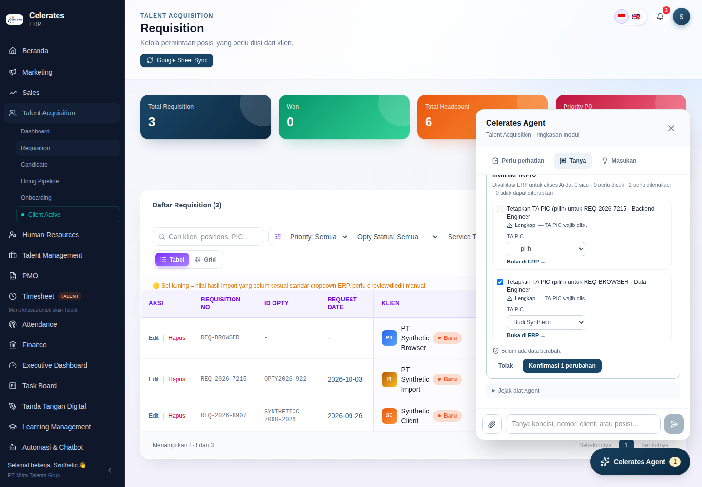
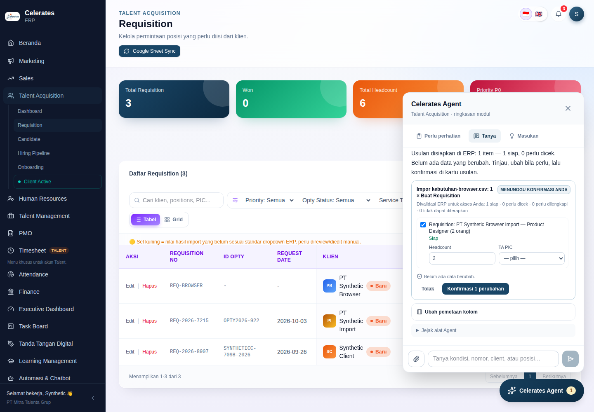
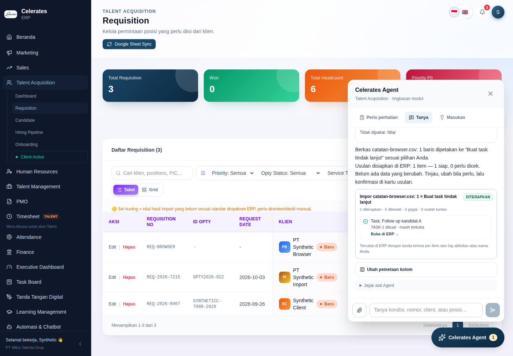

# Operating Substrate M2 — Ask, Drop, Act: implementation record

Date: 2026-09-26. Branch: `audit/erp-production-readiness`. Baseline: M1 ([record](operating-substrate-m1.md), commit `454344e`).
Direction: [doc 14](../14-celerates-enterprise-intelligence-operating-model.md) (North Star), [doc 15](../15-operating-substrate-assessment-and-next-increment.md), [doc 16](../16-operating-substrate-build-reuse-adopt.md).
Decisions: [ADR-010](../adr/ADR-010-erp-held-agent-proposals-and-outcomes.md) (proposals, receipts, outcomes) and [ADR-011](../adr/ADR-011-agent-datasets-and-imports.md) (datasets and imports) are new. [ADR-013](../adr/ADR-013-agent-interaction-protocol-and-runtime.md) is amended to allow the `propose` risk class.

M1 let the Agent read and explain. This increment makes the three Golden Journeys work end to end on the same substrate.

The substrate is:
- ERP-issued delegation;
- the Entity Catalog;
- persisted AG-UI runs;
- typed tools with deterministic playbooks.

There is still no model call. Every sentence the Agent writes is assembled from ERP rules, ERP records, approved knowledge or the user's own file, and each source is shown as typed evidence.

## What is now functional end to end

| Journey | What the user does | What happens | Where |
| --- | --- | --- | --- |
| **A. Ask anything** | Types a question in `Tanya`, e.g. "requisition mana yang belum punya TA PIC?", "status REQ-2026-5513", "astra engineer" | See the steps below this table. | `ask` in `cdi/agent/playbooks.py`; `reads.search`; `agent/signals` |
| **B. Drop anything (tables)** | Attaches or drops a CSV/XLSX in `Tanya` | See the steps below this table. | `cdi/agent/datasets.py`; `import_dataset`; `components/agent/{mapping,proposal}.tsx` |
| **C. Signal/ask → act → outcome** | Presses **Tindak lanjuti** on a `Perlu perhatian` group, or on the action offered by an answer | See the steps below this table. | `follow_up_signal`; `SIGNAL_REMEDY`; `lib/agent/{commands,proposals}.ts`; `components/agent/follow-ups.tsx` |

**Journey A — what happens:**

1. Content words are extracted; Indonesian and English question words are ignored.
2. The words are matched against the wording of every ERP attention rule the user can read. A matched rule answers with its exact count and examples, and offers **Tindak lanjuti**.
3. The ERP catalog is searched with every term required on the same record. A record number, or a single match, is read fully with its relations and matching rules. Several matches are grouped by type. A loose any-term search runs only when no rule answered, and its results are labelled "cocok sebagian".
4. Approved knowledge is cited.
5. If no source matches, the answer says so.

**Journey B — what happens:**

1. The file becomes a user-owned dataset. The delimiter is voted, title rows are skipped, the header is detected, and day-first and Indonesian dates are handled.
2. Intelligence picks the ERP command whose parameter specs the columns fit best: names, aliases and enum values, taken from ERP's catalog. The mapping is shown as *Inferensi*, with unused columns listed.
3. ERP validates every row: types, enums, PIC names, and possible duplicates. Only rows ERP marks `ok` are pre-selected.
4. The user confirms. Rows are created exactly like the manual TA action, which creates a tracker, an opportunity and a requisition.
5. If required columns are missing, or the guess is wrong, the **mapping card** lets the user choose the command and the columns. That starts a new, re-validated proposal.
6. An applied import teaches the header-set mapping. The next identical file maps the same way, labelled *Observasi*.

**Journey C — what happens:**

1. ERP declares the remedy command next to the rule. For example, *Requisition belum memiliki TA PIC* → assign a TA PIC; every other rule → a follow-up task linked to each record.
2. Intelligence creates an ERP-held pending proposal. The user fills editable fields (PIC from ERP's list), includes or excludes items, and confirms.
3. ERP re-validates each item with the user's current access and applies it in a savepoint. It never overwrites a PIC someone set meanwhile. It writes per-item receipts and an activity log "<user> (via Celerates Agent)".
4. The rule clears in `Perlu perhatian`.
5. **Tindak lanjut berjalan** shows the user's recent proposals, with live resolved/open outcomes that ERP computes from current records.
6. ERP reports the decision to Intelligence (`agent_outcomes`).

### Governed write path (ADR-010)

```
Intelligence playbook ──(action token + user delegation + Idempotency-Key)──▶ ERP: create *pending* proposal
                                                                             (validate each item for this user;
                                                                              store items + sha256; no effect)
User in ERP session ──(same origin, stored sha256, include/edit only editable fields)──▶ ERP: confirm
   └─ re-validate with current access → savepoint per item → receipt per item → activity log → outcome check
ERP ──(best effort, user delegation)──▶ Intelligence: POST /api/agent/runs/{id}/outcomes (learning signal only)
```

- Intelligence cannot confirm or apply.
- A replayed confirm returns the stored receipts.
- A changed proposal returns 412; an expired or rejected one returns 409.
- A forged AG-UI `resume`/`state` is still inert.
- Voice does not exist yet and could not confirm.

### M1 invariants — verified, not regressed

- **`Perlu perhatian`**: same 9 rules, SQL, wording, counts and links. The metadata hash test is still `08eeb5fd…`, and `readSignal` parity with the panel still holds. The panel only gains **Tindak lanjuti** and **Tindak lanjut berjalan**.
- **`Masukan`**: unchanged; the existing browser journey still files a contextual Feature Request. `feature_request.create` mirrors it for Agent use.
- **Delegation**: ERP-issued Ed25519 delegation on every delegated call; the user is reloaded from the DB each time.
- **Catalog sensitivity**: unchanged. Withheld and commercial fields never leave ERP (re-asserted in the journey).
- **AG-UI**: stream, resume and conformance with the standard `@ag-ui/client` are re-verified.
- **assistant-ui**: still lazily loaded; first-load JS is unchanged (`/sales` 131 kB, `/pmo/invoices` 134 kB, `/tasks` 124 kB).

## Architecture decisions changed, and why

1. **ADR-010 (new): confirmation lives in an ERP session, not in a write-scoped delegation.**
   - Doc 15 anticipated `jti` replay protection for write-scoped delegations.
   - Implementation showed it is unnecessary once the delegation can only create a *pending* proposal. The only effectful call is a same-origin ERP session POST against a stored digest, and it is idempotent by proposal state.
   - Result: fewer moving parts, and the model or Intelligence can never hold authority.
2. **Signal remedies are declared in ERP** (`SIGNAL_REMEDY`), not in playbooks. Adding a remedy is a one-line ERP change next to the rule, and Intelligence stays free of per-workflow branches.
3. **The command allowlist lives in ERP** (`commands.ts`: params, aliases, editable fields, preconditions, apply, outcome). Intelligence reads it from `agent/catalog`. The import mapper therefore works for any command without new code.
4. **ADR-011 (new): datasets are owner-scoped in Intelligence, and mapping memory is learned only from applied ERP outcomes.**
   - Imports do not go through the knowledge pipeline, because they are not knowledge.
   - The mapping is labelled *Inferensi*; a learned or user-chosen mapping is labelled *Observasi*.
5. **"Ask anything" is federated and deterministic.**
   - Search stays in ERP: multi-term, catalog-declared non-sensitive fields, module-gated. It gains an any-term ranked mode.
   - Nothing is indexed or copied into Intelligence, which keeps ADR-009.
   - A model is still not needed for the demo journeys. The model loop (PydanticAI/LiteLLM) remains the evaluation track in doc 16.
6. **ADR-013 amended**: the registry accepts `read` and `propose` tools; there is no `write` class. A test enforces that the ERP client exposes no apply or confirm method.
7. **Task provenance (audit F04, for Agent-created tasks)**: `kanban_tasks.source_type/source_id/created_by_user_id`, and the task number is allocated under an advisory lock. Manual task creation is unchanged.

No locked decision in ADR-001…009 changed. Docs 14–16 need no material correction: this increment realizes doc 15's M2/M3 items A/B/C with the simplifications above.

## What remains incomplete

- **Model-backed understanding.** Questions are routed by word overlap with rule wording and by catalog search. Paraphrases that share no words with a rule or record will not match. Next step: the S3 evaluation (PydanticAI over `cdi/agent/tools.py`), with the same evidence contract.
- **Retrieval quality (M1 handoff).** Indonesian and English FTS with reciprocal-rank fusion, the embedding-mode split, and the `ts_rank` defect in Pre-Sales retrieval are *not* done. Agent knowledge search uses the M1 OR-`@@` path.
- **Search depth.** No legal-form or name normalization (e.g. "PT"), no trigram matching, no `entity_mentions`.
- **Voice** (ADR-012) is not started.
- **Brain Console.** No agent runs, outcomes or datasets pages yet. Data is in `agent_runs`, `agent_steps`, `agent_outcomes`, `agent_datasets` and `agent_mapping_templates`.
- **Imports.**
  - Only commands with parameter specs can be imported: `requisition.create` and `task.create`. `lead.create` needs an ERP command.
  - One proposal holds at most 200 rows; a dataset holds 2,000 rows and 2 MB.
  - PDF, DOCX and images are not "drop anything" yet.
  - Datasets are purged after 30 days by the worker (rows and original file). Proposal items in ERP keep the imported values as the record of what was proposed.
- **Proposals.**
  - The user is not notified outside the panel.
  - Undo is a normal ERP edit.
  - The outcome of `requisition.create` means "exists", not "filled".
  - Pending proposals expire after 2 hours, and expired ones are hidden from **Tindak lanjut berjalan**.
- **Access for editors.** Non-Owner editors can use commands (`canWriteModule`), but the ERP pilot middleware still admits only the Owner, so this is exercised only in tests.

## Test and build evidence

All local verification used PostgreSQL 16 + pgvector (and PGlite for the default unit mode), with Chromium via Playwright, on disposable synthetic data.

| Suite | Result |
| --- | --- |
| ERP `npm test` (11 tests; new `tests/proposals.test.ts`) | 11/11 pass on PGlite **and** on real PostgreSQL (CI mode). See the coverage list below. |
| ERP `tsc --noEmit`, `next build` | Pass. First-load JS unchanged versus M1. |
| Intelligence `pytest` (25 pass, 1 optional Docling skip) and `ruff check` | Pass. See the coverage list below. |
| Cross-stack `node tests/http-smoke.mjs` with `ERP_BROWSER_TEST=1 FOUNDATION_BROWSER_TEST=1` | Pass on PGlite and on real PostgreSQL (CI mode). All pre-existing journeys are unchanged, plus the new Agent journeys listed below. |

**ERP proposals test covers:**
- validation per user; viewer and revoked user cannot apply;
- idempotency and key conflict; only the proposer can confirm; digest mismatch returns 412;
- re-validation against a concurrent manual change, with no overwrite; non-editable overrides ignored; unknown commands never run;
- replay without a second effect; expiry and rejection;
- `requisition.create` parity (tracker + opportunity + requisition); duplicate warning;
- task provenance; outcome transition to *tuntas*; Feature Request notification;
- activity-log attribution.

**Intelligence tests cover:**
- tools can read or propose, never write;
- follow-up proposes the ERP-declared remedy with PIC left to the user;
- import mapping from ERP specs with title row, `;` delimiter and Indonesian dates;
- dataset ownership and outcome isolation;
- learning only from applied outcomes;
- missing columns → mapping card; user correction and its validation;
- `ask` routing: rule, record number, partial match, nothing found;
- dataset retention purges rows and files.

**New Agent journeys in the cross-stack harness:**
- API: ask (rule + SOP + action, record number); follow-up (proposal → cross-origin refused → 412 → confirm → PIC set → activity log → replay → signal cleared → outcome listed and reported to Intelligence); import (bad file rejected → mapping inference → per-row validation → confirm → rows created → template learned → re-import labelled *Observasi* and duplicate flagged → reject).
- Browser: ask with an action chip; **Tindak lanjuti** → choose PIC → **Konfirmasi** → receipt → **Tindak lanjut berjalan** shows it resolved; CSV attach → confirm; wrong headers → mapping card → confirm.

CI: `erp-ci.yml` gains `erp_proposals_test` (`PROPOSALS_DATABASE_URL`). GitHub Actions results for the pushed commits are listed at the end of this file.






## Runtime and configuration

**Not deployed.** As instructed, nothing was deployed to Railway from this session. The code is deploy-ready and backward-compatible.

- **Migrations run at start in both services.**
  - ERP `drizzle/0005_agent_proposals.sql`: two new tables and three nullable `kanban_tasks` columns, additive.
  - Intelligence `infra/postgres/migrations/004_agent_outcomes_and_datasets.sql`: three new tables, additive.
- **No new environment variables.** The feature uses the M1 Agent configuration plus two existing variables:
  - ERP `INTELLIGENCE_ACTION_TOKEN_SHA256`, which the ADR-007 contract already requires. It now also gates `POST agent/proposals`.
  - Intelligence `ERP_ACTION_TOKEN`, already required in `ERP_MODE=http`.
- **Storage.** Datasets use the Intelligence object storage that is already configured (`STORAGE_BACKEND`). The web proxy forwards `/api/agent/*` with an 11 MB body limit, and datasets are capped at 2 MB.
- **No new dependencies.** `openpyxl` and `python-multipart` were already present.
- **Optional:** Intelligence `AGENT_DATASET_DAYS` (default 30) sets the dataset retention. The existing worker service runs the purge hourly.
- **Without the Agent configuration**, the panel behaves as M1 does without it: `Perlu perhatian` and `Masukan` only. **Tindak lanjuti**, **Tindak lanjut berjalan** and file drop are hidden.
- **Post-deploy smoke test** (Owner session, synthetic or real records):
  1. `/ta` → **Tindak lanjuti** on *Requisition belum memiliki TA PIC* → choose a PIC → **Konfirmasi**. Check the requisition's TA PIC and the activity log "(via Celerates Agent)".
  2. Attach a small CSV with `Client,Position,Headcount`, then confirm.
  3. Ask "requisition mana yang belum punya TA PIC?".

## Stakeholder demo (about 8 minutes)

1. **Perlu perhatian, unchanged.** Open `/ta` → **Celerates Agent**. The same rule groups, counts and links appear, and each group now has **Tanyakan** and **Tindak lanjuti**.
2. **Ask anything.**
   - In **Tanya**, type *requisition mana yang belum punya TA PIC?*. The answer gives the exact count and examples from the rule (*Sinyal*), cites the SOP (*Pengetahuan disetujui*), and offers **Tindak lanjuti**.
   - Then type a requisition number, e.g. *status REQ-…*. The record is read with its relations and matching rules (*Fakta ERP*).
3. **Act, governed.**
   - Press **Tindak lanjuti**. A proposal card appears: "Belum ada data berubah".
   - Pick a TA PIC from ERP's own list; the item auto-includes. Press **Konfirmasi 1 perubahan**.
   - The receipt shows the change as applied. Open the requisition via **Buka di ERP** and show the TA PIC and the activity log "Owner (via Celerates Agent)".
4. **Outcome.** Back in **Perlu perhatian**, the rule count dropped. **Tindak lanjut berjalan** shows the follow-up as "1 dari 1 tuntas".
5. **Drop a file.**
   - Attach a CSV/XLSX of client needs (e.g. `Klien;Jabatan;Jumlah;Level;Tanggal Request`, with a title row).
   - The Agent shows the file (*Berkas Anda*) and the column mapping (*Inferensi*, with unused columns).
   - ERP validates each row: an unknown level is *tidak dapat diterapkan*, and a repeat is flagged as a possible duplicate. Confirm the ready rows; requisitions appear in `/ta`.
6. **It learns, only from what was applied.**
   - Upload the same file again. The mapping is now *Observasi*, "sama seperti impor sebelumnya yang diterapkan", and ERP flags the rows as duplicates of what was just imported.
   - Upload a file with unfamiliar headers. The mapping card opens; choose "Buat task tindak lanjut" and a column for *Judul*, then confirm.
7. **Masukan.** File a Feature Request exactly as before.

## Safest next continuation point

Start from this commit on `audit/erp-production-readiness`. In order:

1. **Deploy and verify on Railway** (separate task). Run the post-deploy smoke above. Watch the ERP DB pool (5) and `AGENT_WORKERS` (4) under real use.
2. **Retrieval and search quality** (M1 handoff, still open):
   - Indonesian + English FTS with reciprocal-rank fusion and a relevance set;
   - name normalization / trigram in `reads.search`;
   - fix `ts_rank` in Pre-Sales retrieval.
3. **Model evaluation track (S3/S5).**
   - Let a bounded model loop choose among `allowed_tools(principal)` for questions the deterministic `ask` cannot route.
   - Keep: facts only from tool results; `propose` as the only effectful class; ERP confirmation unchanged.
4. **More ERP commands, as data rather than code paths**:
   - `lead.create`, which enables lead imports;
   - task assignment for PMO/Finance rules once F13 semantics are settled.
5. **Brain Console**: read-only views over `agent_runs`, `agent_outcomes` and `agent_mapping_templates` (what was asked, proposed, applied and learned), behind ERP sign-in.
6. **Voice (ADR-012)**: push-to-talk → transcript → the same `ask` run. Voice never confirms.

## CI results

GitHub Actions on the pushed commits (`a98eec5`, `985c390`, `468ed9c`, `81ce85c`):

| Job | Result |
| --- | --- |
| ERP pilot checks `verify` — unit tests on PostgreSQL, typecheck, builds, full cross-stack HTTP + browser harness incl. the new Agent journeys | Pass on all four commits. Final: [run 36235498763](https://github.com/yosdwi/celerates-digital-intelligence/actions/runs/36235498763/job/108386399284) |
| P0 `api` (pytest + ruff) | Pass: [run 36235498772](https://github.com/yosdwi/celerates-digital-intelligence/actions/runs/36235498772/job/108386399465) |
| P0 `web` | Pass: [same run](https://github.com/yosdwi/celerates-digital-intelligence/actions/runs/36235498772/job/108386399456) |
| P0 `compose` | Fails at `docker compose up --build`. This is the same pre-existing gate as M1 and the foundation commits (pinned MinIO image pull); this increment did not cause it. |
