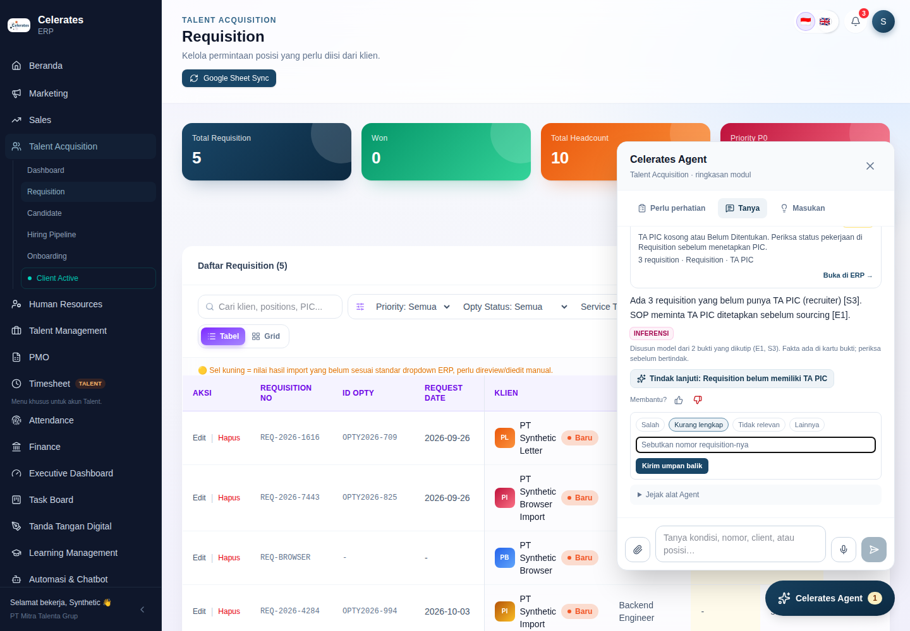
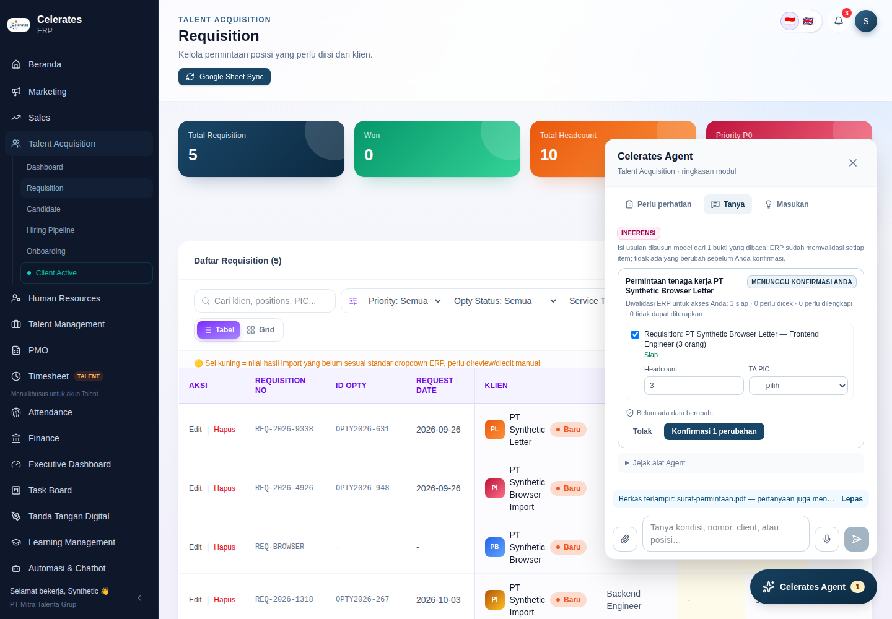
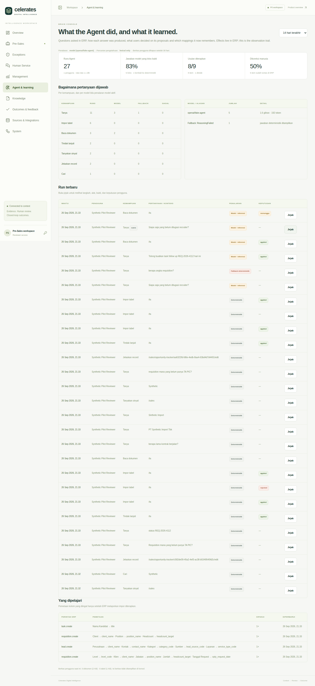
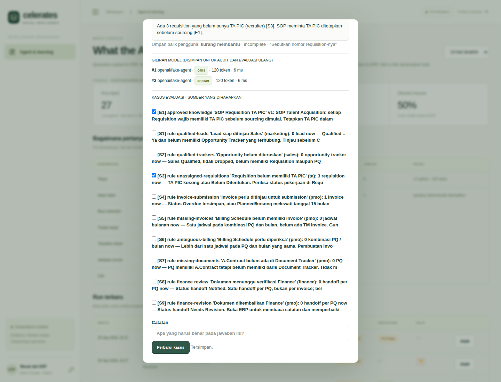

# Operating Substrate M3 — Understanding, documents, voice and the Brain Console: implementation record

Date: 2026-09-26. Branch: `audit/erp-production-readiness`. Baseline: M2 at `6fca148`, deployed to production.
Direction: [doc 14](../14-celerates-enterprise-intelligence-operating-model.md), [doc 15](../15-operating-substrate-assessment-and-next-increment.md), [doc 16](../16-operating-substrate-build-reuse-adopt.md). Previous: [M2 record](operating-substrate-m2.md).

New decisions:
- [ADR-014](../adr/ADR-014-bounded-model-reasoning.md) — bounded model reasoning; PydanticAI is not adopted.
- [ADR-012](../adr/ADR-012-push-to-talk-voice.md) — push-to-talk voice.

Amended: [ADR-011](../adr/ADR-011-agent-datasets-and-imports.md) (documents) and [ADR-013](../adr/ADR-013-agent-interaction-protocol-and-runtime.md) §7.

## Why this increment

In production, M2's `ask` answered only when a question shared words with an ERP rule or record, and "drop anything" meant only CSV/XLSX. The highest-leverage gap was **understanding**: paraphrases, natural-language requests to act, and documents people actually receive. Each of these needed to stay bounded by the same evidence and authority rules.

Understanding is only as good as the evidence it reads, so the retrieval and name-resolution layers were improved in the same increment. Voice then came almost free, because it is only another way to fill the same composer. The Brain Console makes all of this inspectable.

Everything extends the shared substrate:
- the same tool registry and AG-UI runs;
- the same evidence cards;
- the same ERP-held proposals and ERP confirmation.

No workflow-specific endpoint was added.

## What is now functional end to end

| Capability | What the user sees | Guarantees | Where |
| --- | --- | --- | --- |
| **Model understanding** (optional) | Paraphrased questions are answered. The answer text carries an **Inferensi** label and cites `[S2]`/`[E1]`/`[D1]`, and each id matches an evidence card. The cited rule offers **Tindak lanjuti**. | Plan → read → answer in at most 4 JSON turns. Reads come from a planner allowlist. Citations must exist, and every number must occur in the evidence. On any failure it falls back to the deterministic router and says so. | `cdi/agent/reasoning.py`, `gateway.structured` |
| **Natural-language actions** | "Tolong buatkan task follow up REQ-… hari ini" produces a proposal card. The user confirms, and a task linked to the requisition is created. | The model can only call `erp_propose`, which creates a pending proposal. ERP validates each item, and the user confirms in an ERP session (ADR-010). | same |
| **Drop documents** | Drop a PDF, DOCX, TXT or MD file. Without a model: size, sections, and the record numbers it names, linked to ERP. With a model: a cited summary, or a **proposal** when the file asks for work. For example, a request letter becomes requisitions. The file stays attached, so follow-up questions cite its pages. | The document belongs to the uploader only and is never treated as knowledge. It is purged after 30 days. The model can search only the document bound to the run. Scanned PDFs are refused (no OCR). | `cdi/agent/documents.py`, `read_document`, migration 006 |
| **Indonesian + English retrieval** | Knowledge answers match Indonesian morphology (e.g. *pembayaran → bayar*, *diverifikasi → verifikasi*, *dimulai → mulai*), English stems and prefixes. | Relevance set: **9/9 top-1**, against **6/9** for the English-only baseline. RRF uses vector rank only when embeddings are semantic. `python -m cdi.reembed` re-embeds after a switch. | migration 005, `cdi/retrieval.py`, `cdi/reembed.py` |
| **Name resolution** | "PT Astra Tbk" finds "Astra"; typos find clients where pg_trgm exists; relations match despite legal forms and punctuation. | ERP-side and federated; nothing is copied into Intelligence. Without pg_trgm, fuzzy search degrades to any-term search. | ERP migration 0006, `reads.search`, `catalog.nameKey` |
| **Push-to-talk voice** (optional) | A microphone appears next to the composer. Click to record, click to stop; the transcript fills the composer for review; **Kirim** sends it. | Transcription is not a run. Audio is not stored. Voice cannot send or confirm. Runs are recorded as `modality='voice'`. | ADR-012, `components/agent/voice.tsx`, `/api/agent/transcribe` |
| **Brain Console · Agent & learning** | See the list below this table. | Curator-only. Dataset contents are never shown. Effects remain in ERP. | `cdi/agent/console.py`, `apps/web/src/Agent.tsx` |
| **Lead import and extraction** (Marketing) | `lead.create` joins the ERP command allowlist, so the existing import, mapping card and document paths now also create leads. | Mirrors the manual `createLead` action (number format, defaults). Possible duplicates are flagged by legal-form-insensitive name. The outcome stays open until the lead is qualified or disqualified. | `commands.ts` |

**Brain Console** (Intelligence web `/app/agent`) shows:
- runs by capability;
- the model-grounded share against fallback, with reasons;
- per-model turns and tokens;
- failures;
- user decisions on proposals as ERP reported them (applied, rejected, human-edited, resolved);
- learned mappings;
- the dataset footprint;
- a full run trace (steps, tools, evidence, provenance, answer, decision).

### Invariants — re-verified

- **ERP remains truth and authority.**
  - Models read what the user may read, under the user's delegation.
  - Models draft pending proposals only.
  - ERP re-validates each item at confirmation.
- **`Perlu perhatian` and `Masukan` are unchanged.** The rule-metadata hash is still `08eeb5fd…`, and the browser journeys still pass.
- **Deterministic mode is fully functional when models are disabled.**
  - Without `AGENT_MODEL`, every journey works as in M2, plus documents (deterministic read, cited passages), multilingual retrieval and name resolution.
  - Without `AGENT_TRANSCRIBE_MODEL`, no microphone is shown.
- **Facts, signals, observations and inference stay visibly distinct.**
  - Evidence cards keep their type badges.
  - Model text is labelled *Inferensi* with its citations.
  - Deterministic text is labelled as such.
  - Model-drafted proposals are labelled as inference, validated by ERP.

## Decisions that changed, and why

1. **ADR-014 — the loop is ours, not PydanticAI.**
   - Doc 16 expected PydanticAI for the model loop.
   - Building the loop showed that the boundary we need is three validated reply shapes over *our* registry.
   - That takes under 500 lines (`reasoning.py`), with no dependency, provider-portable through LiteLLM JSON mode, and fully testable with a scripted provider.
   - A framework would duplicate the registry and move validation into library code.
2. **Generation and embeddings are switched separately** (`GENERATION_MODE`, `EMBEDDING_MODE`, `AGENT_MODEL`). Production can enable reasoning without re-embedding knowledge. Switching embeddings is an explicit `cdi.reembed` step.
3. **Documents are user working material, not knowledge** (ADR-011 amendment). This keeps the governed knowledge path — curator approval, scopes — meaningful, and keeps personal documents out of other users' retrieval.
4. **Voice is an input method (ADR-012).** It is not a second agent and not a confirmation channel. This removed the need for a separate voice runtime (LiveKit stays not adopted, per doc 16).

## What remains incomplete

- **Model quality is not yet measured on real traffic.** CI proves the plumbing with a scripted stand-in, not a real provider's quality.
  - Enable `AGENT_MODEL` in a pilot.
  - Watch the grounded share and fallback reasons in the Brain Console.
  - Compare providers by switching `AGENT_MODEL`.
- **Grounding is syntactic.** It stops invented ids and numbers, but not a wrong reading of correct evidence. The *Inferensi* label and the adjacent cards are the mitigation.
- **Retrieval limits.**
  - Snowball over-stems some Indonesian forms (*penagihan → agih*).
  - Cross-lingual matching (an Indonesian question against an English passage) needs semantic embeddings (`EMBEDDING_MODE=litellm` + `cdi.reembed`).
- **Documents.** No OCR, no images, and no promotion of a dropped document to governed knowledge from the panel (the curator path exists in the Brain Console Knowledge page).
- **Voice.** Push-to-talk only; no spoken answers; the transcription language is fixed per deployment (`id` by default).
- **Brain Console.**
  - Curator workspace token only; ERP sign-in for the Console is still pending.
  - No export or alerting.
  - Evaluation is observational; there are no labelled answer sets yet.
- **Commands.** PMO and Finance remedies are still follow-up tasks; semantics are pending (F13).

## Test and build evidence

All local runs used PostgreSQL 16 + pgvector (and PGlite for the default ERP unit mode), Chromium via Playwright, and disposable synthetic data. The model path was exercised against a local OpenAI-compatible stand-in (`services/intelligence-api/tests/fake_model_server.py`) and, in unit tests, a scripted provider. **No real model provider was called from this session.**

| Suite | Result |
| --- | --- |
| Intelligence `pytest` (31 pass, 1 optional Docling skip) and `ruff check` | Pass. See the coverage list below. |
| ERP `npm test` (11 tests) | 11/11 pass on PGlite and on PostgreSQL (CI mode). See the coverage list below. |
| ERP `tsc`, `next build`; Intelligence web `tsc`, `vite build` | Pass |
| Cross-stack `node tests/http-smoke.mjs` with `ERP_BROWSER_TEST=1 FOUNDATION_BROWSER_TEST=1` on PostgreSQL | Pass. All earlier journeys, plus the new journeys listed below. |

**Intelligence tests cover:**
- model reasoning: plan/read/answer, citation ids, ungrounded-number rejection with repair, allowlist, provider down, natural-language proposal, unknown command;
- documents: DOCX/PDF parsing, scanned-PDF refusal, owner-only access, document vs table separation, model brief → proposal, model cannot choose the dataset;
- voice: capabilities, 503 when unconfigured, 401/422, transcript only (no run), `modality='voice'`;
- Brain Console: curator only (reviewer 403, delegation 401), aggregates, trace;
- retrieval: the relevance set and re-embed idempotency.

**ERP tests add:**
- provenance and citation reducer;
- legal-form search terms and name-match relations;
- fuzzy search on PostgreSQL with pg_trgm, and the degrade path on PGlite;
- `lead.create` parity, duplicate warning, user-completed fields and outcome.

**New cross-stack journeys:**
- **Deterministic:**
  - `PT … Tbk` and typo resolution;
  - leads CSV → `lead.create` → applied;
  - PDF dropped → deterministic read linked to the requisition it names → cited question;
  - 9 MB file refused.
- **Model (stand-in):**
  - paraphrase answered with a cited rule and SOP as *Inferensi*;
  - ungrounded answer rejected with deterministic fallback;
  - natural-language task → proposal → confirmed task linked to the requisition;
  - request-letter PDF → requisition proposal → applied;
  - capabilities (reasoning + voice) and transcription API.
- **Browser:**
  - fake-microphone push-to-talk → transcript reviewed then sent → *Inferensi* line with every cited id matching a card;
  - PDF drop → requisition proposal card;
  - Brain Console (reasoning mode, voice badge, trace, learned mappings, mobile).

CI results for the pushed commits are listed at the end of this file.

## Runtime and configuration

**Not deployed from this session.** All changes are backward-compatible and deploy-ready.

- **Migrations run at start in both services, and all are additive.**
  - ERP `0006_name_resolution.sql`: best-effort `CREATE EXTENSION pg_trgm`. If the database role cannot create it, a notice is logged and fuzzy search degrades.
  - Intelligence `005_multilingual_search.sql`: a generated `chunks.search_multi` column and a GIN index. This rewrites `chunks` once, which is fast at pilot size.
  - Intelligence `006_agent_documents.sql`: `agent_datasets.kind`.
- **New dependency:** `pypdf` (Intelligence, in `uv.lock`).
- **With no new configuration**, the Agent behaves as in M2 plus the deterministic parts of this increment: documents, retrieval, names, leads and the Brain Console.
- **To enable model understanding** (Intelligence API service):
  - `GENERATION_MODE=litellm`;
  - `AGENT_MODEL=<litellm model>` (e.g. `openai/gpt-4.1-mini`, `anthropic/claude-…`, or a LiteLLM proxy alias);
  - `MODEL_API_KEY` and, for a proxy, `MODEL_API_BASE`;
  - optionally `FALLBACK_MODEL` and `AGENT_FAST_MODEL`.
  - Keep `EMBEDDING_MODE=demo` until you run `python -m cdi.reembed` with a real embedding model.
- **To enable voice:** `AGENT_TRANSCRIBE_MODEL=<whisper-compatible model>` (e.g. `openai/whisper-1`), plus optionally `AGENT_TRANSCRIBE_LANGUAGE`. It requires `GENERATION_MODE=litellm`.
- **No ERP configuration changes.** ERP discovers reasoning and voice from `GET /api/agent/capabilities`, cached for 15 s.
- **Brain Console:** open `/app/agent` in the Intelligence web with a curator workspace token.
- **Post-deploy smoke test:**
  1. `/ta` → **Tanya** → "requisition mana yang belum punya TA PIC?". The answer is deterministic, or model with *Inferensi*.
  2. Attach a text PDF, then ask about it.
  3. Open `/app/agent` in the Intelligence web.

## Stakeholder demo (about 10 minutes, with a model configured)

1. **Understanding.**
   - In ERP `/ta` → **Celerates Agent** → **Tanya**, ask *"Siapa saja yang belum ditugasi recruiter?"*. No word of the question appears in the rule.
   - The answer cites the rule `[S…]` and the SOP `[E…]`, and the cards show those ids.
   - The line under the answer says *Inferensi — disusun model dari 2 bukti*.
   - Press **Tindak lanjuti**.
2. **Grounding.** Ask a question whose answer the evidence doesn't hold. The Agent says so, or falls back and says the answer was composed without the model. No invented numbers appear.
3. **Act in words.**
   - Ask *"Tolong buatkan task follow up REQ-… besok"*. A proposal card appears: *Belum ada data berubah*.
   - Confirm. The receipt shows the task, and **Buka di ERP** opens the linked task.
4. **Drop a document.**
   - Attach a client's request letter (PDF).
   - The Agent reads it (*Berkas Anda*) and prepares requisitions: client, position, headcount. ERP validates them (*Siap*); confirm, and they appear in `/ta`.
   - Ask *"berapa lama kontraknya?"*. The answer cites the page.
5. **Voice.** Click the microphone and say the question. The transcript appears in the composer; edit it if needed, then **Kirim**. Nothing ran before you sent it.
6. **Names.** Ask about *"PT … Tbk"* or a misspelled client; it is still found.
7. **Brain Console.**
   - Open Intelligence web → **Agent & learning**.
   - Show the runs, the grounded share, fallbacks with reasons, the voice badge, the proposals users applied or edited, and the mappings learned from applied imports.
   - Open **Jejak** on the paraphrase question to show plan, tools, evidence, inference and decision.

**Without a model**, steps 1–3 run the deterministic router (rule wording and record numbers), step 4 gives the deterministic document read and cited passages, and step 5 is hidden.

## Safest next continuation point

Start from the final commit of this record on `audit/erp-production-readiness`.

1. **Deploy, then enable `AGENT_MODEL` in the pilot.**
   - Keep `EMBEDDING_MODE=demo`.
   - Watch the Brain Console for a week: grounded share, fallback reasons, human edits.
2. **Semantic embeddings.** Set `EMBEDDING_MODE=litellm` with an embedding model, run `python -m cdi.reembed`, and re-run the relevance set with cross-lingual queries added.
3. **Evaluation set.** Save real questions with expected evidence ids from the console traces, and run them per provider before switching `AGENT_MODEL`.
4. **ERP sign-in for the Brain Console** (delegation issuer), replacing the workspace token for managers.
5. **More commands as data:**
   - PMO/Finance remedies once F13 semantics are settled;
   - candidate or talent intake for TA;
   - promotion of a dropped document to a knowledge draft for curator review.
6. **OCR for scanned documents**, as an optional extra on the worker, following the Docling path.

## CI results

GitHub Actions on the pushed M3 commits:

| Commit | ERP pilot checks `verify` (unit, typecheck, builds, full HTTP + browser harness) | P0 `api` / `web` | P0 `compose` |
| --- | --- | --- | --- |
| `8c8ddf0` model reasoning | Pass | Pass | Fails (pre-existing MinIO image pull, as in M1/M2) |
| `ee9b80a` retrieval + names | Pass | Pass | Fails (pre-existing) |
| `5d5f138` documents | Pass | Pass | Fails (pre-existing) |
| `0023db5` Brain Console | **Fail** — the console browser check opened the first "Model · inferensi" row. Rows created in the same second can order a document-proposal run first, whose trace is labelled "USULAN DISUSUN MODEL". The check was made specific in `52bb056`. | Pass | Fails (pre-existing) |
| `52bb056` voice + `lead.create` | Pass: [run 36248990776](https://github.com/yosdwi/celerates-digital-intelligence/actions/runs/36248990776) | Pass: [run 36248990773](https://github.com/yosdwi/celerates-digital-intelligence/actions/runs/36248990773) | Fails (pre-existing) |
| `a255c6b` docs | not triggered (path filter) | Pass | Fails (pre-existing) |
