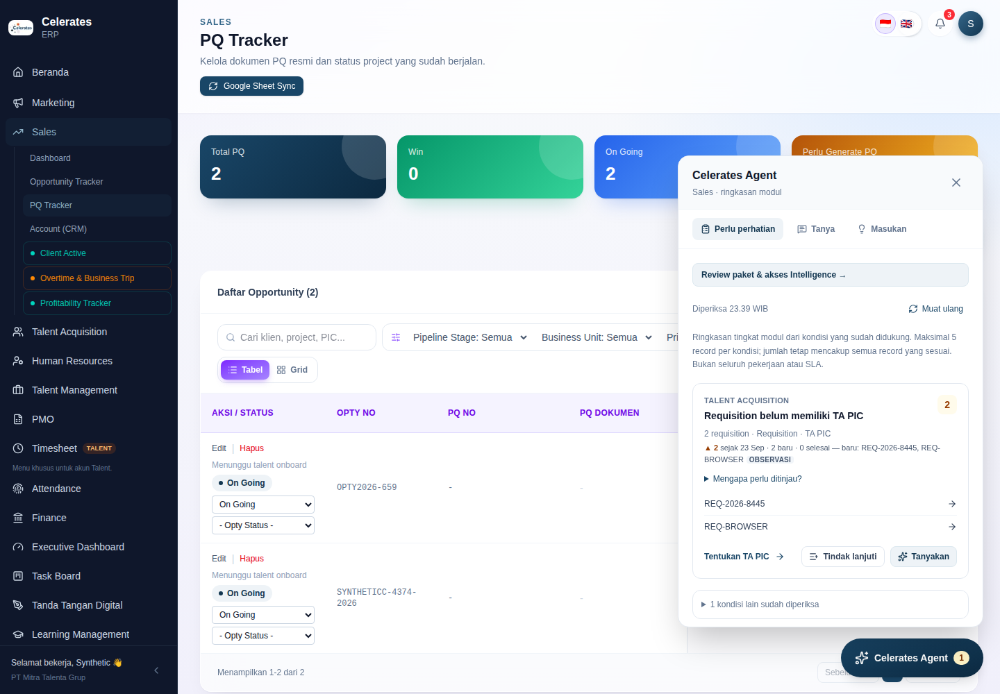
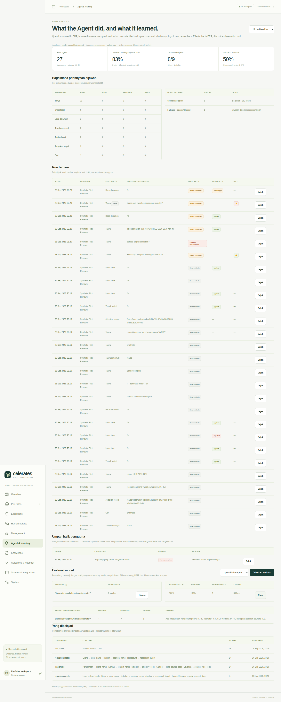

# Operating Substrate M4 — Quality loop, ERP sign-in to the Brain Console, signal history: implementation record

Date: 2026-09-26. Branch: `audit/erp-production-readiness`. Baseline: M3 plus the Cloudflare Workers AI provider path (`ced8be1`), which is live in production.
Direction: docs [14](../14-celerates-enterprise-intelligence-operating-model.md)–[16](../16-operating-substrate-build-reuse-adopt.md). Previous: [M3 record](operating-substrate-m3.md).
New decisions: [ADR-015](../adr/ADR-015-agent-quality-loop.md) (quality loop) and [ADR-016](../adr/ADR-016-erp-sign-in-to-brain-console.md) (ERP sign-in to the Brain Console).

## Why this increment

With a real model provider in production, the highest-leverage gap was no longer capability but **knowing how good the answers are, and making provider or model changes safe**. That needed three things:

- persisted model turns;
- a way for users to say an answer was wrong;
- a replay evaluation over saved cases.

Two further changes made the loop usable and useful:

- **Managers can open the Brain Console** from ERP with their own identity, without a shared workspace token.
- **The Agent notices change over time.** It reports what changed in `Perlu perhatian` since the last day observed. This is the first organizational-memory capability that works without a model.

Everything extends the existing substrate: the same runs and evidence ledger, the same delegation keys, the same rules, and the same console. No workflow branch was added.

## What is now functional end to end

| Capability | What the user sees | Guarantees | Where |
| --- | --- | --- | --- |
| **Answer feedback** | Under every completed answer: **Membantu?** 👍 👎. A 👎 asks for a reason (*Salah / Kurang lengkap / Tidak relevan / Lainnya*) and an optional note. | Only the asker can rate, and only completed runs. It is an observation: nothing changes in ERP or knowledge. | `components/agent/answer-feedback.tsx`, `POST /api/agent/runs/{id}/feedback` (ERP BFF → Intelligence) |
| **Model turns** | In the Brain Console run trace: each model turn with its verdict (`calls`, `answer`, `proposal`, `rejected: …`, `invalid: …`, `unavailable`), model, tokens and latency. | Contains only evidence the user could read. Curator-only. Kept 90 days (`AGENT_TURN_DAYS`), except for evaluation cases. | `agent_model_turns`, `reasoning.py`, `runs.py` |
| **Evaluation cases** | In the trace: **Simpan sebagai kasus uji**, choosing which sources the answer must cite (default: what it cited). | Only model-answered runs qualify. Sources are stable refs (`erp_rule:…`, `erp:type/id`, `knowledge:doc`, `upload:…`). | `agent_eval_cases`, `quality.py` |
| **Replay evaluation** | **Evaluasi model**: pick an allowlisted model and run. The result shows plan valid %, grounded %, expected-source recall, median latency and tokens, with per-case detail. | Recorded requests are replayed with frozen evidence. **No ERP call, no delegation, nothing applied** (a proposal reply is only validated). The model list is `AGENT_MODEL` + `AGENT_EVAL_MODELS`. | `quality.replay_case`, `/api/console/agent/evals` |
| **Brain Console feedback view** | The share of answers rated helpful (overall and for model answers), recent complaints with notes and a trace link, and a rating column in the runs table. | Curator-only. | `apps/web/src/Quality.tsx`, `Agent.tsx` |
| **ERP sign-in to the Brain Console** | The ERP Agent panel shows Owners **Brain Console: kualitas & pembelajaran Agent →**. It opens the console signed in as themselves, with only *Agent & learning* in the navigation. | Owner only. The assertion is Ed25519 with a console audience and scope, valid 2 h, passed in the URL fragment and stripped from history. It is neither a workspace principal nor an Agent delegation. | `GET /api/agent/console`, `mintConsoleSignIn`, `delegation.verify_console` |
| **Signal history** | Each `Perlu perhatian` group shows e.g. *▲ 2 sejak 23 Sep · 2 baru · 0 selesai — baru: REQ-…*, labelled **Observasi**. Asking *"Apa yang berubah sejak kemarin?"* lists the changes with observation cards and **Tindak lanjuti** for rising rules. The model also sees the observed change on each rule. | ERP stores one snapshot per rule per Jakarta day (≤ 500 ids). It is refreshed at most every 15 minutes, or at once when the count moves. The live rule result is still computed from ERP. Trends are best effort and never break the panel. | ERP `0007_signal_snapshots.sql`, `signalTrends`, `attention.tsx`, `_what_changed` |

**Fixed along the way:** search-hit and record evidence cards now carry their citation ids. Before this, an answer citing `[E1]` for a search hit had no matching id on the card.

### Invariants — re-verified

- **ERP is truth and authority.** Evaluation never calls ERP, and feedback and snapshots are observations. The console sign-in grants no workspace or Agent rights.
- **`Perlu perhatian` and `Masukan` do not regress.**
  - Group metadata, counts and links are unchanged; the hash test still passes.
  - Signal parity with `readSignal` holds.
  - The trend line is additive.
- **Deterministic mode works without models.**
  - Feedback, signal history, "what changed", the console and ERP sign-in all work with no model configured.
  - Evaluation says a model is needed.
- **Facts, signals, observations and inference stay distinct.** Trends are *Observasi*, model text is *Inferensi*, and evidence cards keep their types.

## Decisions that changed, and why

1. **ADR-015 — model turns are persisted.**
   - Without them, an answer cannot be audited, and a provider switch cannot be compared on the same evidence.
   - Retention (90 days) and curator-only access are explicit.
   - Replaying frozen evidence was chosen over live re-runs, which would need a user's ERP delegation and could create proposals.
2. **ADR-016 — ERP sign-in to the Brain Console** reuses the ADR-008 key pair with a separate audience and scope. Managers no longer need the shared workspace token, and Pre-Sales approvals still do.
3. **Signal history lives in ERP**, next to the rules that define it: derived, day-granular and bounded. Intelligence only reads it through the existing `agent/signals` contract. No new ADR is needed: it is an observation table under the existing rule engine (doc 15 "observations").

## Test and build evidence

All local runs used PostgreSQL 16 + pgvector (plus PGlite for the default ERP unit mode) and Chromium via Playwright, on disposable synthetic data. The model path used the local OpenAI-compatible stand-in; no real provider was called from this session.

| Suite | Result |
| --- | --- |
| Intelligence `pytest` (35 pass, 1 optional Docling skip) and `ruff check` | Pass. See the coverage list below. |
| ERP `npm test` (11 tests) | 11/11 on PGlite and on PostgreSQL. See the coverage list below. |
| ERP `tsc` + `next build`; Intelligence web `tsc` + `vite build` | Pass |
| Cross-stack `node tests/http-smoke.mjs` with `ERP_BROWSER_TEST=1 FOUNDATION_BROWSER_TEST=1` on PostgreSQL | Pass (13 PASS lines), including every earlier journey. See the list below. |

**Intelligence tests added:**
- quality loop: turn verdicts including rejection and repair, ledger refs, feedback authorization and upsert, cases (deterministic runs refused, unknown refs dropped), replay good vs weak model with no ERP call, retention keeping case turns;
- console sign-in: scope, expiry, over-long lifetime, forgery, non-Owner, and not a workspace or Agent credential;
- "what changed" answer from trends.

**ERP tests added:**
- console sign-in minting (not a delegation; Owner only);
- signal trends: delta, new, resolved, no earlier day, 15-minute reuse, immediate refresh on count change;
- reducer: feedback part only for answers;
- migration table count 70.

**New harness journeys:**
- API:
  - snapshot → `/api/operations/context` trends → "Apa yang berubah sejak kemarin?" answered with observation cards;
  - feedback through ERP (200 / 422);
  - Brain Console sign-in `303` with a fragment token.
- Browser:
  - trend line with the *Observasi* label;
  - Owner console link;
  - 👎 with reason and note after a model answer;
  - Brain Console opened through ERP sign-in (navigation limited, fragment stripped) → trace shows model turns and the user's note → case saved → **Jalankan evaluasi** → 100% plan-valid and grounded → per-case detail.

CI results are listed at the end of this file.

## Runtime and configuration

**Not deployed from this session.** All changes are backward-compatible and deploy-ready.

- **Migrations run at start and are additive.**
  - Intelligence `007_agent_quality_loop.sql`: four tables.
  - ERP `0007_signal_snapshots.sql`: one table.
- **No new required configuration.**
- **Optional (Intelligence):**
  - `AGENT_EVAL_MODELS`: comma-separated LiteLLM model names a curator may evaluate besides `AGENT_MODEL`, e.g. a candidate Workers AI model;
  - `AGENT_TURN_DAYS` (default 90).
- **Optional (ERP):** `INTELLIGENCE_CONSOLE_URL`, when the Intelligence web origin differs from `INTELLIGENCE_BASE_URL`. The console sign-in reuses `AGENT_DELEGATION_*` in ERP and `ERP_DELEGATION_PUBLIC_KEYS` in Intelligence.
- **The worker** also purges old model turns in its hourly housekeeping.
- **Post-deploy smoke test:**
  1. Ask a question in ERP → 👎 with a note.
  2. Open **Brain Console** from the panel → the note appears under *Umpan balik pengguna*.
  3. Open **Jejak** on a model answer → **Simpan sebagai kasus uji** → **Jalankan evaluasi** with the production model.
  4. Next day: groups show *sejak …*.

## Stakeholder demo (about 8 minutes)

1. **The Agent notices change.** In ERP `/ta` → **Celerates Agent** → *Perlu perhatian*: *"▲ 2 sejak kemarin · 2 baru"* (Observasi). In **Tanya**: *"Apa yang berubah sejak kemarin?"* → the changed rules with observation cards → **Tindak lanjuti**.
2. **Users judge answers.** Ask a question and rate it 👎 *Kurang lengkap* with a note.
3. **Managers see quality from ERP.**
   - Click **Brain Console** in the panel. You are signed in as yourself, and only *Agent & learning* is shown.
   - Show the helpful share, the complaint with its note, the runs with 👍/👎, and the model/fallback split.
4. **Why was that answer given?** Open **Jejak**: steps, tools, evidence, the model turns and verdicts (including a rejected ungrounded draft), and the user's note.
5. **Make provider changes safe.**
   - **Simpan sebagai kasus uji** on a few good answers.
   - Choose the production model, or a candidate from `AGENT_EVAL_MODELS`, and **Jalankan evaluasi**.
   - Compare plan-valid %, grounded %, expected-source recall and latency before changing `AGENT_MODEL`.

## Remaining gaps

- **Replay scope.** Replay evaluates the first plan and the final answer on frozen evidence, not a candidate's full multi-turn exploration. Production traces show that part.
- **Evaluation cost.** Runs are synchronous per case, up to 50 cases, in the API thread pool. Large suites would move to the worker.
- **Signal history** starts when the panel is first used after deploy. It depends on panel traffic (at least one open per day), not on a scheduled job. Ids are capped at 500 per snapshot.
- **Console sign-in.** No revocation list for issued sign-ins (2 h lifetime). Non-Owner managers still cannot sign in; the pilot is Owner-only.
- **Carried over from M3:** syntactic grounding, no OCR, voice push-to-talk only, and cross-lingual retrieval dependent on semantic embeddings.

## Safest continuation point

Start from the final commit of this record on `audit/erp-production-readiness`.

1. **Deploy.** Collect a week of real questions and feedback, then save 15–30 good answers as cases.
2. **Gate model changes.** Before changing `AGENT_MODEL`, run the evaluation for the current and candidate models (`AGENT_EVAL_MODELS`) and switch only when grounded % and recall are not worse.
3. **Scheduled snapshots.** Replace panel-driven snapshots with a daily ERP job. Once there is history, add a morning *Ringkasan* in the panel.
4. **Close the loop from complaints to knowledge.** Offer curators "turn this note into a knowledge draft" from a complaint, reusing the existing feedback → lesson curator path.
5. **Broaden sign-in and commands.** Extend the console sign-in to non-Owner managers when the pilot opens up. Add PMO/Finance remedies once F13 is settled.
