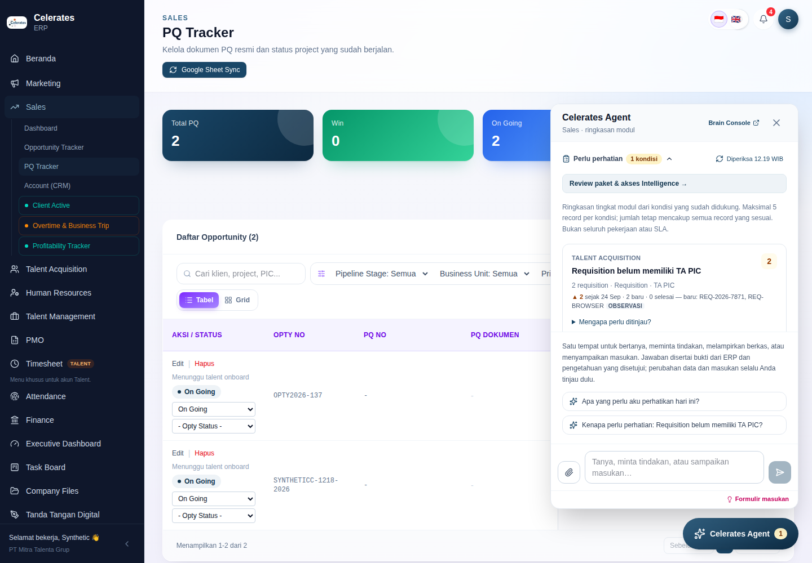
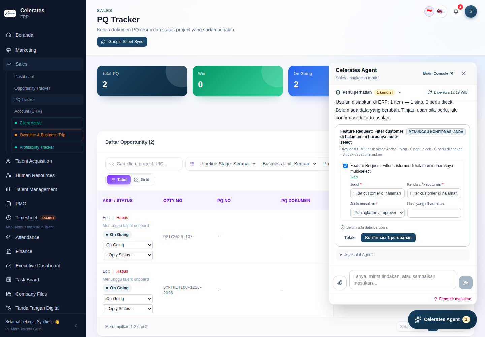
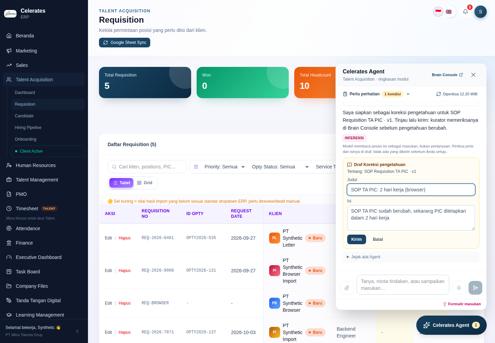
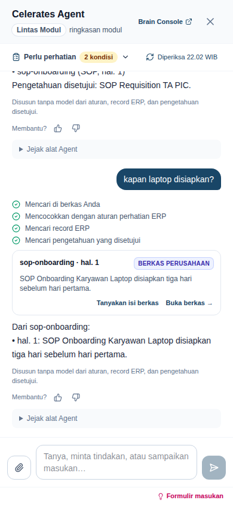

# Operating Substrate M5 — One Agent surface, Masukan understood from free text: implementation record

Date: 2026-09-27. Branch: `audit/erp-production-readiness`. Baseline: M4 (`dc3e7cf`).
Direction: docs [14](../14-celerates-enterprise-intelligence-operating-model.md)–[16](../16-operating-substrate-build-reuse-adopt.md), plus the product UX direction of 2026-09-27: one universal conversational surface, not three AI tabs, as the centre of a future PWA/mobile operational shell. Previous: [M4 record](operating-substrate-m4.md).
New decision: [ADR-017](../adr/ADR-017-one-agent-surface-and-intent-routing.md).

## Why this increment, and what was deliberately left for later

The Agent panel had three entry tabs (*Perlu perhatian / Tanya / Masukan*), and *Masukan* was still a static form. The product direction is one Agent the user talks to. The Agent decides whether a message is a question, an action, a document to understand, or feedback, and it keeps the proactive summary in view.

M5 therefore does three things on the existing substrate:
1. **One surface.**
2. **Free-text feedback routed to the right kind, always reviewed.**
3. **The attention brief as a conversational answer.**

Two items were sequenced after M5 on purpose:

| Later | Why not now |
| --- | --- |
| **Company Files / Knowledge Explorer** (M6) | Needs a file registry with access classes. CVs are personal data and contracts are commercial, so the access model is a business decision first. |
| **Insight Agent**: file ↔ ERP comparison, e.g. "TOR asks 8, requisition covers 5" (M7) | Should build on M6's file-to-entity links. Built now, it would be a TOR-specific branch. |
| PWA install and a full-page `/agent` home (M8) | Shell work. M5 only makes the panel full screen on phones. |

## What is now functional end to end

| Capability | What the user sees | Guarantees | Where |
| --- | --- | --- | --- |
| **One Agent surface** | The launcher opens one conversation and one composer: attach, text, 🎤, send. **Perlu perhatian** sits on top as the *Ringkasan*, with count badge, *Diperiksa HH:MM WIB* and reload. It is open at first and folds to one line once a conversation starts. Suggestions include *"Apa yang perlu aku perhatikan hari ini?"*. **Formulir masukan** is always at the bottom. Brain Console is in the header (Owners). On phones the Agent is full screen. | The Ringkasan uses the same ERP reader and components: groups, counts, wording, links, `Tanyakan`, `Tindak lanjuti`, trends and *Tindak lanjut berjalan*. It works when Intelligence is off, and the form is the path then. | `components/agent/agent-panel.tsx`, `agent-thread.tsx` |
| **Masukan understood (model)** | *"SOP TA PIC sudah berubah…"* → an *Inferensi* line ("dibaca sebagai masukan, bukan pertanyaan") and a **Draf Koreksi pengetahuan** naming the SOP, with editable title and body, **Kirim** and **Batal**. *"Filter customer harusnya multi-select"* → a Feature Request proposal card. **Bukan ini: …** switches the kind. | The route is validated: intent from a fixed set, and citations must exist. The record and the knowledge come from cited evidence, or the page's record for "data ini salah", never from model text. It is recorded as a model turn (`route`) and can become an evaluation case. | `reasoning.validate_route`, `intents.prepare` |
| **Masukan understood (no model)** | Feedback-like wording → *"Ini terdengar seperti masukan. Pilih jenisnya…"* with **Laporkan koreksi data** (when a record is named), **Koreksi pengetahuan** (when knowledge matched), **Jawaban Agent keliru** (when there is an earlier answer), and **Jadikan Feature Request**. | Nothing is guessed. The user's choice is shown as an observation (*dipilih Anda*). | `intents.cues/offers`, `route_feedback` |
| **Reviewed drafts** | Feature Request → the existing ERP proposal card, with the page as context. Data correction → a **task for the data owner** linked to the record. Knowledge correction and Agent feedback → an Intelligence-held draft the user sends. | No new write path. ERP effects stay ERP-held proposals the user confirms. Drafts are owner-only (404 for anyone else), sent through the ERP BFF (same origin), and Agent feedback lands on the previous answer as `agent_feedback`. | `agent_submissions` (migration 008), `draft_submission` (propose-class tool), `/api/agent/submissions/{id}` |
| **Curator review** | Brain Console → **Masukan dari percakapan**: routed kinds, model vs user-chosen, and sent corrections. **Jadikan draf pengetahuan** or **Tutup**. | A promoted correction becomes a *draft* knowledge source with the scope and classification of the knowledge it corrects, never wider. Approval stays in Knowledge (workspace token). | `console.review_submission`, `apps/web/src/Quality.tsx` |
| **Attention brief** | *"Apa yang perlu aku perhatikan hari ini?"* → *"n dari m kondisi perlu perhatian"*, ranked by observed rise and then by count, with **Tindak lanjuti** and **Jelaskan**. | Deterministic even with a model configured: live ERP counts (Sinyal cards), with change as *Observasi*. | `playbooks.brief` |
| **Conversation context** | Follow-ups and "jawaban tadi salah" refer to the previous exchange. | The model receives the previous question and answer of the same thread, skipping feedback turns. It is untrusted data. | `intents.previous_answer` |

### Invariants — re-verified

- **ERP is truth and authority.**
  - Every ERP effect is an ERP-held proposal confirmed by the user.
  - A data correction is a task, not an edit.
  - Intelligence stores drafts and observations only.
- **Models read, reason and propose, but never apply.** A route produces a draft. Evaluation replay validates it without drafting.
- **`Perlu perhatian` and `Masukan` do not regress.**
  - Same reader, groups, counts, links and actions.
  - The form is unchanged and reachable.
  - Browser journeys assert both.
- **Facts, signals, observations and inference stay distinct.**
  - A model route is *Inferensi*; a user-chosen kind is *Observasi*.
  - The brief's counts are Sinyal and its changes are Observasi.
- **Deterministic mode works without models.** The brief, feedback kinds offered for the user to pick, and drafts all work with no model.
- **Shared substrate.** Routing is one reply shape and one `prepare`, over the same tools, proposals, quality loop and console. There is no per-complaint branch.

## Decisions that changed, and why

**ADR-017 — one Agent surface and intent routing.**
- The tabs are gone as entry points. The capabilities remain.
- Feedback routing adds a model reply shape and a deterministic user-choice path.
- Intelligence-owned objects (knowledge corrections, Agent feedback) get **Intelligence-held drafts**. This mirrors ADR-010 for objects that do not live in ERP.
- An ERP sign-in (ADR-016) may promote a correction to a *draft* knowledge source. It still cannot approve knowledge.

## Test and build evidence

All local runs used PostgreSQL 16 + pgvector (plus PGlite for the default ERP unit mode) and Chromium via Playwright, on disposable synthetic data. The model path used the local OpenAI-compatible stand-in; no real provider was called.

| Suite | Result |
| --- | --- |
| Intelligence `pytest` and `ruff check` / `ruff format --check` | 36 pass, 1 optional Docling skip; lint clean |
| ERP `npm test` (11 tests) | 11/11 on PGlite and on PostgreSQL |
| ERP `tsc` + `next build`; Intelligence web `tsc` + `vite build` | Pass |
| Cross-stack `node tests/http-smoke.mjs` with `ERP_BROWSER_TEST=1 FOUNDATION_BROWSER_TEST=1` on PostgreSQL | Pass: 14 PASS lines, including every earlier journey |

**Intelligence tests added (`test_one_agent_routes_feedback_to_reviewed_drafts`):**
- offers without a model;
- data correction → a linked task proposal;
- Feature Request with the page context;
- knowledge correction:
  - the draft is owner-only;
  - it is sent with an edited title;
  - it appears in the curator queue;
  - promotion creates an ingested *draft* knowledge source;
  - a second review is refused;
  - it shows in the overview stats;
- Agent feedback lands on the previous answer, and there is no draft without one;
- the brief makes no model call;
- a model route reads, then routes (turn verdict `route`, `previous` context), is saved as a case and replayed at recall 1.0;
- an invalid route falls back to the offers.

**ERP tests added:**
- reducer: strict `route_feedback` action shapes (unknown intents and malformed targets dropped);
- submission part;
- a model route is not rated as an answer.

**New harness journeys:**
- API, no model:
  - the brief;
  - complaint → kinds offered → Feature Request confirmed in ERP with `context_path` and type;
  - "Data REQ-… salah" → task proposal for that requisition;
  - knowledge correction draft → cross-origin send refused → sent with an edited title.
- API, model:
  - a knowledge correction routed with the SOP from cited evidence, and the "Bukan ini" alternative offered;
  - cancel;
  - a Feature Request routed.
- Browser:
  - one surface with no tabs;
  - Ringkasan open, then folded;
  - the thread chunk loads when the Agent opens;
  - free-text Masukan → **Jadikan Feature Request** → confirmed (`FR-… dibuat`);
  - **Formulir masukan** and back;
  - every earlier flow;
  - full-screen phone layout;
  - model: knowledge correction draft edited and sent;
  - Brain Console: **Jadikan draf pengetahuan**.

CI results are listed at the end of this file.

## Runtime and configuration

**Not deployed from this session.** All changes are backward-compatible.

- **Migration:** Intelligence `008_agent_submissions.sql` (one table), applied at start. There is no ERP migration.
- **Configuration:** no new variables.
  - The composer accepts up to 1,000 characters (was 300).
  - With `AGENT_MODEL` set, routing uses the model; without it, users pick the kind.
- **ERP routes added:**
  - `POST /api/agent/submissions/{id}`: same-origin, forwarded under delegation;
  - `route_feedback` accepted by `/api/agent/ag-ui`.
- **Intelligence routes added:**
  - `POST /api/agent/submissions/{id}` (delegation, owner);
  - `GET/POST /api/console/agent/submissions` (curator or ERP sign-in).
- **Post-deploy smoke test:**
  1. Open the Agent: Ringkasan with no tabs.
  2. Type "Filter … harusnya …" → a Feature Request draft → confirm.
  3. Type "SOP … sudah berubah" → **Kirim**.
  4. In the Brain Console → *Masukan dari percakapan* → **Jadikan draf pengetahuan** → approve in Knowledge.

## Stakeholder demo (about 7 minutes)

1. **One place.** Open **Celerates Agent** on `/ta`. *Perlu perhatian* is right there. Click *"Apa yang perlu aku perhatikan hari ini?"*: a ranked brief with the change since yesterday, and **Tindak lanjuti**.
2. **Ask, act, drop.** In the same composer:
   - ask a question;
   - "buatkan task follow up REQ-…" → proposal → confirm;
   - drop a request letter → requisitions proposed.
3. **Say what's wrong, in your own words.**
   - "Filter customer di halaman ini harusnya multi-select" → a Feature Request draft with the page attached → confirm.
   - "Data REQ-… salah, headcount harusnya 8" → a task for the data owner. The data itself is untouched.
   - "SOP TA PIC sudah berubah…" → a knowledge correction draft → edit → **Kirim**.
4. **The loop closes.** In the Brain Console, the correction waits under *Masukan dari percakapan* → **Jadikan draf pengetahuan** → approve in Knowledge → the next answer cites it.
5. **On a phone.** The same Agent, full screen.

## Remaining gaps

- **Routing quality needs real traffic.** CI proves the plumbing with a stand-in. Save real routed messages as evaluation cases (the expected intent is recorded) before relying on a new model.
- **Deterministic cue list.** Feedback-like wording is a small, fixed pattern set. It only *offers* kinds, so a miss costs one extra step: the form is always there.
- **Previous-answer context** is one exchange deep. There is no long conversation memory.
- **A promoted correction is additive.** The corrected source is not deprecated automatically; the curator does that in Knowledge.
- **Carried over:**
  - signal snapshots are panel-driven, not a daily job;
  - no OCR;
  - push-to-talk only;
  - Owner-only pilot;
  - replay covers the first plan and the final reply.

## Safest continuation point

Start from the final commit of this record on `audit/erp-production-readiness`.

1. **Deploy.** Watch *Masukan dari percakapan*: the routed kinds and the model vs user-chosen split. Save 10–20 real routed messages as cases.
2. **M6 — Company Files / Knowledge Explorer.**
   - First decide access classes per file type (CV, contract, proposal, SOP, BAST, manpower).
   - Then:
     - a file registry with extracted metadata and ERP entity links;
     - hybrid search, preview and "tanya file ini", as a capability of the same Agent;
     - one Explorer page.
3. **M7 — Insight Agent** on M6's file-to-entity links: file ↔ ERP comparisons stored as inferences with a lifecycle.
4. **M8 — Operational shell.**
   - A PWA manifest and a full-page `/agent` home on mobile.
   - The daily brief as a scheduled snapshot plus a notification.
   - Multi-role rollout once access rules are defined.
