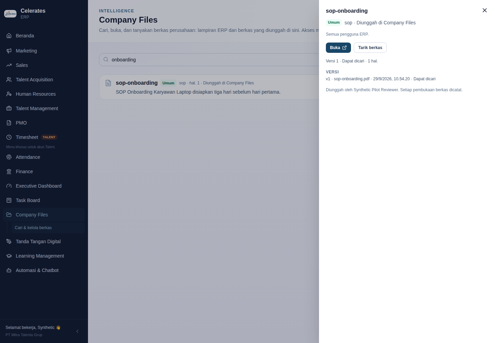
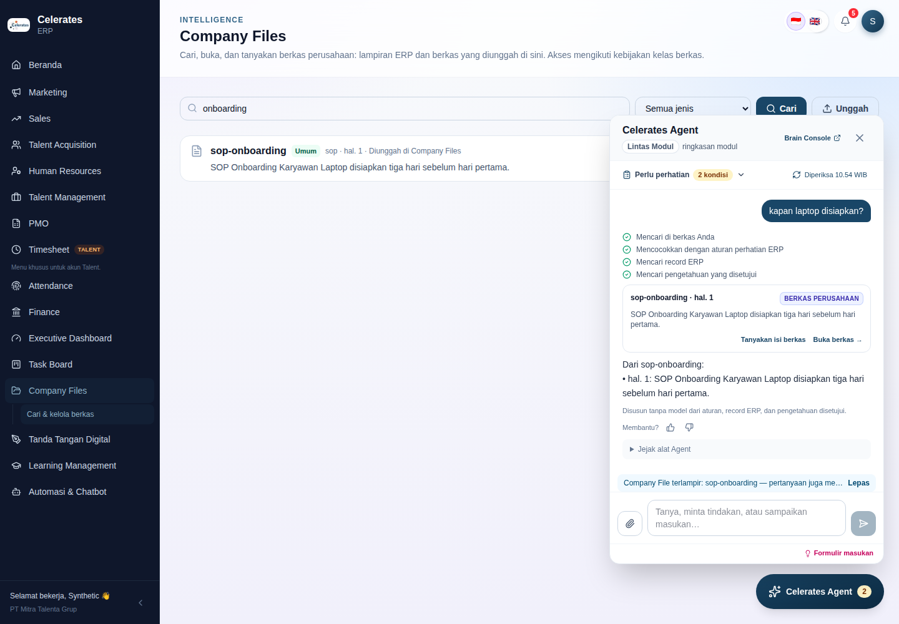

# Operating Substrate M6 — Company Files: implementation record

Date: 2026-09-27. Branch: `audit/erp-production-readiness`. Baseline: M5 (deployed).
Direction: [doc 17](../17-company-files-architecture.md), approved with `personal` and `commercial` indexing under the proposed policy. Previous: [M5 record](operating-substrate-m5.md).
New decision: [ADR-018](../adr/ADR-018-company-files-registry.md). Storage verification: [storage-encryption-and-backups.md](storage-encryption-and-backups.md).

## What is now functional end to end

| Capability | What the user sees | Guarantees | Where |
| --- | --- | --- | --- |
| **Company Files explorer** | ERP → **Company Files**: one search over file content, titles and linked records, filtered by kind. Each result shows a class badge (*Umum / Divisi / Komersial / Personal*), kind, page, origin and linked records. The detail shows versions, reading state (pages, OCR pages, tables), identity-pattern flags by name, links, **Buka** and **Tarik berkas**. | Every search is authorized by ERP policy. Opening a file is authorized per request and logged. | `apps/erp/src/app/files`, `components/files/explorer.tsx`, `/api/files/*` (BFF) |
| **Upload** | **Unggah**: file, title, kind, access class, owning division. | The kind's default class is the minimum; only an Owner may choose a looser one. The file type is checked from the bytes. 20 MB limit. Sha-addressed immutable keys; versions deduplicated by hash. | `files.create_managed`, `extract.sniff` |
| **ERP files, without copying them** | CVs (candidate and pipeline), PKS/PO/CR and other project documents, opportunity PO/PQ and BAST, from `attachments` and legacy file columns, are listed, searchable and open in ERP. Pasted links appear as external files. | ERP declares which files are Company Files, and serves bytes only to the indexer (read credential). **Identity documents (KTP, NPWP, KK, BPJS, selfies, signatures) and undeclared attachments are never declared.** Deleting or replacing a file in ERP is reconciled at the next sync (≤ 10 min). | `src/lib/files/sources.ts`, `files/{catalog,feed,content}`, `files.sync_erp` |
| **Reading: pages, tables, OCR** | Text PDFs are read per page. Scanned pages and table-heavy kinds (contract, BAST, PO, proposal, manpower, invoice) go through Docling with OCR (RapidOCR) and TableFormer. DOCX keeps tables; XLSX/CSV become one page per sheet. | Chunks never cross pages; tables are chunked alone; headings are carried. Stored in the existing `chunks` table with the multilingual FTS, so knowledge search never sees file chunks. Models are pre-fetched in the image. | `cdi/extract.py`, `files.ingest`, Dockerfile |
| **Access classes** | See the table below. | Grants and per-class handling are Owner-editable ERP data. For `commercial`/`personal`, ERP confirms per request that the user can read the file or a person-confirmed linked record. Extracted links never grant access. | ERP `0008`, `agent/files/access`, `agent/files/readable` |
| **Identity-pattern hold** | A `general`/`division` file containing NIK, NPWP or KTP/KK wording becomes *Ditahan untuk ditinjau*: visible only to the uploader and Owners. An Owner reclassifies it, or it is withdrawn. | Tighten only. Pattern names are stored, never the values. | `extract.pii_flags`, `files.ingest` |
| **Agent** | "cari kontrak Astra", "cari CV java" and similar return **Berkas perusahaan** cards with class, page and links. For shared classes, **Tanyakan isi berkas** attaches the file, and answers cite pages. The model plans with `files_search`, `file_read` and `files_for_entity`. | For `commercial`/`personal` (model visibility `none`), no snippet or passage enters AG-UI events, model turns, the ledger or the Brain Console trace. The Agent says which file holds the answer and that the user can open it. | `agent/tools.py`, `reasoning.py`, `playbooks._files_lines` |
| **Brain Console** | *Company Files*: counts by origin and class, reading states and OCR pages, held files (**Tarik**), failures (**Ulangi**), and the recent access log. | Curator or ERP Owner sign-in. | `/api/console/files`, `apps/web/src/Quality.tsx` |
| **ERP document route hardened** | Unchanged for users. | `/api/documents` now resolves an object to the record that references it and checks module access. Unreferenced keys are served to Owners only (legacy); `DOCUMENTS_STRICT=1` refuses them. | `app/api/documents/route.ts`, `objectModule` |

**Access classes (defaults, editable in ERP)**

| Class | Examples | Who reads | Indexing | Model sees |
| --- | --- | --- | --- | --- |
| `general` | SOP, policy, template, admin | any active back-office user | semantic | full |
| `division` | proposal, manpower, report | readers of the owning division | semantic | full |
| `commercial` | PKS, PO, CR, BAST, invoice, PQ | editors of sales/pmo/finance for their division's files, **and** readers of the linked record | lexical | none |
| `personal` | CV, appraisal | editors of ta/hr for their division's files, **and** readers of the linked record | lexical | none |

Owners read every class. `identity` is not a class: those files are never declared.

### Invariants — re-verified

- **ERP remains truth and authority.**
  - No ERP file is copied.
  - ERP decides indexability, class grants and record visibility.
  - Company Files changes nothing in ERP.
- **Models may read, reason and propose, but never apply.** Model-hidden content never reaches a model. No tool can change a class, share, delete or download.
- **`Perlu perhatian`, `Masukan` and the M5 surface do not regress.** Every earlier journey passes unchanged.
- **Facts, signals, observations and inference stay distinct.** Files are their own evidence type, *Berkas perusahaan*.
- **Deterministic mode.** Search, open, upload and "tanya file ini" work without a model; OCR needs no model provider.
- **Shared substrate.** Files reuse object storage, `chunks`, the FTS/RRF retrieval, the worker, delegation, the ERP contract and the Agent tools. There is no parallel pipeline.

## Decisions that changed, and why

**ADR-018 — Company Files registry.**
- The registry lives in Intelligence over three origins, and bytes stay with their owner.
- ERP declares its files and decides access (classes as risk, grants as ERP data).
- Model-hidden content never enters a run.
- One page-, table- and OCR-aware extractor, shared with Agent drops. The drop parser now uses the same readers; scanned drops are sent to Company Files for OCR.

**Deviations from doc 17**

| Doc 17 said | Implemented | Why |
| --- | --- | --- |
| Metadata columns on ERP `attachments` | Not added | Intelligence records size, type and hash at extraction, so ERP's upload paths stay untouched. |
| Record-level `/api/documents` | Unreferenced keys are still served to Owners by default | Not every legacy path column in every module is declared yet; `DOCUMENTS_STRICT=1` is ready for when the pilot opens beyond Owners. |
| `file_link_propose` / `file_save_draft` Agent tools | Deferred | Links are made in the explorer; a drop can be re-uploaded in Company Files. |

## Test and build evidence

All local runs used PostgreSQL 16 + pgvector (plus PGlite for the default ERP unit mode) and Chromium via Playwright, on disposable synthetic data. Docling models cannot be downloaded in this sandbox (the model hub is blocked). The Docling path is therefore tested through its adapter with a Docling-shaped converter, and **real OCR is verified in the deployed image with `python -m cdi.files_smoke`** (see Runtime).

| Suite | Result |
| --- | --- |
| Intelligence `pytest` and `ruff check` / `ruff format --check` | 42 pass, 1 optional Docling skip; lint clean |
| ERP `npm test` (12 tests) | 12/12 on PGlite and on PostgreSQL |
| ERP `tsc` + `next build`; Intelligence web `tsc` + `vite build` | Pass |
| Cross-stack `node tests/http-smoke.mjs` with `ERP_BROWSER_TEST=1 FOUNDATION_BROWSER_TEST=1` on PostgreSQL | Pass: 15 PASS lines, including every earlier journey |

**New Intelligence tests (`tests/test_files.py`)**
- **Extraction:**
  - byte sniffing;
  - pages;
  - DOCX tables;
  - XLSX sheets;
  - scanned page → Docling OCR blocks with page and table provenance;
  - scan flagged without OCR;
  - identity patterns.
- **Classes:**
  - general for everyone, with content shared with the model;
  - division by division;
  - commercial by grant, UI snippet only, model withheld;
  - a linked-record denial hides the file;
  - Owner sees all;
  - loosening refused;
  - uploader lacking the grant refused.
- **Identity hold:** invisible to others; release by an Owner only; withdrawal unindexes.
- **ERP sync and ingestion:**
  - ERP sync registers CV, BAST and link; ingests with OCR;
  - CV hidden until ERP confirms readability; no personal grant means no result;
  - an ERP deletion withdraws, a new etag re-versions;
  - failure → backoff → curator retry.
- **Agent:**
  - "cari kontrak" returns file cards, and the contract content is absent from every stored step;
  - "tanya file ini" cites a page;
  - asking about a model-hidden file is refused.
- **HTTP:** upload, bad bytes (422), search, content download logged, withdraw refused to a non-owner, console curator-only.

**New ERP test:**
- the feed lists declared attachments and columns and excludes `onboarding_ktp` and undeclared attachments;
- column names gain their extension; external links are typed;
- grants: a TA editor holds `personal` for `ta`, and a sales viewer holds no `commercial`;
- `readable` per user; Owner reads all;
- `/api/documents` object → module resolution.

**New harness journeys**
- **API:**
  - an ERP CV in object storage plus a KTP attachment, and a SOP upload through the BFF;
  - the worker syncs and ingests;
  - identity excluded; class `personal`;
  - search finds the CV (snippet in the UI, linked candidate);
  - open → `303` to ERP's document route → PDF; SOP preview sandboxed; both opens logged;
  - the Agent's CV run carries no CV text;
  - "tanya file ini" on the SOP;
  - deleting the ERP attachment withdraws it at the next sync.
- **Browser:**
  - explorer search with class badge;
  - detail (indexed, pages, **Buka**);
  - upload queued;
  - Agent "cari berkas sop onboarding" → **Tanyakan isi berkas** → a page-cited answer.

CI results are listed at the end of this file.

## Runtime and configuration

**Not deployed from this session.** All changes are backward-compatible.

- **Migrations** run at start and are additive:
  - Intelligence `009_company_files.sql`;
  - ERP `0008_company_files.sql`: policy tables, seeded with the defaults above.
- **Image:** the Intelligence Dockerfile now pre-fetches Docling layout, TableFormer and RapidOCR (`torch:latin`) into `/opt/docling-models` (`DOCLING_ARTIFACTS_PATH`). The first build after this change downloads the models, so it needs network access at build time.
- **Configuration.** No new required variables. Optional:
  - `FILES_SYNC_SECONDS` (default 600) in Intelligence;
  - `DOCUMENTS_STRICT=1` in ERP, to refuse unreferenced object keys.
  - Existing variables are reused: `ERP_TOKEN` (the indexer uses the read credential), `ERP_BASE_URL`, the delegation keys and the S3 settings.
- **The worker** (the existing `integration-worker`) now also syncs ERP files, ingests file versions and purges withdrawn uploads past their retention.
- **Post-deploy smoke test:**
  1. `python -m cdi.files_smoke` in the Intelligence API or worker container: it renders a scanned page and must print `ocr_pages=1` with the words found (exit 0). This is the real OCR check.
  2. ERP → Company Files: the CVs, PKS and BAST already in ERP appear within 10 minutes. Search "BAST" and open one.
  3. Upload a SOP (class *Umum*) → state **Dapat dicari** → Agent: "cari berkas sop …" → **Tanyakan isi berkas**.
  4. Brain Console → *Company Files*: no failures; the access log shows the opens.
- **Storage.** Encryption at rest is met at the platform level. **Backups are not yet demonstrated for any store**; this predates M6. Before announcing uploads, enable Railway volume backup schedules on all four volumes and run one restore drill ([details](storage-encryption-and-backups.md)).

## Stakeholder demo (about 7 minutes)

1. **One place for files.** ERP → **Company Files** → "BAST Maret": the scanned BAST attached to an invoice is found on page 2, from OCR. **Buka** opens it through ERP.
2. **Access follows ERP.**
   - The same search as a Sales viewer shows no BAST and no count.
   - A TA editor finds CVs ("CV java"); others do not.
3. **Upload what ERP has no place for.** Upload a SOP and a client manpower sheet. They are searchable within a minute, with sheet rows as tables.
4. **Ask about a file.** In the Agent: "cari berkas sop onboarding" → **Tanyakan isi berkas** → "kapan laptop disiapkan?" → a page-cited answer.
5. **What the model never sees.** "cari kontrak Astra" → the PKS card says *Isi tidak dibagikan ke Agent*. The Brain Console trace shows the card without the content.
6. **Safety net.** Upload a KTP scan as *Umum* → *Ditahan untuk ditinjau* → Brain Console → **Tarik**.

## Remaining gaps

- **OCR quality for Indonesian scans** is unmeasured. RapidOCR's Latin model is used. Run the 10-sample comparison against Tesseract `ind` (doc 17 §5) on real non-identity scans before relying on OCR for search.
- **Backups:** see Runtime. The gap predates M6, but managed uploads now exist only in Intelligence MinIO.
- **Scale:** there is no ANN index yet (add a partial HNSW index when file chunks exceed about 50k). The ERP sync is a full snapshot every 10 minutes, which is fine for thousands of files.
- **Not yet:** re-ingestion when a class's indexing policy changes (re-queue manually through retry); a Drive/Sheets connector (F06); ClamAV; retention/hold UI.
- **M7:** structured file facts (contract parties, value and dates; BAST period; manpower rows; CV skills), entity-resolution suggestions, file ↔ ERP insights and CV ↔ requisition matching, all on the links built here.

## Safest continuation point

Start from the final commit of this record.

1. **Deploy**, run `cdi.files_smoke`, and enable backups (per the storage doc).
2. **Measure OCR** on 10 real scans. Add Tesseract `ind` only if needed.
3. **M7 — Insight Agent on files**, starting with manpower sheets vs requisitions (tables are already extracted per sheet) and contract end dates vs project status.
