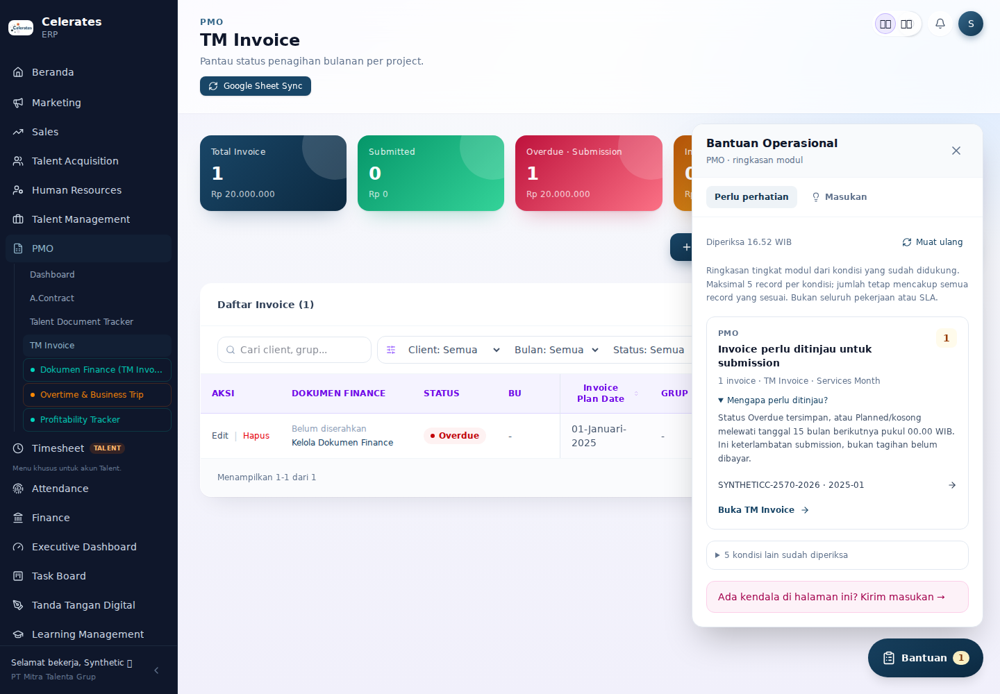
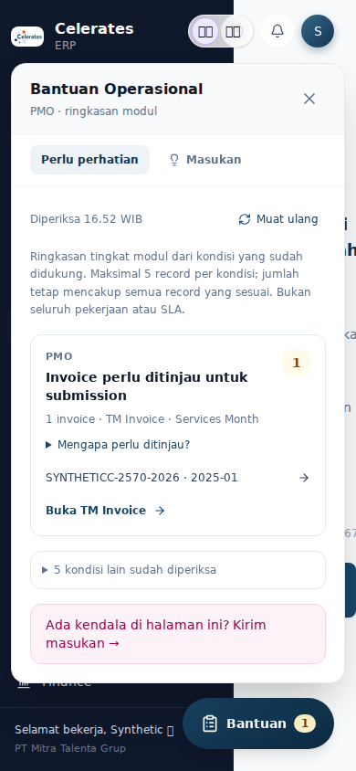

# Contextual operational assistance — implementation direction

Baseline inspected: `audit/erp-production-readiness`, `cc64e01` (2026-09-25).
Read AGENTS, both handoffs, ADR-001–006, architecture/workflows, meeting alignment,
ERP audit 01–10, reference-product study, runtime notes, ERP source and existing
FastAPI/React Intelligence implementation before choosing this increment.

## Observed facts (before implementation)

- `apps/erp/src/app/layout.tsx` already mounts one pink FeatureRequestFab above
  the existing navy/slate ERP. Keep the sidebar, tables, forms and workflow screens.
- `feature-requests/actions.ts::createFeatureRequest` already records page, server
  release/environment, requester, attachments, notifications and activity. Its
  status action gates Done on acceptance criteria/release/BA validation. Reuse it.
- `schema.ts` distinguishes Sales trackers from PQ opportunities; lead_id,
  opportunity_tracker_id and requisitions.opportunity_id support exact handoffs.
  Client-name matching in `lib/crm.ts` is not a canonical relationship.
- `pmo/invoices/page.tsx` calls two writes during GET; `pmo/page.tsx` calls another.
  `pmo/actions.ts::syncBillingScheduleToInvoices` uses NOT EXISTS without serialization;
  multiple source schedules can create duplicate rows. Overdue is submission delay
  after Services Month + one month + 14 days, NOT payment delinquency.
- `finance_document_handoffs` is unique per PQ opportunity, not per invoice.
- `actor.ts`, auth and middleware intentionally restrict this deployed pilot to
  active Owners. Existing broad module permissions are not a proven row policy.
- `services/intelligence-api/cdi/erp.py` has separate demo/HTTP adapters; the live
  ERP does not implement that machine contract. Do not silently wire demo truth
  into operational screens or share ERP credentials with that service.

## Chosen increment (engineering/product judgment)

Replace the one FAB with a native contextual work panel: immediately useful
attention groups, exact counts, bounded source records, rule explanations,
existing-screen actions and inline contextual Feature Request. Scope Marketing,
Sales, TA, PMO and Finance signals to supported deterministic state. On other
modules explain coverage honestly and still offer page-aware feedback. Do not
infer attendance compliance, talent capacity, historical profit or missing BAST.

Use a same-origin session-bound read API in the ERP monolith, fixed SQL queries,
read-only consistent snapshot, explicit capability policy and allowlisted DTOs.
No LLM, new vector store, service, chatbot or machine integration is needed for
these facts. Every group declares its unit and rule; module scope is visible,
not a claim to infer the currently edited record. Unknown paths fall back to the module. Known record URLs may carry UUIDs;
query strings and fragments never enter feedback context.

Preserve the Owner pilot gate; also test the reader's conservative division
policy independently so future role rollout cannot simply leak all Owner data.
No payroll, candidate details, contact data, financial amounts, raw document
URLs or free-text notes belong in these responses.

Fix PMO read side effects: explicit reviewed materialization commands, transaction
serialization, skip ambiguous monthly source groups, no overwrite of existing
invoices/documents. Compute overdue at read time consistently in Jakarta; retain
explicit stored statuses. No speculative unique constraint on all historical
invoices. Add supporting nonunique index; no data rewrite.

Pattern research: contextual sidebars/related records from ServiceNow Horizon and
work queues from Atlassian support informed the context-first approach, not their
visual design. See docs/09-reference-product-study.md for broader comparisons.
https://horizon.servicenow.com/workspace/patterns/contextual-side-bar/contextual-side-bar-use-cases
https://support.atlassian.com/jira-service-management-cloud/docs/what-are-queues/

## Verification and deployment

Extend disposable production-Next HTTP tests for real signals, feedback, permission
revocation, read-only pages and repeatable commands; add isolated rule/role tests.
Keep Docker/PostgreSQL/private S3 and current Railway pilot; preserve PostgreSQL
PGDATA=/var/lib/postgresql/data/pgdata. No new infrastructure/model secrets.
Detailed results and demo steps will be appended after execution.

## Implemented baseline

- `components/operational-assistance.tsx`: one native navy FAB and nonmodal panel;
  module context, nine condition groups, exact counts with five source records,
  rule disclosure, existing record/screen links, explicit coverage and empty state.
  Requests are aborted on navigation; failed refresh removes stale facts. Refresh
  runs on opening, manual request, focus and every 60 seconds while open/visible.
  Escape returns focus; mobile panel fits 390px viewport. No localStorage of data.
- `lib/operations/policy.ts`: active actor + Owner or exact backoffice division
  capability, valid access levels only. Cross-module groups are independently
  authorized. Unknown contexts fall back; query strings/fragments are dropped.
  No HR/payroll/talent details or commercial amounts in response DTOs.
- `lib/operations/reader.ts`: fixed code-owned queries in one read-only repeatable
  read transaction, no user/model SQL, no writes, no vector retrieval, no shared
  cache. API `GET /api/operations/context?path=...` uses fresh authenticated claims,
  current pilot gate, private/no-store responses and generic 403/503 failures.
- Marketing: Qualified leads without linked Sales tracker. Sales: Qualified,
  non-Dropped trackers without linked Requisition/PQ (extension PQ excluded).
  TA: missing/Belum Ditentukan PIC. PMO: submission attention, missing invoice,
  ambiguous schedule, missing Document Tracker, Finance revision. Finance:
  Notified handoff waiting review. Counts use the actual distinct source units;
  the FAB counts conditions, never adds invoices and leads into a misleading total.
- Inline feedback calls existing `createFeatureRequest`, preserving requester,
  server release/environment, Owner notification, activity log and BA status loop.
  Full form/attachments remain linked. Server validates title/description lengths;
  failure messaging asks the user to check the list before retrying because the
  legacy multi-step feedback write is not yet transactional/idempotent.

## ERP maturity correction

`pmo/actions.ts` preparation actions now require PMO editor access as well as the
pilot guard and call `lib/operations/materialize.ts`. A PostgreSQL advisory lock
serializes preparation; a target-table lock prevents a simultaneous insert during
reconciliation. Inserts and activity evidence commit together. Repeat calls skip
existing rows. Multiple Billing Schedule sources for the same PQ/date are skipped,
not summed or arbitrarily selected. These conditions remain visible for review.

The PMO GET pages no longer call any preparation/status mutation. PMO tables,
PMO/Executive dashboards, Finance aggregate and CRM invoice history use
`invoiceStatusExpression`; the panel shares `derivedSubmissionOverdue` with it.
The rule uses Asia/Jakarta and a strict boundary after the 15th 00:00 of the next
month. Explicit Submitted/Canceled/Overdue remain stored source states; no history
is rewritten and no inference is made about payment. Edit forms show stored state.
Migration `0003_operational_indexes.sql` adds two nonunique supporting indexes.
No global uniqueness rule is invented for historical/manual invoices.

## Verification executed locally

- TypeScript typecheck and optimized Next production build passed.
- Six node tests passed: pilot guards, safe feedback URLs, all server action guards,
  repeatable/checksummed migrations, role/context matrix, real SQL operational
  fixtures. The SQL test exercises exact count vs five-item sample, absence of
  sensitive fields, linked-PQ exclusion, strict WIB threshold, table/panel parity,
  no-query unauthorized access, repeated preparation and transactional audit.
- Production Next HTTP harness passed: bootstrap/login, guarded pages, original
  lead → tracker → requisition/PQ journey, contextual API, GET without PMO writes,
  repeated explicit preparation, derived status without persisted mutation,
  feedback/attachment/BA gate and immediate revoked-session denial.
- Real Chromium + Playwright journey passed: source record navigation, Escape and
  focus restoration, inline feedback written with actual record path/release/module,
  Owner notification, simulated 503 removes stale facts, recovery and 390px mobile
  bounds. Screenshots below use disposable synthetic data; inspected visually.
- Local database verification uses PGlite over the PostgreSQL wire protocol and
  local S3 emulator. CI additionally provisions PostgreSQL 16 for the rules/command
  test, with multiple connections for the concurrent preparation assertion, and
  builds Docker. Local results do not substitute for the CI/native PostgreSQL gate.

Reproduce: `cd apps/erp && npm ci && npm test && npm run typecheck && npm run build`;
then `npx playwright install --with-deps chromium` and
`ERP_BROWSER_TEST=1 npm run test:http`. Browser executable can be supplied with
`ERP_BROWSER_EXECUTABLE`; screenshots are optional via `ERP_SCREENSHOT_DIR`.
All harness fixtures are disposable and never target a live ERP.

## Deployment / portability

Same `apps/erp/Dockerfile`, PostgreSQL and private S3; no model keys or extra service.
The migration runner applies 0003 under its existing lock before startup. Runtime
Docker copies use `--chown` to avoid recursively rewriting the dependency layer.
Railway uses explicit service settings; the deprecated/unused TOML was removed.
Preserve the existing Postgres volume and `PGDATA=/var/lib/postgresql/data/pgdata`.
The same image and `infra/erp-compose.yml` remain the VPS path. Railway source
revision must be moved from the old pinned commit to the verified new commit.
Avoid rolling back to page-triggered PMO writes; a UI-only revert can leave the
additive indexes and safe command implementation in place.

## Management demo (about five minutes)

1. Login as an approved pilot Owner. Open Marketing and create a synthetic Qualified
   lead. Open Bantuan: its reference appears with the rule and source link.
2. Use the existing Convert action. Refresh Bantuan: that Marketing condition clears.
   In Sales, qualify/convert the tracker with the existing workflow. Open Bantuan:
   Requisition without TA PIC now appears; follow its link and assign the PIC.
3. On PMO, use an A.Contract with a single monthly Billing Schedule. Bantuan shows
   missing invoice/Document Tracker. Use the explicit preparation buttons, confirm,
   refresh: the conditions clear; repeating preparation does not duplicate records.
   A past Services Month displays submission attention without changing stored status.
4. Open Masukan from that invoice page, report a process improvement and submit.
   Feature Request shows the original record URL and deployed release; BA captures
   acceptance criteria, links implementation, and validates before Done.
5. Explain that visible facts come from ERP state, with no invented cash-flow,
   capacity or payroll claims. A missing signal is not proof that a module is healthy.

## Deliberate boundaries / remaining work

- Deployed access stays active-Owner-only per ADR-006. The division policy tests are
  defense in depth, not approval to open roles. Row authorization, real-user role
  UAT and separation of sensitive existing pages remain gates before wider rollout.
- HR/TM/Timesheet/Attendance keep page-context feedback but have no invented signals.
  User-to-employee identity, policy states and capacity semantics need separate work.
- No chatbot, AI-generated facts, arbitrary SQL, automatic business decisions,
  notification/reminder campaign, payment/cash prediction, RAG or agent infrastructure.
- No new machine ERP-to-Intelligence endpoint; existing isolated Intelligence demo
  and adapter remain unchanged. A reviewed versioned read/event/action contract is
  still required before binding that service to the live ERP.
- Manual/historical duplicate invoices are not silently deduplicated. Business
  cardinality and schema constraints require BA confirmation. General ERP validation,
  feedback transactional delivery and the existing mobile page layout remain separate
  maturity work; this change only makes the new panel responsive.
