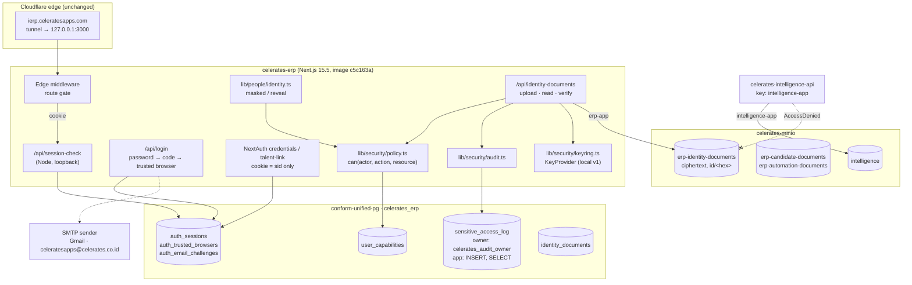

# 01 — Implemented security architecture (M0–M4)

**Date:** 2026-10-02. **Branch:** `feat/talent-ops-completion`. **Deployed image:** `celerates-erp:c5c163a`
(built from commit `c5c163a` with `git archive`, not from a working tree). **Pilot:** `ierp.celeratesapps.com`.

Read with: [00 baseline](00-baseline-review.md) · [02 auth & sessions](02-auth-session-implementation.md) ·
[03 authorization & data policy](03-authorization-and-data-policy.md) · [04 identity-document POC](04-identity-document-poc.md) ·
[05 verification results](05-security-verification-results.md) · [06 independent test handoff](06-independent-security-test-handoff.md)

This records what was built and tested, not what the architecture could do. Each control below is either
**live on the pilot and verified**, or listed under "Not implemented".

## 1. Current → implemented

| Area | Before (2026-10-01) | Now (live on the pilot) |
| --- | --- | --- |
| Baseline | image built from 4 uncommitted files | every deployed change is a commit; image built from `git archive <sha>` |
| Secrets | env files on tmpfs `/tmp` (10-day cleanup) | `/etc/celerates/secrets/` (root 700/600); containers recreated from there by `infra/pilot/celerates-run.sh` |
| Object storage credentials | ERP and Intelligence share the MinIO root key | `erp-app` (only `erp-*`) and `intelligence-app` (only `intelligence`); Intelligence gets `AccessDenied` on every ERP bucket |
| Session | NextAuth JWT, 10 years, claims in the cookie, middleware trusts the cookie | cookie holds only `sid` + user id; `auth_sessions` row checked on every request; 7 d idle / 30 d absolute (Talent 30 / 90) |
| Revocation | none (rotate `NEXTAUTH_SECRET` for everyone) | logout, logout-all, per-device revoke, Owner "sign out everywhere", deactivate user, password change/reset, Talent link revoke |
| Backoffice login | password only | password + 6-digit code to the corporate mailbox on a new browser; 30-day trusted browser; `AUTH_EMAIL_OTP` required (ON) |
| Google OAuth | dormant, auto-created users | removed from code |
| Invite / reset | invited users could not set a password; no reset | "Aktivasi akun / lupa password": same email code, then a new password; all sessions revoked |
| Authorization | division × level only; Owner sees everything | division RBAC **plus** sensitivity capabilities in one `can(actor, action, resource)`; Owner holds no data capability implicitly |
| Step-up | none | `requireRecentAuth` / `can()` require an email code (or, for Talent, a WhatsApp link) in the last 10 minutes for sensitive actions |
| NIK / NPWP / KK / bank number | decrypted on 5 pages for any HR/TA/TM level | masked everywhere; plaintext only through `lib/people/identity.ts` with capability + scope + step-up; audited |
| Identity documents | KTP files in `erp-candidate-documents`, plaintext, readable by any TA level and the MinIO root key | encrypted per object (AES-256-GCM, DEK wrapped by a versioned KEK) in private `erp-identity-documents` under opaque keys; scoped, step-up, audited |
| Audit | free-text create/update/delete labels | append-only `sensitive_access_log`: logins, codes, step-up, logout, access changes, capability grants, uploads, reads, reveals, denials |
| Agent | no category boundary for documents | KTP status metadata only (`ktp_status` field); no document id, key or bytes; Intelligence cannot reach the bucket |

## 2. Implemented architecture

What did not change: the Next.js monolith, PostgreSQL runtime, MinIO, Intelligence, Cloudflare edge, ConForm.
No new service, identity provider, KMS, Redis or policy engine was introduced.

## 3. Migrations introduced

| File | Content |
| --- | --- |
| `apps/erp/drizzle/0011_security_foundation.sql` | `auth_sessions`, `auth_trusted_browsers`, `auth_email_challenges`, `user_capabilities`, `sensitive_access_log` (+ append-only triggers), `identity_documents` |

Applied on the pilot at 2026-10-02 08:35:22 UTC by `scripts/start.mjs` (checksum-tracked like 0000–0010).
Out-of-band (superuser, recorded in [03 §6](03-authorization-and-data-policy.md#6-audit-log-integrity)):
`celerates_audit_owner` role owns `sensitive_access_log`; an event trigger blocks dropping it.

## 4. Code paths changed (apps/erp unless noted)

New: `src/lib/security/{policy,session,email-otp,audit,keyring,identity-documents,actions}.ts`,
`src/lib/people/identity.ts`, `src/app/api/{login,step-up,session-check,identity-documents,identity-documents/[id]}/route.ts`,
`src/components/security/{step-up,reveal-field,identity-documents}.tsx`, `src/app/access-management/security-controls.tsx`,
`src/app/profile/sessions-panel.tsx`, `src/app/me/documents/page.tsx`, `scripts/issue-recovery-code.mjs`,
`tests/security.test.ts`, `tests/security-http.mjs`, `infra/pilot/celerates-run.sh`.

Changed: `src/lib/auth.ts` (sid-only JWT, Google removed, code-gated credentials), `src/middleware.ts` (live session check),
`src/lib/actor.ts` (`currentClaims`, `requireRecentAuth`), `src/lib/login-throttle.ts` (generic keys),
`src/lib/require-division-access.ts` (status check), `src/lib/object-store.ts` + `scripts/init-storage.mjs` (identity bucket),
`src/lib/talent/identity.ts` (link revoke ends sessions), `src/lib/agent/reads.ts` (`ktp_status`),
`src/lib/automation/document-merge.ts`, `src/app/{hr,hr/[id],hr/[id]/edit-personal,ta/onboarding/[id]/edit,tm/database-salary}/…`,
`src/app/ta/onboarding/actions.ts`, `src/app/hr/actions.ts`, `src/app/access-management/*`, `src/app/profile/*`,
`src/app/login/*`, `src/app/go/[code]/page.tsx`, `src/components/talent/talent.tsx`, `scripts/seed-test-accounts.mjs`,
`next.config.mjs` (`middlewareClientMaxBodySize`), `package.json` (`nodemailer` 7.0.13).

## 5. Runtime configuration (names only)

`/etc/celerates/secrets/celerates-erp.env` gained `IDENTITY_KEYRING_FILE`, `AUTH_EMAIL_DOMAINS=celerates.com`,
`AUTH_EMAIL_EXCEPTIONS` (one non-corporate backoffice address: the real Owner), and its S3 key became `erp-app`.
`AUTH_EMAIL_OTP` is unset, i.e. email codes are **required**. `SMTP_HOST/PORT/USER/FROM/PASSWORD_FILE` send codes from
`celeratesapps@celerates.co.id` through Gmail (see [02 §7](02-auth-session-implementation.md#7-otp-sender)).
New root-only files: `identity-keyring` (uid 1000, 0400, mounted read-only at `/run/secrets/identity-keyring`),
`minio-erp-app.secret`, `minio-intelligence-app.secret`, `poc-accounts`. Backups of the previous env files end in
`.pre-m0-root-minio` and `.pre-m1`.

## 6. Rollback

All steps are reversible; take them in this order and only as far as needed.

1. **Application:** `infra/pilot/celerates-run.sh erp celerates-erp:pre-security-20261002` with the env backup
   `sudo cp /etc/celerates/secrets/celerates-erp.env.pre-m1 /etc/celerates/secrets/celerates-erp.env`.
   The old image ignores the new tables. Users must sign in again (old cookies lack the old claims).
2. **Database (only if the schema itself must go):** stop `celerates-erp`, then restore
   `/var/backups/celerates/celerates_erp-pre-0011-20261002T083506Z.dump`
   (sha256 `4f8e67a1…0159624`) with `pg_restore --clean --if-exists -d celerates_erp` as the superuser.
   This also discards every session, capability, audit row and identity document created since.
   First `DROP EVENT TRIGGER protect_sensitive_access_log;` (superuser) or the drop of the audit table is refused.
3. **MinIO credentials:** restore `*.env.pre-m0-root-minio` and recreate the three containers. The scoped users can stay.
4. **Identity documents** are unreadable without `/etc/celerates/secrets/identity-keyring`. Never delete it while rows exist.

## 7. Known limitations

- **Delivery to `@celerates.com` not yet confirmed.** Codes are sent through Gmail (`celeratesapps@celerates.co.id`,
  SMTP verified, test message accepted); arrival in a Dewaweb mailbox (inbox vs spam) still needs one real check.
  If mail fails, the operator break-glass code still works.
- **Bank-account changes by HR** need a fresh step-up, but the edit form has no "Confirm it's you" dialog: the user must
  confirm first (any *Tampilkan* button) and then save within 10 minutes; otherwise the save fails with a generic error.
- **Blank identity fields keep the stored value**; an identity number cannot be cleared from the form.
- **`identity.read`** (non-number personal fields such as address, birth date, mother's maiden name) is defined and
  tested in `can()` but those fields are still shown to every HR/TA user who can open the record.
- **Compensation** capabilities (`compensation.*`, `payroll.export`) exist and are tested in `can()`, but pay columns are
  not yet behind a module (review Phase 5).
- The **session check costs one loopback HTTP call + one indexed query per request** (Next 15.5 Node-runtime middleware
  corrupts large request bodies, so middleware stays on the Edge runtime; see [02 §3](02-auth-session-implementation.md#3-where-the-session-is-checked)).
- The **KEK is a file on the same host** as the data (Phase 4 baseline, no KMS by decision). Host root can decrypt.
- **No EXIF stripping or image re-encoding** on upload; JPEG/PNG/PDF are checked by magic bytes and markup sniffing only.

## 8. Residual risks

- Single VPS: host root (the `debian` operator, passwordless sudo, Docker group) can read every database, bucket and key.
- The corporate mailbox is the second factor; its own strength (cPanel password, 2FA) is unknown.
- Shared test accounts remain active on the pilot by decision (development environment). Once email codes are required
  they can only sign in on new browsers if their mailboxes exist.
- Backups of `conform-unified-pg` and MinIO are still not automated (review Phase 0, out of M0–M4 scope). The two dumps
  under `/var/backups/celerates/` are manual rollback points.
- Railway `erp-web` still runs the old auth code (decision: preview only); it must not hold real data.

## 9. Not implemented (exact)

From the M0–M4 request: nothing in the definition of done is missing; only the first real delivery to an
`@celerates.com` inbox remains to be observed.
Outside M0–M4 or deferred by decision: SSH hardening, tunnel-token rotation, backup automation and restore drill,
Railway retirement, Intelligence non-root container, Agent dataset egress guard (R11.2) and model egress policy/log
(Phase 6), compensation module (Phase 5), `identity.read` enforcement on non-number fields, Talent link browser binding
and 7-day expiry (R5.5, business decision), Cloudflare Access for admin surfaces, HSTS/CSP headers, disabling the shared
test accounts (deferred by the owner), passkeys/TOTP, KMS.
