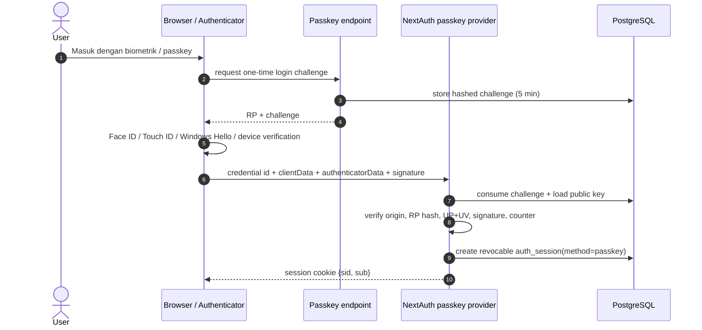

# 02 — Authentication and session implementation (M1, M2)

## 1. Model

| | Value | Why |
| --- | --- | --- |
| Session authority | PostgreSQL `auth_sessions` | revocable per session; no Redis (decision 5) |
| Cookie | NextAuth JWT (encrypted, HttpOnly, Secure, SameSite=Lax) containing only `sid` and `sub` | cookie contents are never trusted for authority |
| Backoffice idle / absolute | 7 days / 30 days | survives a weekend; bounds a stolen cookie |
| Talent idle / absolute | 30 days / 90 days | Talent re-enter with WhatsApp `masuk` |
| Trusted browser | 30 days, revocable, SHA-256 of a 32-byte token in `__Host-erp-tb` | password fallback on a known browser does not need daily webmail |
| Passkey / biometric | WebAuthn discoverable credential; public key only in ERP; user verification required | Face ID / Touch ID / Windows Hello / device biometric stays on the authenticator |
| Step-up window | 10 minutes | one task (view a KTP, grant access), not one click |
| Code | 6 digits (CSPRNG), HMAC-SHA256 with `NEXTAUTH_SECRET` bound to user + purpose, 10 min, single use, 5 wrong tries, newer code supersedes | stored hashes cannot be brute-forced offline |
| Rate limits | password: 20/15 min per email, 60/15 min per IP · code send: 5/15 min per user, 20 per IP · code verify: 30/15 min per IP | `auth_attempts` fixed windows |

`auth_sessions` columns: id, user_id, auth_method (`password`, `password+email_otp`, `passkey`, `talent_link`), auth_time,
trusted_browser_id, step_up_at, created_at, last_seen_at, idle_expires_at, absolute_expires_at, device (browser · OS),
ip_prefix (/24 or /48), revoked_at, revoke_reason. `last_seen_at`/`idle_expires_at` are touched at most once a minute.

## 2. Sign-in sequence

Backoffice has two user-facing paths.

### A. Passkey / biometric (preferred after enrollment)



The private key and biometric stay on the authenticator. ERP stores no biometric template.

### B. Corporate email/password bootstrap and recovery

Existing password → new-browser corporate mailbox code → trusted-browser flow remains the bootstrap/recovery path.
It is also used to activate invited accounts and to recover an account.

Daily use: a valid session goes straight in. A user with a registered passkey can choose the passkey path without
typing an email. A trusted browser whose session expired can still use the password fallback. A new/untrusted browser
using the password path needs the mailbox code. Talent keeps the separate WhatsApp deep-link path.

Passkey enrollment happens from Profile after a normal authenticated session and requires the current password again.

## 3. Where the session is checked

1. **Middleware** (`src/middleware.ts`, Edge runtime): decodes the cookie only to see that one exists, then asks
   `GET http://127.0.0.1:$PORT/api/session-check` with the same cookie. That Node route runs `loadSession()` and returns
   the live session's division access, Owner flag and account type, or 401. No answer → no claims → `/login` (pages) or
   403 (APIs), and the stale cookie is deleted.
2. **Server code**: every `getServerSession()` runs the NextAuth `jwt` callback, which runs `loadSession()` again; an
   invalid session throws, NextAuth clears the cookie and the caller gets no session. `requireActor`, `currentClaims`,
   route handlers and server actions therefore always see fresh claims and capabilities.

Why not Node-runtime middleware (which could query PostgreSQL directly): Next 15.5.24 tees the request body for Node
middleware and swaps the route's copy in with an **un-awaited** `finalize()`; any body still streaming when middleware
returns reaches the route "disturbed" (observed: HTTP 500 for uploads ≥ ~1 MB, a regression for evidence uploads).
The Edge path awaits it. `experimental.middlewareClientMaxBodySize` is raised to 25 MB so the 22 MB Server Action limit
is not silently truncated by the middleware copy.

## 4. Revocation events

| Event | Implementation | Effect |
| --- | --- | --- |
| Logout | NextAuth `events.signOut` → `revokeSession(sid, 'logout')` | that session refused on the next request, also for a copied cookie |
| Logout all devices | Profile → *Keluar dari semua perangkat* (`logoutAllDevices`) | every session + every trusted browser of the user |
| Lost device | Profile → *Sesi aktif* → *Keluarkan*; Owner → *Keluarkan dari semua perangkat* | one session / all sessions |
| Deactivate user | Access Management → *Nonaktifkan* (`deactivateUser`) | status `inactive`, sessions + trusted browsers revoked, Talent link revoked, grants superseded; access rows kept; reversible (*Aktifkan kembali*) |
| Reject user | `rejectUser` | sessions + trusted browsers revoked |
| Password change | Profile | every other session revoked |
| Password reset / invite activation | `/api/login` reset | every session + trusted browser + registered passkey revoked, then this browser trusted |
| Access / capability change | none needed | claims reload on the next request |
| Talent link revoked | `revokeTalentLink` | that Talent's sessions revoked |
| Global kill switch | rotate `NEXTAUTH_SECRET` (stop and ask) | every cookie and every code invalid |

## 5. Invite, first login, reset

Owner *Invite* creates an active user without a password (audited `user_invite`). The person opens `/login` →
*Aktivasi akun / lupa password* → enters their email → receives a code → sets a password (8–72) → signs in on that
browser without a second code. The response is identical whether or not the email exists.

## 6. Allowed mailboxes and break-glass

- Codes are sent only to `AUTH_EMAIL_DOMAINS` (`celerates.com,celerates.co.id`) or to addresses in `AUTH_EMAIL_EXCEPTIONS`. Every code
  sent to an exception is audited with reason `mailbox_exception`. Today the only exception is the real Owner's
  non-corporate address; without it the Owner could not sign in on a new browser.
- **Break-glass** (host access required, audited `break_glass_code_issued`):
  ```bash
  docker exec -it celerates-erp node scripts/issue-recovery-code.mjs <email> "<reason>"          # login code
  docker exec -it celerates-erp node scripts/issue-recovery-code.mjs <email> "<reason>" --reset  # set-password code
  ```
  The code is printed only to the operator's terminal; give it to the person by phone or in person. It is a normal
  challenge (10 min, single use, 5 tries). An emailed code never cancels a break-glass code, so it still works while
  mail is down. When the email cannot be sent, the login form moves to the code step and says so.
- Codes are never logged, returned in an API response or written anywhere except as an HMAC.

## 7. OTP sender

**Decision (owner, 2026-10-02):** the owner has no access to the `celerates.com` cPanel, so a `noreply@celerates.com`
mailbox (review option A) is not possible. The sender is Google Workspace **`celerates.co.id`** over SMTP submission
(`smtp.gmail.com:587`, STARTTLS required) with an **App Password** of `celeratesapps@celerates.co.id`. The code still proves control of the recipient's
approved `@celerates.com` or `@celerates.co.id` mailbox; the sender domain does not need to match. `nodemailer` 7.0.13 was added (the version range
`next-auth` 4.24 accepts). Resend was not used: its key is unset everywhere and it would need DNS changes on Dewaweb.

**Status (2026-10-02 08:5x UTC): configured.** App Password of `celeratesapps@celerates.co.id` stored in
`/etc/celerates/secrets/smtp-password` (uid 1000, 0400, mounted read-only); SMTP AUTH over STARTTLS verified from the
container; a test message to the sender's own mailbox was accepted (`250 2.0.0 OK`), and a test in the login-code format sent to an
`@celerates.com` mailbox at 09:10 UTC arrived in the **Inbox** (confirmed by the owner; through `dewaspamguard`). To replace the password
(the owner, in their own SSH terminal; `bash`, because Debian's `sh` cannot read silently):

```bash
# 1. Store it (no echo; spaces and the paste's trailing CR are removed). Prints 16 when correct.
sudo bash -c 'umask 077; read -rs -p "App Password: " p; echo; printf %s "$p" | tr -d " \r" > /etc/celerates/secrets/smtp-password; chown 1000:1000 /etc/celerates/secrets/smtp-password; chmod 400 /etc/celerates/secrets/smtp-password; wc -c < /etc/celerates/secrets/smtp-password'
# 2. Configure (already present in celerates-erp.env; change the account if a dedicated sender is created).
sudo sh -c 'cat >> /etc/celerates/secrets/celerates-erp.env <<EOF
SMTP_HOST=smtp.gmail.com
SMTP_PORT=587
SMTP_USER=celeratesapps@celerates.co.id
SMTP_FROM=Celerates ERP <celeratesapps@celerates.co.id>
SMTP_PASSWORD_FILE=/run/secrets/smtp-password
EOF'
# 3. Recreate the ERP container (the run script mounts smtp-password once it exists; ~30 s restart).
/opt/celerates-digital-intelligence/infra/pilot/celerates-run.sh erp   # celerates-erp:pilot = current build
# 4. Test: sign in from a private window with an approved @celerates.com / @celerates.co.id account whose mailbox someone can read; check inbox and spam.
```

Prefer a dedicated Workspace user over the shared `celeratesapps@` mailbox: an App Password grants full mailbox access.
Workspace allows about 2,000 messages per user per day. `From:` must be the authenticated account (DKIM alignment).
`celerates.co.id` has no DMARC record; deliverability to `mx1/mx2.dewaspamguard.com` must be checked with a real send.

## 8. Passkey production configuration

The pilot implementation derives RP/origin from `NEXTAUTH_URL` by default. Production should verify the canonical host explicitly:

```text
AUTH_EMAIL_DOMAINS=celerates.com,celerates.co.id
PASSKEY_RP_ID=<erp-host-without-scheme>
PASSKEY_ORIGIN=https://<erp-host>
PASSKEY_RP_NAME=Celerates ERP
```

Passkeys require HTTPS except localhost development. The public login endpoint issues only a short-lived challenge;
credential registration remains behind an authenticated backoffice session and current-password confirmation.

Server verification checks:

- challenge is one-time and not expired;
- `clientDataJSON.type`, origin and cross-origin flag;
- RP ID hash in authenticator data;
- user-presence and user-verification flags;
- ES256 or RS256 public-key signature;
- authenticator counter when the authenticator provides a non-zero counter;
- active backoffice account and approved corporate mailbox policy.

## 9. Removed

Google OAuth provider, its auto-create/bind-by-email `signIn` callback and the Google button. `google_tokens` stays for
Sheets sync. Old 10-year cookies stopped working at deploy (no `sid`); everyone signed in again once.
