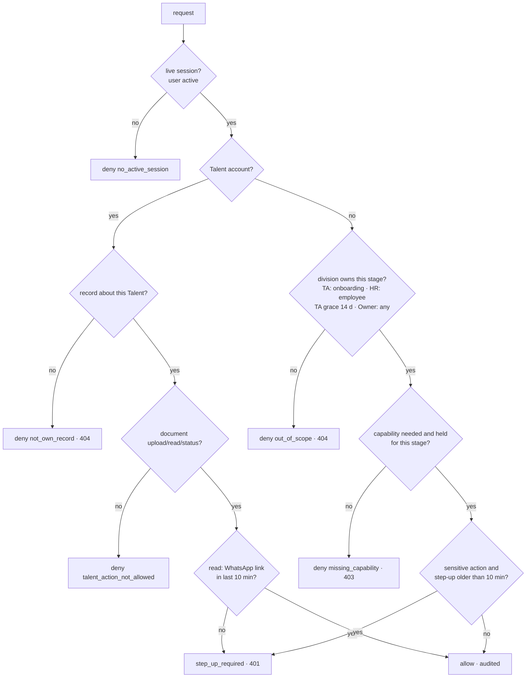

# 03 — Authorization and sensitive-data policy (M3)

## 1. One decision point

`apps/erp/src/lib/security/policy.ts` exports a pure `can(actor, action, resource, now)`:

- **actor**: user id, status, account type, Owner flag, division access (`viewer`/`editor`/`full`), capabilities with
  scope, `step_up_at`. Always loaded from PostgreSQL for this request (`loadSession`), never from the cookie.
- **resource**: classification (`identity`, `bank`, `compensation`), lifecycle stage (`onboarding`, `employee`, `self`),
  promotion time, subject user.
- **action**: `identity.read`, `identity.reveal`, `identity_document.read|upload|verify|status`, `bank.read|write`,
  `compensation.read|write`, `payroll.export`, `access.admin`.
- **result**: allow, or deny with a reason (`no_active_session`, `out_of_scope`, `missing_capability`,
  `not_own_record`, `talent_action_not_allowed`, `step_up_required`).



The same function is used by the UI pages, server actions, route handlers and the Agent read path, so a direct API or
server-action call gets the same answer as the UI. UI hiding is never the control.

## 2. Capabilities

Table `user_capabilities(user_id, capability, scope, reason, granted_by, granted_at, expires_at, revoked_at, revoked_by)`.
One active grant per user and capability. Scope: `all`, `onboarding` or `employee` (lifecycle stages the grant covers).

| Capability | Lets the holder | Step-up |
| --- | --- | --- |
| `identity.read` | read non-number personal fields (defined; not yet enforced on pages, see 01 §7) | no |
| `identity.reveal` | see NIK, NPWP, KK number in plaintext | yes |
| `identity_document.read` | open / download identity documents; verify them | yes |
| `bank.read` / `bank.write` | see / change a bank account number (HR or Finance) | yes |
| `compensation.read` / `compensation.write` | pay data (TM, HR, Finance; not yet behind a module) | write only |
| `payroll.export` | payroll export (none exists yet) | yes |
| `access.admin` | grant/revoke capabilities (Owner holds it implicitly) | yes |

Granting: Access Management → user → *Izin data sensitif* → capability, scope, reason → *Beri*. Needs Owner (or
`access.admin`) **and** a fresh step-up; only an Owner can grant `access.admin`; never for Talent accounts. Every grant
and revoke is audited. **Owners hold no data capability implicitly**: an Owner who wants to open KTPs grants themselves
`identity_document.read` visibly and audibly (review R7.3).

## 3. Lifecycle rule (who owns a person's identity data)

| Stage | Owning division | Notes |
| --- | --- | --- |
| Onboarding in progress (no `employees` row) | TA | TA editors upload; TA + capability read |
| Promoted (`employees.onboarding_request_id` set) | HR | TA keeps access for **14 days** after promotion, then loses it |
| Talent's own upload without an ERP employee | the Talent | nobody else |
| Bank data | HR or Finance | TA may *enter* a bank number while onboarding (data entry) without `bank.write` |

## 4. Access matrix (identity documents; all rows are automated tests)

| Actor | Request | Result | Test |
| --- | --- | --- | --- |
| Anonymous | any KTP | DENY 403 (middleware) | security.test middleware; security-http; pilot runtime |
| Talent A | own KTP, WhatsApp link < 10 min | ALLOW | security.test, security-http |
| Talent A | own KTP, link older | `step_up_required` | security.test |
| Talent B | Talent A's KTP | DENY 404 | security.test, security-http |
| TA + `identity_document.read` | onboarding-in-progress KTP, step-up | ALLOW | security.test |
| TA | after promotion + 14 days | DENY 404 | security.test |
| TA (onboarding-scoped grant) | employee-stage KTP | DENY 403 | security.test |
| HR + `identity_document.read` | employee KTP, step-up | ALLOW | security.test, security-http, pilot runtime |
| HR + capability | onboarding still with TA | DENY 404 | security.test |
| HR without capability | any KTP | DENY 403 | security.test |
| PMO | any KTP | DENY 404 | security.test, security-http, pilot runtime |
| Finance | any KTP | DENY 404 | security.test |
| Owner without explicit capability | any KTP | DENY 403 | security.test, security-http |
| Owner with explicit capability | KTP, step-up | ALLOW | security.test, security-http |
| Valid session, no recent step-up | any KTP | `step_up_required` 401 | security.test, security-http, pilot runtime |
| Revoked session | any KTP | DENY 403 | security.test, security-http |
| Deactivated user | anything | DENY (next request) | security.test, security-http, pilot runtime |
| Direct MinIO / object URL | any KTP | DENY (no public port, no policy, no presign, ciphertext) | pilot runtime |
| `/api/documents?bucket=identity-documents` | any KTP | DENY 404 | security.test, security-http, pilot runtime |
| Agent / model | KTP content | DENY (no route, no credential) | security.test static + runtime MinIO |
| Agent | KTP status | metadata only (`ktp_status`) | security.test |

The persona × capability matrix for identity reveal, bank, compensation, payroll export and access administration is
in `tests/security.test.ts` → "policy matrix" (37 rows).

## 5. Identity numbers (NIK, NPWP, KK, bank account)

`apps/erp/src/lib/people/identity.ts` is the only module that decrypts them (`tests/security.test.ts` fails the build if
`decryptPII` appears anywhere else).

- Lists and pages show `maskIdentity()` (`••••••••••••0001`). HR profile: *Tampilkan* → server action `revealField` →
  `can(identity.reveal | bank.read)` + step-up → plaintext for that component only; allow and deny audited.
- Edit forms never receive plaintext: the field shows the masked value as placeholder; blank keeps the stored value;
  a typed value is encrypted. A bank change after onboarding needs `bank.write` + step-up.
- Generated contracts (document automation) get plaintext only if the user may reveal right now; otherwise the masked value.
- `/tm/database-salary` shows a masked NIK.

## 6. Audit log integrity

`sensitive_access_log(at, actor_user_id, session_id, action, resource_type, resource_id, subject_employee_id,
subject_onboarding_id, subject_user_id, decision, reason, step_up_at, ip_hash, device)`. Never content, identity
numbers, bank numbers, pay values, codes, tokens or keys (tests assert this on the stored rows and on all logs).

Events written: `login` allow/deny (reason: method, `bad_credentials`, `rate_limited`, `email_verification_required`,
`talent_link_invalid`), `otp_login_send`, `otp_login_verify`, `otp_reset_send`, `otp_reset_verify`,
`otp_step_up_send`, `step_up`, `logout`, `logout_all`, `session_revoke`, `session_revoke_all`, `trusted_browser_revoke`,
`password_change`, `password_reset`, `break_glass_code_issued`, `user_invite`, `user_approve`, `user_reject`,
`user_delete`, `user_deactivate`, `user_reactivate`, `division_access_set`, `owner_grant`, `owner_revoke`,
`timesheet_converter_set`, `capability_grant`, `capability_revoke`, `identity_document.upload|read|verify`,
`identity.reveal`, `bank.read`, `bank.write`.

Integrity (applied on the pilot 2026-10-02 08:38 UTC, superuser):

```sql
CREATE ROLE celerates_audit_owner NOLOGIN;
ALTER TABLE sensitive_access_log OWNER TO celerates_audit_owner;
ALTER FUNCTION sensitive_access_log_append_only() OWNER TO celerates_audit_owner;
GRANT INSERT, SELECT ON sensitive_access_log TO celerates_erp_app;
-- the app role owns schema public and could otherwise DROP the table:
CREATE FUNCTION protect_sensitive_access_log() RETURNS event_trigger ... -- raises on DROP of sensitive_access_log
CREATE EVENT TRIGGER protect_sensitive_access_log ON sql_drop EXECUTE FUNCTION protect_sensitive_access_log();
```

Verified as `celerates_erp_app`: INSERT works; UPDATE, DELETE, TRUNCATE, `DISABLE TRIGGER`, DROP and disabling the
event trigger are all refused. Future migrations that alter this table must run as the superuser.
In the test databases (PGlite) the app owns the table; the row triggers still refuse UPDATE/DELETE/TRUNCATE.

## 7. What is still division-only

Every module not listed above keeps its existing division × level RBAC (`route-access.ts`, `requireDivisionAccess`,
`module-access.ts`) unchanged. Pay data (about 35 columns) is still readable by any TM level until the compensation
module (review Phase 5). Non-number personal fields are still division-only until `identity.read` is wired.
